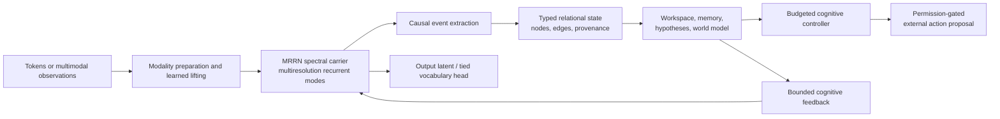

# MRCRA

## Multimodal Relational-Continuity Resonance Architecture

MRCRA is an experimental PyTorch architecture that combines a
**multiresolution spectral recurrent network** with a **bounded relational
cognitive substrate**. The dense spectral carrier preserves causal signal
history across multiple time scales; the sparse cognitive system turns salient
events into typed relations, memories, hypotheses, workspace state, and
permission-gated action proposals.

This repository contains the architecture, language-model interface, original
English FineWeb trainer, checkpointing and evaluation systems, Trackio
instrumentation, and executable acceptance evidence.

> **Project status:** research implementation. No pretrained production
> checkpoint is included. The repository validates mechanisms and causal
> contracts; it does not claim general intelligence, deployment maturity, or
> capabilities that have not been established by training and held-out
> evaluation.

[Quick start](#quick-start) ·
[Architecture](#architecture-at-a-glance) ·
[Model profiles](#model-profiles) ·
[Training](#fineweb-training) ·
[Dashboard](#trackio-dashboard) ·
[Documentation](#documentation) ·
[Validation](#validation-and-claim-boundaries)

## Why this architecture exists

Most sequence models keep information in token-indexed vectors and recover
context through attention over an expanding cache. MRCRA explores a different
division of labor:

- The **MRRN carrier** stores causal history in learned resonant modes with
  amplitude, phase, frequency, and decay across several physical resolutions.
- A **typed event graph** stores sparse, durable structure only when the dense
  stream produces a sufficiently supported event.
- A **global workspace** selects a small competitive set of information and
  feeds it back into the carrier.
- **Episodic and semantic memory** separate exact retained detail from validated
  consolidation.
- **Hypotheses and a world model** maintain bounded alternatives and estimate
  action-conditioned consequences.
- A **budgeted controller** proposes internal operations and external actions,
  while hard capability, permission, provenance, viability, and abstention
  gates remain authoritative.

The central idea is not to discard tensors or learned vectors. It is to make
spectral dynamics the continuous information carrier and reserve explicit
relational state for structure that benefits from identity, provenance, and
longer-lived continuity.

## Architecture at a glance



| Component | Role |
| --- | --- |
| Multiresolution Resonance Network | Causal dense carrier built from stable paired-real complex resonators, neighbor-scale exchange, structured mixing, bounded coherence attention, and learned spectral activations. |
| Resonant Spectral GLU | A learned frequency-domain activation with bounded gain, phase modulation, and sparse legal sum/difference-frequency interactions. |
| Event and relation substrate | Promotes supported temporal events into fixed-capacity typed nodes, pair relations, and hyperedges. |
| Provenance ledger | Keeps observation, prediction, reconstruction, simulation, and external evidence distinguishable through immutable source records. |
| Global workspace | Selects a bounded competitive set of active structure and broadcasts learned context back into the carrier. |
| Memory | Uses exact episodic retention and gated semantic consolidation rather than treating every learned write as fact. |
| Hypothesis and world model | Represents a bounded set of alternatives, including an explicit unknown option, and predicts multihorizon consequences. |
| Controller and agent boundary | Executes budgeted internal operations; external actions require an application-owned schema, authorization, viability state, and executor receipt. |
| Cognitive learning | Allows language loss and evidence-backed auxiliary objectives to shape the cognitive path without inventing labels or treating task loss as environmental reward. |

### What is distinctive

- **Spectral recurrent state:** learned phase and decay are first-class carrier
  variables rather than only positional features.
- **Dense–sparse integration:** continuous multiscale dynamics and explicit
  relational cognition train through one causal path.
- **Authoritative metadata:** learned embeddings estimate content, but cannot
  silently rewrite node identity, relation type, provenance, permissions, or
  observed-versus-predicted status.
- **Bounded computation:** attention candidates, graph capacity, workspace
  occupancy, hypotheses, memory retrieval, and controller steps all have
  explicit limits.
- **Fail-closed cognition:** abstraction, invariants, semantic knowledge, and
  external action proposals require their own evidence and authorization gates.
- **Inspectable dynamics:** spectral state, event thresholds, cognitive
  gradients, causal ablations, relational state, memory, and action gates are
  exposed through the Trackio dashboard.

### Multimodal boundary

The cognitive network consumes typed observation packets rather than assuming
that every input is a one-dimensional token sequence. Modality preparation for
text, audio, images, video, fields, graphs, and sets lives in
[`src/mrrn/modalities.py`](src/mrrn/modalities.py). Masks, timestamps,
coordinates, sample intervals, segment boundaries, uncertainty seeds, source
identities, and provenance accompany learned values into the model.

The included end-to-end trainer is specifically an English language-model
trainer. Other modalities require an application to provide their observation
packets and evidence-backed training targets; unordered structures are not
silently flattened into the temporal carrier.

## Model profiles

The model sizes below use the GPT-2 vocabulary of 50,257 tokens.

| Profile | Parameters | Carrier | Intended use | Selection |
| --- | ---: | --- | --- | --- |
| Integrated light | 8,413,442 | 5 scales, shared learned depth, 96-wide base | Local development, architecture experiments, and lower-cost training while retaining the complete cognitive substrate | `--lightmodel` |
| Serious | 115,925,944 | 6 scales, unshared learned depth, 256-wide base | Full architecture training and serious evaluation | Default |
| Legacy sequence MRRN | 4,695,023 | Sequence-only spectral carrier | Compatibility and carrier-only ablation | `--legacy-mrrn` |

The parameter counts are construction-time invariants, not rounded marketing
targets. Reproduce the audits with:

```bash
python scripts/report_mrcra_parameters.py --lightmodel
python scripts/report_mrcra_parameters.py
```

Detailed subsystem allocations are retained in
[`outputs/mrcra_8p4m_parameter_report.json`](outputs/mrcra_8p4m_parameter_report.json)
and
[`outputs/mrcra_120m_parameter_report.json`](outputs/mrcra_120m_parameter_report.json).

## Quick start

MRCRA requires Python 3.11 or newer.

### Linux or macOS

```bash
git clone https://github.com/leatherman55/MRCRA.git
cd MRCRA
python3.11 -m venv .venv
source .venv/bin/activate
python -m pip install --upgrade pip
python -m pip install -r requirements.txt
```

### Windows PowerShell

```powershell
git clone https://github.com/leatherman55/MRCRA.git
cd MRCRA
py -3.11 -m venv .venv
Set-ExecutionPolicy -Scope Process Bypass
.\.venv\Scripts\Activate.ps1
python -m pip install --upgrade pip
python -m pip install -r requirements.txt
```

For NVIDIA training, install the CUDA-enabled PyTorch wheel selected by the
[official PyTorch installer](https://pytorch.org/get-started/locally/) before
installing `requirements.txt`. A separate system CUDA toolkit is not required
for official PyTorch wheels.

### Verify the installation

The smoke test uses a tiny local model and does not download FineWeb:

```bash
python scripts/train_fineweb.py \
  --smoke-test \
  --no-trackio \
  --no-dashboard \
  --output-dir work/mrcra-smoke
```

Run the complete Python test suite with:

```bash
python -m pytest
```

## Python API

The following constructs an **untrained** integrated light model and demonstrates
the output contract:

```python
import torch
from mrrn import MRCRAConfig, MRCRALanguageModel

vocabulary_size = 50_257
config = MRCRAConfig.light_8p4m(output_dim=vocabulary_size)
model = MRCRALanguageModel(config)

tokens = torch.randint(0, vocabulary_size, (1, 128))
output = model(tokens, source_uris=("example://prompt",))

logits = output.logits
nodes = output.cognitive.nodes
relations = output.cognitive.relations
workspace = output.cognitive.workspace
uncertainty = output.cognitive.uncertainty
provenance = output.ledger
```

Generation preserves recurrent cognitive state and records generated tokens as
predictions rather than observations:

```python
generated = model.generate(
    tokens[:, :16],
    maximum_new_tokens=32,
    temperature=0.8,
    top_k=50,
    top_p=0.95,
)

generated_tokens = generated.tokens
generated_provenance_ids = generated.generated_provenance_ids
```

Meaningful generation requires trained weights. Checkpoint identity includes the
complete model configuration, so incompatible profiles cannot be silently mixed.

## FineWeb training

[`scripts/train_fineweb.py`](scripts/train_fineweb.py) is the canonical training
entrypoint. A normal invocation trains the integrated serious MRCRA model; it
never silently falls back to the legacy sequence-only carrier.

### Recommended first substantial run

```bash
python scripts/train_fineweb.py \
  --lightmodel \
  --total-tokens 20000000
```

### Serious profile

```bash
python scripts/train_fineweb.py \
  --total-tokens 20000000
```

### Resume a run

`--resume` loads the latest checkpoint in the resolved output directory:

```bash
python scripts/train_fineweb.py \
  --lightmodel \
  --total-tokens 20000000 \
  --resume
```

If you change the total-token target while extending a run, reuse the original
directory explicitly because the default light-model directory includes the
token budget:

```bash
python scripts/train_fineweb.py \
  --lightmodel \
  --total-tokens 32000000 \
  --output-dir outputs/my-light-run \
  --resume
```

### Device selection

`--device auto` is the default:

- CUDA is selected first when available.
- CUDA uses BF16 when supported and dynamically scaled FP16 otherwise.
- Pure carrier tensor kernels are compiled automatically on CUDA.
- On Apple silicon, the integrated light model defaults to CPU because its
  heterogeneous cognitive graph is launch-bound on MPS in matched local probes.
- Explicit `cpu`, `mps`, `cuda`, and indexed CUDA devices remain available.

Examples:

```bash
python scripts/train_fineweb.py --lightmodel --device cuda:0 --precision bf16
python scripts/train_fineweb.py --lightmodel --device cpu --cpu-threads 4
python scripts/train_fineweb.py --lightmodel --device mps
```

The built-in trainer is single-process and single-device. It does not claim
multi-GPU data or model parallelism.

An optional MLX backend is available on Apple silicon for supported carrier
inference and recurrent decode:

```bash
python -m pip install -e '.[apple]'
```

It imports the same learned weights and fails closed for unsupported topology.
The complete relational cognitive authority path remains the PyTorch reference.

### Default data and context contract

| Setting | Default |
| --- | --- |
| Dataset | Original English `HuggingFaceFW/fineweb`, configuration `sample-10BT` |
| Tokenizer | GPT-2 BPE |
| Optimization context | 32,768 tokens |
| Carrier execution chunk | 256 tokens |
| Carrier TBPTT span | 4,096 tokens |
| Cognitive TBPTT horizon | 4 event cycles |
| Full-softmax tile | 2,048 vocabulary entries |
| Held-out split | Stable document-ID hash, 1% |
| Evaluation/checkpoint interval | 25 optimizer updates |

Dataset and tokenizer revisions are pinned before training. Documents are packed
for throughput, but document transitions are excluded from next-token loss and
reset recurrent and cognitive state. Full-vocabulary cross entropy is exact and
tiled for memory control; it is not sampled or approximated.

Raw FineWeb supplies language targets but no external downstream consequence.
The FineWeb stage therefore does **not** enable functional-surprise reinforcement
learning by treating task loss as reward. RASL is available only for trajectories
with a legitimate environment, verifier, or preference consequence.

### Run outputs

Each run directory contains the durable state required for exact continuation:

```text
run_manifest.json
metrics.jsonl
checkpoints/
diagnostics/
```

Checkpoints include model, optimizer, scheduler, AMP scaler, stream position,
packer buffers, retained runtime state, provenance ledger, and random state.
Local run directories and weight files are excluded from Git by default.

## Trackio dashboard

Trackio logging and the local dashboard are enabled by default during training.
MRCRA adds two architecture-specific tabs:

- **Spectral Network:** training stability, token-scale resonance, learned
  spectral activation triads, pole/phase structure, and phase-transition
  telemetry.
- **MRCRA Cognition:** typed event graphs, reconstruction, deliberation,
  hypotheses, viability, invariant transfer, uncertainty, memory, provenance,
  and action authorization.

The trainer also records matched **full**, **soft-only**, and **cognition-off**
evaluation arms so cognitive contributions can be measured on identical retained
data.

Reopen the dashboard with:

```bash
PYTHONPATH=src python scripts/show_trackio_dashboard.py \
  --project mrcra-fineweb
```

Disable UI launch while retaining or disabling logging independently:

```bash
python scripts/train_fineweb.py --lightmodel --no-dashboard
python scripts/train_fineweb.py --lightmodel --no-trackio --no-dashboard
```

Dashboard artifacts are diagnostic observers. They do not participate in model
authority, optimization decisions, or external action permission.

## External actions and application authority

The neural model never calls tools or changes an environment directly.
Application integration uses `CognitiveAgentSession`, an application-owned
`ActionSchemaRegistry`, explicit authorized goals, viability authority when
enabled, and a structured executor.

The session owns:

```text
observe → deliberate → authorize → execute → ingest receipt
```

Learned utility cannot bypass capability, permission, provenance, viability, or
abstention gates. Simulation remains scenario-tagged, and environment feedback
updates the measured system model without granting new permissions.

## Repository layout

```text
src/mrrn/              Architecture, language interface, training, and runtime
scripts/               Training, parameter audits, benchmarks, and verification
tests/                 Unit, integration, causal, and acceptance tests
trackio_frontend/      Spectral Network and MRCRA Cognition dashboard source
outputs/               Small retained specifications and evidence artifacts
spec/                  Machine-readable traceability ledgers
```

Large checkpoints, local datasets, Trackio databases, build products, and active
training runs are intentionally not stored in the public repository.

## Documentation

| Document | Contents |
| --- | --- |
| [MRCRA architecture specification](outputs/multimodal_relational_continuity_resonance_architecture.md) | Complete cognitive architecture, invariants, authority boundaries, training contracts, and acceptance criteria |
| [MRRN mathematical specification](outputs/multiresolution_resonance_network_spec.md) | Spectral carrier equations, attention, recurrent state, activation, input/output contracts, and scaling behavior |
| [8.4M parameter audit](outputs/mrcra_8p4m_parameter_report.json) | Exact light-profile configuration and subsystem parameter allocation |
| [115.9M parameter audit](outputs/mrcra_120m_parameter_report.json) | Exact serious-profile configuration and subsystem parameter allocation |
| [Acceptance manifest](outputs/mrcra_acceptance_manifest.json) | Environment, commands, source hashes, and retained verification results |
| [Evidence ledger](spec/mrcra_evidence.json) | Machine-readable mapping from specification requirements to implementation and tests |

## Validation and claim boundaries

Run the repository-wide acceptance workflow with:

```bash
python scripts/run_mrcra_acceptance.py
python scripts/build_mrcra_evidence.py
```

The retained initial-public-release evidence records:

- 536 passing Python tests and 1 skipped test;
- passing frontend tests, lint, and production build;
- passing empirical mechanism acceptance;
- passing integrated cognitive-path acceptance;
- passing bounded performance acceptance;
- source hashes for every retained acceptance input.

These results establish implemented contracts, bounded causal effects, exact
resume behavior, and local mechanism learnability. They do not substitute for a
seriously trained checkpoint, broad downstream evaluation, target-hardware
qualification, or evidence of general cognition.

## License

No license file is currently included. Public visibility alone does not grant
permission to reuse, modify, or redistribute the code. Add an explicit license
before treating this repository as an open-source release.
