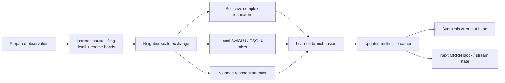
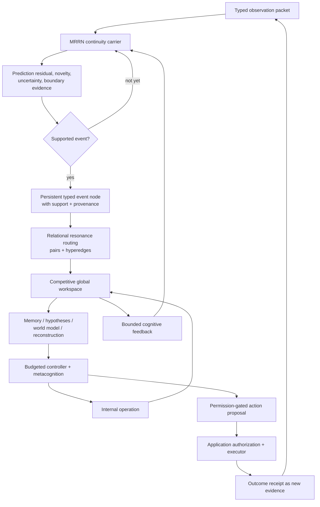
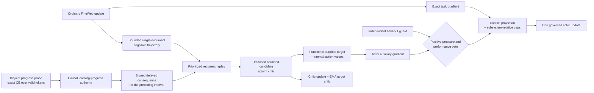

# MRCRA

## Multimodal Relational-Continuity Resonance Architecture

MRCRA is an experimental PyTorch architecture that combines a
**multiresolution spectral recurrent network** with a **bounded relational
cognitive substrate**. The dense spectral carrier preserves causal signal
history across multiple time scales; the sparse cognitive system turns salient
events into typed relations, memories, hypotheses, workspace state, and
permission-gated action proposals.

This repository contains the architecture, language-model interface, original
English FineWeb trainer, checkpointing and evaluation systems, Trackio
instrumentation, and executable acceptance evidence.

> **Project status:** research implementation. No pretrained production
> checkpoint is included. The repository validates mechanisms and causal
> contracts; it does not claim general intelligence, deployment maturity, or
> capabilities that have not been established by training and held-out
> evaluation.
>
> **Important unfinished work:** PC-RASL is an experimental, incomplete research
> subsystem and is disabled by default. The CUDA path is also unfinished: device
> selection and mixed-precision plumbing exist, but end-to-end NVIDIA training
> has not yet been qualified as a supported release path. CUDA support is under
> active development. The CPU implementation is currently the reference path.

[MRRN carrier](#1-mrrn-the-spectral-continuity-carrier) ·
[MRCRA cognition](#2-mrcra-the-cognitive-framework) ·
[Learning system](#critic-and-self-learning) ·
[Quick start](#quick-start) ·
[Model profiles](#model-profiles) ·
[Training](#fineweb-training) ·
[Dashboard](#trackio-dashboard) ·
[Documentation](#documentation) ·
[Validation](#validation-and-claim-boundaries)

## The core idea

MRCRA is best described as **a spectral continuity substrate inside a bounded
relational cognitive framework**.

- The **Multiresolution Resonance Network (MRRN)** is the dense carrier. It
  processes every valid input position and maintains causal, multiscale history
  in stable complex recurrent modes.
- **MRCRA** is the cognitive framework around that carrier. It promotes only
  selected events into explicit structure and coordinates relations, memory,
  hypotheses, reconstruction, uncertainty, internal operations, and authorized
  action.

The word *spectral* does not mean that tensors or learned vectors have been
abolished. Spectra are represented by ordinary real tensors. The difference is
that parts of the latent state are given explicit amplitude, phase, frequency,
decay, scale, and support semantics rather than being treated as interchangeable
feature coordinates.

The word *cognitive* is also used narrowly. It names an implemented organization
of recurrent perception, memory, prediction, relational structure, uncertainty,
and action selection. It is not a claim that an untrained checkpoint is
conscious, generally intelligent, or an empirical model of a biological brain.

## 1. MRRN: the spectral continuity carrier

### What the carrier is

The Multiresolution Resonance Network is a causal sequence and field model whose
persistent state is a hierarchy of damped complex oscillators. Each mode carries
four interpretable dynamical quantities:

| Quantity | Function |
| --- | --- |
| Amplitude | How strongly a pattern is currently represented |
| Phase | Where the pattern is within a learned temporal or spatial cycle |
| Frequency | How rapidly that phase evolves |
| Decay | How quickly the stored influence is forgotten |

Those modes operate at several physical resolutions. Fine scales preserve sharp
changes and precise timing. Coarser scales integrate progressively larger
regions. The result is not one global Fourier transform: it is a causal,
localized multiresolution hierarchy with recurrent state at every scale.

### Why it was made

A cognitive architecture needs a carrier that can preserve continuity without
turning every observation into a permanent graph node or revisiting every past
position at every step. Conventional approaches each solve only part of that
problem:

- dense self-attention can retrieve arbitrary details but normally expands its
  cache and pairwise work with context;
- a fixed recurrent state is streamable but must compress history;
- a global Fourier representation captures periodic structure but localizes
  abrupt events poorly;
- a local convolution or wavelet representation preserves events but does not
  by itself provide content-selective persistent state.

MRRN was developed to provide MRCRA with a **continuous, causal, multiscale
working medium**. The cognitive layer can then remain sparse and event-driven:
the carrier preserves the evolving field; the cognitive system reifies only the
parts that require explicit identity, provenance, relational structure, exact
retrieval, or deliberate control.

### How it works



1. **Preparation.** A modality adapter produces values plus masks, timestamps,
   sample intervals, coordinates, boundaries, source identity, and uncertainty
   metadata. Frequency is assigned only to an ordered or metric domain; an
   arbitrary feature axis is never relabeled as a physical spectrum.
2. **Transform-once lifting.** A learned causal lifting bank separates local
   detail from progressively slower approximations. Predictor and updater pairs
   are algebraically invertible, so downscaling need not silently discard the
   fine information.
3. **Multiscale exchange.** Completed fine-scale evidence is pooled causally
   toward neighboring coarse scales; aligned coarse context is projected back
   toward fine scales. The exchange is local in scale, bounded, and mask-aware.
4. **Resonant recurrence.** Each scale drives stable complex modes with
   content-dependent decay, phase increment, input direction, and readout
   direction. A work-efficient associative affine scan is used during parallel
   training; the identical recurrence is stepped directly during streaming.
5. **Local nonlinear computation.** A conventional SwiGLU-like path is blended
   with the Resonant Spectral GLU (RSGLU). RSGLU learns bounded amplitude gain,
   bounded phase rotation, and sparse sum/difference-frequency interactions.
   This gives the spectral state conditional nonlinear behavior without making
   the entire recurrent update unstable.
6. **Selected exact retrieval.** Attention is exact over an explicit bounded
   candidate set: a causal local window, aligned coarse landmarks, and selected
   memory items. It is not unrestricted dense attention over the full prefix.
7. **Branch fusion.** Identity, resonance, local mixing, and attention are
   combined by learned gates and small residual scales. This lets the network
   fall back toward an ordinary local model when spectral structure is not
   useful.
8. **Output and continuation.** The hierarchy is synthesized for a task output
   or retained directly as recurrent stream state. Streaming state is independent
   of total context length except for explicitly bounded recent windows and
   memory.

### The recurrent mathematics

For one scale, head, mode, and input lane, the continuous state begins with

$$
\frac{dz(t)}{dt} = \lambda(t)z(t) + g(t),
\qquad
\lambda(t) = -\alpha(t) + i\omega(t),
\qquad
\alpha(t) > 0.
$$

The real part, $-\alpha$, guarantees decay; the imaginary part, $\omega$,
rotates phase. MRRN uses an exponential-trapezoidal step. With
$q_t=\Delta_t\lambda_t$,

$$
\begin{aligned}
z_t &= e^{q_t}z_{t-1} \\
&\quad + \Delta_t\left[
\left(\varphi_1(q_t)-\varphi_2(q_t)\right)g_{t-1}
{}\mathbin{+} \varphi_2(q_t)g_t
\right],
\end{aligned}
$$

where

$$
\varphi_1(q)=\frac{e^q-1}{q},
\qquad
\varphi_2(q)=\frac{e^q-1-q}{q^2}.
$$

Small-$q$ series are used near zero to avoid unstable division. Because
$|e^{q_t}|=e^{-\alpha_t\Delta_t}<1$, the isolated recurrence is contractive.
The drive is decay-normalized so that learning a longer half-life does not
automatically increase steady-state gain. Complex values are stored as paired
real numbers, so the mathematics can be represented by ordinary CUDA, MPS, and
CPU tensor kernels. This mathematical portability does not mean that every
backend implementation is complete; the current CUDA training path is not.

This is the carrier's mathematical authority. The broader cognition definition
discussed below uses equations only as schematic state bookkeeping, not as
derived physical laws.

### How local and global context coexist

MRRN does not divide context into a purely local module and one all-seeing global
module. It obtains a continuum:

- a scale-$s$ coefficient summarizes approximately $2^s$ original positions;
- a window of $w$ coefficients at that scale covers approximately $w2^s$
  original positions;
- recurrent modes at every scale summarize the entire valid prefix, with
  different learned half-lives and frequencies;
- fine-to-coarse exchange carries innovations outward;
- coarse-to-fine exchange returns slower contextual constraints;
- selected memory and attention recover exact details that fixed-state
  compression cannot guarantee.

The carrier is therefore globally informed but not globally exact. This
distinction is fundamental: no finite recurrent state can losslessly preserve
an unbounded history.

### The attention equivalent

MRRN's attention mechanism asks a more structured question than raw dot-product
similarity: **does this candidate contain a compatible spectral pattern after
accounting for its time lag and physical scale?**

Queries and keys are projected into complex heads and bands. Their normalized
cross-spectrum is phase-rotated by the query-candidate lag. The score combines:

- phase-aligned coherence;
- query-key amplitude support;
- a learned distance penalty;
- a learned scale-distance penalty;
- causal and validity masks.

Values are phase-aligned by the same lag before weighted aggregation. Softmax is
exact over the supplied candidates and may be tiled without changing the result.
The approximation lies in **candidate selection**, not in the softmax
calculation. When an attention branch is scheduled, its local window is always
available; distant retrieval is bounded and its miss rate must be measured.

### What MRRN builds on

| Prior line of work | Inherited idea | MRRN specialization |
| --- | --- | --- |
| [Wavelet and lifting methods](https://arxiv.org/abs/2205.02191) | Localized multiresolution analysis | Learned causal perfect-reconstruction hierarchy retained through the network rather than repeated transforms |
| [Fourier Neural Operator](https://arxiv.org/abs/2010.08895), [FNet](https://arxiv.org/abs/2105.03824), and [Hyena](https://arxiv.org/abs/2302.10866) | Efficient global or long-range spectral/convolutional mixing | Localized scale hierarchy plus recurrent resonant state instead of a single global transform |
| [S4](https://arxiv.org/abs/2111.00396), [Mamba](https://arxiv.org/abs/2312.00752), and [Mamba-2](https://arxiv.org/abs/2405.21060) | Structured, selective, hardware-aware state-space sequence modeling | Explicit complex oscillatory modes at several physical resolutions with neighbor-scale exchange |
| [Unitary RNNs](https://arxiv.org/abs/1511.06464) | Complex recurrence for long-range dynamics | Strictly damped, input-selective poles that expose a controlled stability-memory tradeoff |
| [RoPE](https://arxiv.org/abs/2104.09864) | Relative displacement represented through rotation | Phase is persistent dynamical state and is also used for lag-aligned candidate coherence |
| [FlashAttention](https://arxiv.org/abs/2205.14135) | Exact tiled softmax and I/O-aware execution | Exact attention only inside a bounded, multiscale candidate contract |
| [External neural memory](https://arxiv.org/abs/1410.5401) | Exact information cannot be guaranteed by fixed recurrent state | Bounded recent/eidetic retrieval with cheap routing, exact reranking, causality, and versioned eviction |

These sources support ingredients and limitations; none validates MRRN as a
whole.

### What MRRN contributes

The claimed contribution is a **specific implemented synthesis**, not a claim
that complex numbers, wavelets, state-space models, or memory are individually
new:

- one transform-once, perfect-reconstruction hierarchy coupled to selective
  complex recurrence at every scale;
- decay-normalized resonant drive, so persistence and gain cannot be conflated;
- bidirectional neighboring-scale exchange with causal physical support;
- resonant coherence attention that aligns phase by lag and scale over bounded
  candidates;
- a hybrid conventional/spectral activation with bounded gain, bounded phase,
  and frequency-legal triads;
- one carrier contract shared by batch training, chunked execution, recurrent
  generation, cognitive event extraction, and diagnostic instrumentation.

Whether this synthesis improves quality, efficiency, or extrapolation over
matched modern baselines remains an empirical question.

## 2. MRCRA: the cognitive framework

### What the complete architecture is

MRCRA couples the MRRN carrier to a bounded, event-driven relational system.
Dense carrier state remains continuous and distributed. Explicit cognitive
state is sparse, typed, capacity-limited, and provenance-bearing.

This separation solves a practical representation problem:

- continuous context, weak signals, and gradual change remain cheap in MRRN;
- events that need identity become nodes;
- important relations become typed edges or hyperedges;
- selected exact detail enters episodic memory;
- repeatedly validated structure may enter semantic memory;
- uncertainty, hypotheses, and simulations remain distinguishable from
  observations;
- internal operations receive finite budgets;
- external actions remain behind application-owned authority.

MRRN was developed specifically for this role. A graph-only architecture would
have to decide what every input *is* before it had enough temporal context; a
token-only carrier would leave durable identity, provenance, alternatives, and
action authority implicit. MRRN supplies the continuity field from which MRCRA
can form and revise explicit structure.

### The cognitive cycle



| Subsystem | Local role | System-wide role |
| --- | --- | --- |
| Event extractor and allocator | Detects completed, supported changes without future leakage | Converts dense continuity into persistent identity under a hard event quota |
| Typed relation graph | Scores bounded candidate pairs and writes compatible relations/hyperedges | Makes entity, role, temporal, causal, analogical, and system relations explicit |
| Provenance ledger | Records source, support interval, derivation parents, scenario, and verification | Prevents predictions, reconstructions, simulations, and observations from becoming silently interchangeable |
| Global workspace | Runs competitive selection over active structure | Broadcasts a small relevant state back into cognition and the carrier |
| Episodic memory | Preserves selected exact events and relations | Supports delayed retrieval without pretending the recurrent carrier is lossless |
| Semantic memory and knowledge validation | Consolidates only evidence-backed reusable structure | Separates a learned proposal from accepted knowledge |
| Hypothesis bank | Maintains bounded alternatives and an explicit unknown option | Prevents premature collapse to one interpretation |
| World model | Predicts multihorizon latent, reward, cost, constraint, and success consequences | Supplies conditional futures for comparison and control |
| Reconstruction and abstraction control | Reconstructs local detail and tests whether a compressed representation remains applicable | Moves toward finer resolution when uncertainty or contradiction invalidates the current abstraction |
| Invariant discovery | Tests candidate structure across transformations and examples | Supports reusable relational regularities without equating compression with truth |
| Uncertainty and calibration | Separates uncertainty channels and evaluates prediction calibration | Controls abstention, evidence requests, semantic promotion, and action risk |
| Adaptive controller | Selects bounded internal operations and halting | Allocates expensive computation only when its predicted value justifies the cost |
| Metacognitive router | Predicts error and the marginal value of retrieval, reconstruction, simulation, evidence, and more compute | Builds a bounded, provenance-bearing technical self-model of the system's own operations |
| Agent boundary | Produces structured proposals | Requires capability, permission, provenance, viability, and executor receipts before an external effect |

### From the working definition to the implementation

The architecture was designed as a computational interpretation of a *General
Working Definition of Cognition*: cognition as a physically bounded,
self-modifying continuum of relational state updates that preserves useful
continuity, compresses recurring structure, reconstructs detail when necessary,
and changes its own future information through internal operations and action.

That definition is a design framework, not an established scientific consensus
or a proof of cognition. Its equations are schematic descriptions of interacting
state, not mathematical laws. MRCRA implements the principles through explicit,
testable contracts:

| Working principle | Architectural realization |
| --- | --- |
| Scale-flexible relational continuity | MRRN multiresolution state, typed event support intervals, temporal boundaries, and cross-scale routing |
| Physical constraint and bounded resources | Fixed graph capacities, bounded candidate attention, memory quotas, controller step budgets, and explicit halting |
| Adaptive relational compression | Event promotion, graph compression, abstraction applicability tests, and semantic consolidation gates |
| Generative reconstruction rather than perfect archival recall | Conditional graph reconstruction from traces, context, and evidence, with historical-fidelity estimates |
| Provenance of sensed, inferred, predicted, imagined, and reconstructed state | Immutable provenance DAG, source and verification classes, scenario IDs, versions, and revocation |
| External and internally generated content share an active field | Observation packets, retrieved memory, hypotheses, goals, simulations, symbols, and workspace broadcasts enter one bounded cycle while retaining type |
| Cognition changes its effective environment | Internal operations alter later routing; authorized external actions return executor receipts as new observations |
| Stability/plasticity balance | Stable resonant poles, fast recurrent state, medium-term memory, slower parameter learning, replay, trust regions, retention tests, and rollback |
| Agency and self-modeling as higher-order regimes | Alternative action evaluation, world prediction, adaptive control, and metacognitive value/error heads; their presence enables these functions but does not prove emergent agency |
| Intelligence as reusable relational invariants | Invariant proposals must preserve predictive, relational, reconstruction, and counterexample performance before promotion |
| Highest valid abstraction plus local correction | Abstraction selection handles the common case; novelty, uncertainty, contradiction, or boundary failure triggers localized descent |

This is why “spectral intelligence substrate” is only half the description.
MRRN provides continuity, delay, scale, and efficient recurrent context. MRCRA
provides explicit relation, epistemic status, memory policy, alternatives,
correction, and action constraint. The intended unit is the coupled loop.

### Causal Spectral Target Multiplexing

**Causal Spectral Target Multiplexing (CSTM)** is the default auxiliary
training objective on the integrated FineWeb path. It increases the number of
causal learning constraints extracted from each physical corpus token without
replaying the context, running another carrier forward pass, or performing
another full-vocabulary projection.

Every emitted MRRN coefficient ends at a known document-relative position. For
a band with support \(q_s\), that coefficient predicts a complete future block
of \(q_s\) token labels. Vocabulary identities are mapped through a fixed,
non-trainable normalized Rademacher code \(\phi\). The target retains the block
DC coefficient and its first order-sensitive Fourier harmonic:

$$
C_{s,k,m}
=
\frac{1}{\sqrt{q_s}}
\sum_{r=0}^{q_s-1}
\phi(y_{b+r})
\exp\left(-2\pi i m r/q_s\right).
$$

The DC component identifies future block composition; the paired-real harmonic
distinguishes different token orders with the same composition. The source
state ends strictly before the first target token. Incomplete blocks, padded
positions, and blocks crossing a packed-document boundary are rejected rather
than padded or partially supervised.

The predictor is shared across scales and horizons. It uses the carrier's
existing synthesis adapters, a rank-eight bottleneck, scale and horizon
embeddings, bounded harmonic phase rotation, and a zero-initialized cognitive
residual gate. The zero gate makes the initial objective carrier-safe; it can
open only if MRCRA's event/workspace feedback improves future-block prediction.
The next block is always predicted, while one additional horizon from
\(\{2,4,8\}\) rotates deterministically by optimizer step and scale.

Targets are standardized by checkpointed per-scale running RMS and optimized
with Huber loss:

$$
\mathcal L
=
\mathcal L_{\mathrm{CE}}
+
\lambda_{\mathrm{CSTM}}
\frac{
\sum_{s,h} w_{s,h}
\mathrm{Huber}
\left(
\frac{\widehat C_{s,k,h}-\mathrm{stopgrad}(C_{s,k+h})}
{r_s+\epsilon}
\right)
}{
\sum_{s,h}w_{s,h}
}.
$$

Exact next-token CE remains the primary authority. CSTM gradients are computed
separately, projected when they conflict with the task gradient, and capped
relative to that gradient: 10% for the carrier, 5% for cognition, and 10% for
the CSTM-only prediction head by default. Training begins with pure CE for
100,000 physical tokens, then ramps CSTM to weight 0.04 over 400,000 tokens.
These controls are checkpoint-bound and exposed under `--cstm-*`.

The production executor does not backpropagate every CSTM obligation through
every carrier span. It enumerates exact positive-weight obligations by
**physical invocation and scale**, selects one with deterministic
counter-based importance sampling, and activates a substrate VJP on a
configurable fraction \(q\) of contexts. If obligation \(J\) has conditional
probability \(p_J\), dense numerator \(S_J\), and context denominator \(W\),
the pre-governance substrate estimator is

$$
\widehat{\mathcal L}_{\mathrm{substrate}}
=\frac{S_J}{Wq p_J}.
$$

Its expectation is the original dense normalized objective. A small uniform
mixture prevents any positive obligation from receiving a vanishing
probability. This unbiasedness claim applies before nonlinear gradient
projection and subsystem caps; those governance operations are intentionally
bounded but are not linear expectation-preserving transforms.

The CSTM prediction head is trained separately every context from the same
sampled obligation with carrier coefficients, synthesis-adapter output, and
cognitive residual detached. Its estimator is \(S_J/(Wp_J)\). On duty-active
contexts a second, full-graph pass supplies the substrate gradient while
explicitly excluding predictor parameters. Consequently there is at most one
substrate VJP per packed context, predictor learning remains continuous, and
neither gradient authority is counted twice. The sampler is a pure hash of the
seed, optimizer step, target-authority digest, and schema version, so resume
reconstructs the same decision without consuming global RNG.

The accounting is deliberately non-deceptive:

- `progress/tokens_seen` remains physical packed FineWeb token presentations;
- `cstm/spectral_target_views` counts valid derived scale/horizon rows;
- `cstm/coefficient_targets` counts predicted fixed-code coefficients;
- `cstm/raw_token_view_equivalents` counts constituent-token participation in
  multiscale targets and is explicitly not additional corpus data.

The valid row weight is counted once for the complete packed context using the
same boundary authority as target construction. The loss is therefore
independent of how that context is partitioned for TBPTT graph release. Across
gradient-accumulation contexts, CSTM counters are summed and ratios are
recomputed from their summed numerators and denominators.

For a 32,768-token context, the six production scale supports with two active
horizons produce at most two derived target rows per physical token. This is
correlated multiresolution supervision, not two new independent datasets.

### Critic and self-learning (experimental and unfinished)

The repository contains an unfinished prototype training system called the
**Cognitive Resonant Adjoint Surprise Learner (RASL)**. “Self-learning” here
means that the actor is intended to change from measured consequences of its own
trajectories. It does not mean unrestricted autonomous weight modification.

> **PC-RASL maturity boundary:** PC-RASL is not a finished or recommended
> training mode. Its component contracts, delayed-credit bookkeeping, guards,
> and bounded gradient routes have executable tests, but the combined method has
> not yet demonstrated reliable end-to-end learning benefit at meaningful model
> and corpus scale. Its objective, scheduling, interfaces, and checkpoint policy
> may change. It is excluded from normal FineWeb training unless explicitly
> enabled for research.



The canonical FineWeb trainer keeps **Progress-Conditioned RASL (PC-RASL)**
outside the default training authority. It remains an explicit experimental
opt-in. When enabled, it is deliberately not described as ordinary environment
reinforcement learning. It is an optimization-level meta-consequence: the
system receives positive pressure when held-out CE is falling faster than its
own causal learning curve, negative pressure when learning plateaus or
regresses, and no positive pressure before the evidence is mature.

Let $t_i$ be the cumulative number of valid target tokens and $C_i$ the
exact CE in nats per token on a fixed, disjoint progress probe. A Huber-robust
line over the recent window gives the active slope $m_{\text{fast}}$. Older
observations, separated from the present by a configurable lag, fit the shifted
power-law baseline

$$
\widehat C(t)=C_\infty+A(t+t_0)^{-b},
\qquad
\widehat m(t)=-bA(t+t_0)^{-b-1}.
$$

The authority compares both rate and level:

$$
z_s=\frac{\widehat m-m_{\text{fast}}}{\sigma_m},
\qquad
d=C-\widehat C,
\qquad
z_d=-\frac{d}{\sigma_C},
$$

$$
u=\frac{w_sz_s+w_dz_d}{w_s+w_d},
\qquad
p=p_{\max}\tanh
\left(\frac{\mathcal D(u)}{\tau}\right)c.
$$

Here $\mathcal D$ is the configured deadband, $d$ is **progress debt**, and
$c\in[0,1]$ is evidence confidence. Debt
prevents a regress-then-drop strategy from earning positive pressure merely
because its latest local slope looks good. Positive pressure is also
categorically forbidden when the observed CE slope is nonnegative. A separate
held-out guard can veto positive pressure after persistent regression and
requires sustained recovery before re-enabling it.

This signal is not the current training token's negative loss. It is computed
only after an interval from a fixed held-out stream, then assigned as a bounded
delayed consequence to trajectories retained from that earlier interval:

$$
r^{\text{progress}}_t=\lambda_p\,p_i,
\qquad t\in(t_{i-1},t_i].
$$

The prototype critic is designed to learn multihorizon returns, progress return,
immediate consequence, termination, reverse credit, latent/cognitive
transitions, memory utility, uncertainty, and the value of internal cognitive
actions. Its functional-surprise distribution exposes two experimental
actor-side routes: candidate-bounded language credit and an internal-policy loss
for the live cognitive controller.

The current prototype path has the following implemented safeguards:

1. **Three pairwise-disjoint data roles.** A stable document-ID hash assigns
   every FineWeb document to training, progress-probe, or independent guard
   evaluation. The probe and guard identities are bound into the checkpoint.
2. **Causal estimation.** Only monotonically increasing valid-token counts,
   exact probe CE, and current learning rate enter the progress authority.
   Baseline lag and refit freezing prevent the forecast from chasing the
   observation it is judging.
3. **No phase-metric authority.** Event proposal probabilities, threshold
   distance, hard-event counts, and all phase-transition dashboard telemetry are
   absent from the authority API and checkpoint state. They remain observers.
4. **Bounded actions.** The critic evaluates at most 64 explicit language
   candidates per position and always retains the behavior token. The default
   PC-RASL path uses 48. It never constructs a
   `time × vocabulary × critic` tensor.
5. **Delayed bounded replay.** At most a configured number of single-document
   trajectories are retained per progress interval. Recurrent burn-in,
   boundaries, candidate-policy logits and proposal probabilities, cognitive,
   workspace, and relational features, internal-action receipts, and terminal
   masks are captured before the outcome and preserved. The critic therefore
   evaluates the historical behavior that earned the delayed consequence,
   while the current actor is re-evaluated only to obtain a live auxiliary
   gradient. One finalized trajectory is admitted per update to smooth cost.
6. **Critic gradient firewall.** Cognitive features and action receipts are
   detached before critic evaluation. Critic backpropagation cannot mutate the
   actor through a hidden path. The target critic is updated by EMA; PC-RASL
   does not keep an unused full target-actor copy.
7. **Warmup and independent vetoes.** Actor auxiliary gradients wait for both
   progress-estimator and critic warmup. The disjoint CE guard controls positive
   pressure, while RASL's performance guard can independently suppress an actor
   auxiliary update.
8. **Task-gradient authority.** The ordinary exact next-token gradient is
   computed first. Auxiliary gradients are rejected for parameters without a
   live task path, projected away from aggregate subsystem conflicts, and
   capped relative to the task-gradient norm. Defaults cap carrier, general
   cognition, and controller contributions at 2%, 10%, and 15% respectively.
9. **Exact continuation.** Progress observations, fitted baseline, guard state,
   pending and finalized delayed trajectories, replay contents and priorities,
   critic and target critic, calibrator, performance guard, critic optimizer,
   RNG, streams, and identities are checkpointed. Resume rejects evidence or
   configuration drift.
10. **Durable observability.** Every causal observation is fsynced to
    `progress_metrics.jsonl` and logged to Trackio. The dedicated **Learning
    Progress** instrument exposes CE evidence, slopes, debt, pressure, guard,
    exact behavior-evidence status, replay memory, critic/controller losses,
    gradient governance, and component timing.
11. **Transactional continual adaptation.** A separate optional adapter path
    can modify only an explicit parameter allowlist. Base weights are
    fingerprinted; candidates commit only after an application-supplied
    retention evaluation, otherwise parameters and optimizer state roll back.

For an environment, human, or verifier consequence, the general RASL actor
objective can be written conceptually as

$$
\begin{aligned}
\mathcal L_{\text{actor}}
&= \lambda_{\text{task}}\mathcal L_{\text{task}} \\
&\quad + \lambda_{\text{FS}}\mathcal L_{\text{functional-surprise CE}} \\
&\quad + \lambda_{\text{trust}}
D_{\mathrm{KL}}(\pi_{\text{target}}\|\pi_{\text{actor}}).
\end{aligned}
$$

The unfinished PC-RASL prototype attempts this conservatively as a separately
computed auxiliary gradient merged into the live task gradient under the
governor above. Calling the mechanism “reinforcement learning” is optional
terminology: the intended authority is a delayed change in held-out learning
progress, not instantaneous task loss. Neither PC-RASL nor the
external-consequence RASL interface should currently be treated as a validated
production learning system.

| Learning timescale | What changes | Authority |
| --- | --- | --- |
| Every valid position | MRRN recurrent state | Current causal input and retained stream state |
| Event/cognitive cycle | Nodes, relations, workspace, hypotheses, uncertainty, memory proposals | Learned proposals under hard capacities and type/provenance rules |
| Supervised training | Carrier and cognitive actor parameters | Exact task loss plus evidence-backed auxiliary targets |
| Consequence learning | Critic, then guarded actor auxiliary update | Delayed held-out learning progress or environment/human/verifier outcomes, gradient firewall, task-gradient governor, performance veto |
| Continual adaptation | Explicit adapter allowlist only | Replay, retention evaluator, exact commit or rollback |
| Semantic consolidation | Accepted reusable knowledge | Repeated support, prediction/reconstruction validity, distortion and provenance gates |

### What the full architecture builds on

| Prior line of work | Inherited idea | MRCRA specialization |
| --- | --- | --- |
| [Slot Attention](https://arxiv.org/abs/2006.15055) and [shared global workspaces](https://arxiv.org/abs/2103.01197) | Bounded competition can form task-relevant entities and coordinate specialist state | Persistent typed nodes, support intervals, provenance, explicit relation incidence, and carrier feedback rather than exchangeable content slots alone |
| [Graph Networks](https://arxiv.org/abs/1806.01261), interaction networks, and relational GNNs | Entities and relations provide a strong compositional inductive bias | Event-rate typed pair/hyperedge graph coupled to a continuous spectral carrier |
| [Neural Turing Machines](https://arxiv.org/abs/1410.5401) and [Differentiable Neural Computers](https://www.nature.com/articles/nature20101) | Learned systems benefit from explicit external memory | Separate bounded episodic and semantic tiers with evidence, causal query time, exact reranking, versioning, and consolidation authority |
| [DreamerV3](https://arxiv.org/abs/2301.04104) and latent world models | Action-conditioned latent prediction supports planning and learning from consequences | Multihorizon latent/reward/cost/constraint/success heads tied to hypotheses, uncertainty, viability, and authorized actions |
| [Adaptive Computation Time](https://arxiv.org/abs/1603.08983) and [PonderNet](https://arxiv.org/abs/2107.05407) | Computation can be allocated according to input difficulty | Event-triggered internal operations with hard step budgets, operation costs, predicted marginal value, and explicit halt receipts |
| [Distributional RL](https://arxiv.org/abs/1710.10044) and [deep ensembles](https://arxiv.org/abs/1612.01474) | Return distributions and model disagreement expose uncertainty | Bootstrap/quantile critic plus decomposed epistemic and aleatoric channels used in surprise weighting and abstention |
| [Predictive and causal representation learning](https://arxiv.org/abs/2102.11107) | Prediction error, interventions, and invariance can reveal structure | Evidence-gated event formation, conditional invariant proposals, counterexamples, provenance, and action receipts |
| Continual learning with replay and rollback | Adaptation must preserve prior competence | Parameter allowlists, bounded replay, retention gates, immutable base checks, and exact transactional rollback |

Established ingredients include selective recurrence, competitive slots, typed
graphs, external memory, world models, uncertainty estimation, adaptive compute,
and actor-critic learning. MRCRA's contribution is their explicit division of
labor around an MRRN continuity carrier, together with hard epistemic and action
authority boundaries.

### What MRCRA contributes

- **Dense-sparse coupling:** every position receives continuous multiscale
  processing, while explicit graph computation occurs only at supported events.
- **Carrier-to-cognition-to-carrier recurrence:** cognitive workspace state
  feeds back into the same spectral stream that produced the events.
- **Authoritative metadata:** learned content cannot rewrite node identity,
  relation type, physical support, source class, verification state, scenario,
  permission, or observed-versus-predicted status.
- **Explicit abstraction failure:** compression and invariants are provisional;
  uncertainty, novelty, contradiction, and counterexamples can trigger
  localized reconstruction and descent.
- **Bounded multi-hypothesis cognition:** alternatives remain explicit without
  duplicating the full network, including an unknown hypothesis.
- **Consequence learning with a firewall:** the critic observes cognitive
  operation and outcome but cannot backpropagate into the actor; actor changes
  require a separate guarded objective.
- **Fail-closed action:** the neural system proposes; application-owned
  capability, permission, provenance, viability, and execution logic decides.
- **Mechanism-level observability:** spectral state, event thresholds, cognitive
  gradients, causal ablations, memory, uncertainty, provenance, and action gates
  are exposed without giving telemetry control authority.

This exact unification should be treated as experimental until matched ablations
and trained-checkpoint evaluations establish which parts are useful. The
architecture enables phase-transition-like changes in functional regime, but it
does not assume or claim that agency, reflection, or general intelligence must
emerge at a universal threshold.

### Multimodal boundary

The cognitive network consumes typed observation packets rather than assuming
that every input is a one-dimensional token sequence. Modality preparation for
text, audio, images, video, fields, graphs, and sets lives in
[`src/mrrn/modalities.py`](src/mrrn/modalities.py). Masks, timestamps,
coordinates, sample intervals, segment boundaries, uncertainty seeds, source
identities, and provenance accompany learned values into the model.

The included end-to-end trainer is specifically an English language-model
trainer. Other modalities require an application to provide their observation
packets and evidence-backed training targets; unordered structures are not
silently flattened into the temporal carrier.

## Model profiles

The model sizes below use the GPT-2 vocabulary of 50,257 tokens.

| Profile | Parameters | Carrier | Intended use | Selection |
| --- | ---: | --- | --- | --- |
| Integrated ultralight | 2,699,463 | 6 scales, shared learned depth, 36-wide base | Fast mechanism experiments and constrained training while preserving the complete architectural graph, CSTM head, and certified-router eligibility; not a serious capability scale | `--ultralightmodel` |
| Integrated light | 8,416,803 | 5 scales, shared learned depth, 96-wide base | Local development, architecture experiments, and lower-cost training while retaining the complete cognitive substrate and CSTM head | `--lightmodel` |
| Serious | 115,931,878 | 6 scales, unshared learned depth, 256-wide base | Full architecture and CSTM training with serious evaluation | Default |
| Legacy sequence MRRN | 4,695,023 | Sequence-only spectral carrier | Compatibility and carrier-only ablation | `--legacy-mrrn` |

The parameter counts are construction-time invariants, not rounded marketing
targets. The ultralight actor ties its 50,257 × 36 input/output embedding,
shares learned carrier depth across six independently stateful resolution
scales, and keeps bounded runtime capacities small. Its four heads, rank-two
MIMO coupling, 9-to-12 resonance modes, six-mode/order spectral activation, and
rank-eight relational adapter distribute the enlarged budget across both
carrier and cognition. It does **not**
delete the relational branch, event loop, workspace, memories, reconstruction,
world model, controller, metacognition, viability, or PC-RASL interfaces.
Reproduce the audits with:

```bash
python scripts/report_mrcra_parameters.py --ultralightmodel
python scripts/report_mrcra_parameters.py --lightmodel
python scripts/report_mrcra_parameters.py
```

Detailed subsystem allocations are retained in
[`outputs/mrcra_2p7m_parameter_report.json`](outputs/mrcra_2p7m_parameter_report.json),
[`outputs/mrcra_8p4m_parameter_report.json`](outputs/mrcra_8p4m_parameter_report.json)
and
[`outputs/mrcra_120m_parameter_report.json`](outputs/mrcra_120m_parameter_report.json).

## Quick start

MRCRA requires Python 3.11 or newer.

### Linux or macOS

```bash
git clone https://github.com/leatherman55/MRCRA.git
cd MRCRA
python3.11 -m venv .venv
source .venv/bin/activate
python -m pip install --upgrade pip
python -m pip install -r requirements.txt
```

On macOS, `requirements.txt` installs MLX on Apple silicon and installs Apple's
Cut Cross-Entropy package on every architecture. The trainer therefore has an
optimized exact CCE implementation by default; it does not require CUDA.

### Windows PowerShell

```powershell
git clone https://github.com/leatherman55/MRCRA.git
cd MRCRA
py -3.11 -m venv .venv
Set-ExecutionPolicy -Scope Process Bypass
.\.venv\Scripts\Activate.ps1
python -m pip install --upgrade pip
python -m pip install -r requirements.txt
```

> **CUDA status:** CUDA support is unfinished and under active development.
> The repository contains automatic CUDA selection, precision selection,
> activation-memory policy, and optional kernel-compilation plumbing, but the
> complete MRCRA training path has not yet passed target-NVIDIA qualification.
> Expect incomplete behavior or performance regressions; do not treat CUDA as a
> supported production backend yet.

For development experiments on NVIDIA hardware, install the CUDA-enabled
PyTorch wheel selected by the
[official PyTorch installer](https://pytorch.org/get-started/locally/) before
installing `requirements.txt`. A separate system CUDA toolkit is not normally
required for official PyTorch wheels. Installation success does not establish
that the unfinished MRCRA CUDA path is correct or performant.

### Verify the installation

The smoke test uses a tiny local model and does not download FineWeb:

```bash
python scripts/train_fineweb.py \
  --smoke-test \
  --no-trackio \
  --no-dashboard \
  --output-dir work/mrcra-smoke
```

Run the complete Python test suite with:

```bash
python -m pytest
```

## Python API

The following constructs an **untrained** integrated light model and demonstrates
the output contract:

```python
import torch
from mrrn import MRCRAConfig, MRCRALanguageModel

vocabulary_size = 50_257
config = MRCRAConfig.light_8p4m(output_dim=vocabulary_size)
model = MRCRALanguageModel(config)

tokens = torch.randint(0, vocabulary_size, (1, 128))
output = model(tokens, source_uris=("example://prompt",))

logits = output.logits
nodes = output.cognitive.nodes
relations = output.cognitive.relations
workspace = output.cognitive.workspace
uncertainty = output.cognitive.uncertainty
provenance = output.ledger
```

Generation preserves recurrent cognitive state and records generated tokens as
predictions rather than observations:

```python
generated = model.generate(
    tokens[:, :16],
    maximum_new_tokens=32,
    temperature=0.8,
    top_k=50,
    top_p=0.95,
)

generated_tokens = generated.tokens
generated_provenance_ids = generated.generated_provenance_ids
routing_receipts = generated.routing_receipts
```

Meaningful generation requires trained weights. Checkpoint identity includes the
complete model configuration, so incompatible profiles cannot be silently mixed.

### Exact-authority softmax stack

MRCRA does not replace its full-vocabulary probability model with sampled,
hierarchical, or code-aliased softmax. The stack separates mathematical
authority from execution:

- Training and held-out likelihood retain exact full-vocabulary cross entropy.
  The fused/tiled implementations remain dependency-free references. With the
  CCE dependency installed, `auto` selects pretraining-safe Kahan Full-C on a
  qualified CUDA device and Apple's optimized `torch.compile` implementation
  on macOS or CPU only when the declared live-logit workspace can contain it.
  Larger macOS/CPU workloads automatically use the exact tiled implementation,
  because compiled CCE is fast but is not the memory-bounded kernel. The CUDA
  mode preserves every classifier-row gradient;
  `cce_exact` is the no-filtering CUDA audit backend. On macOS, the compiled
  implementation is exact and filters neither classifier nor latent gradients.
  If the external CCE package is unavailable, the native tiled implementation
  remains an exact, memory-bounded fallback on every PyTorch platform.
- Generation exposes the final carrier/cognitive latent without projecting
  every prompt position into 50,257 logits.
- A lazy `CertifiedBalancedVocabularyRouter` builds deterministic,
  equal-capacity geometric clusters over the tied classifier.
  Centroid/radius/bias bounds prove when the exact top-k threshold has been
  found, including every threshold tie. If the proof is incomplete, the
  implementation computes the dense head instead of returning an approximation.
- Certified candidates remain compact through temperature and nucleus sampling;
  they are not expanded back into a 50,257-entry tensor. A persistent boolean
  vocabulary mask makes repetition lookup proportional to the evaluated
  candidates instead of prompt length times candidate count.
- On PyTorch MPS, the branch-heavy certificate controller and an immutable FP32
  classifier shadow run on CPU while the recurrent actor remains on Metal.
  Only the bounded latent and sampled token cross that boundary. This avoids
  repeated MPS scalar synchronizations without changing any logit, bound, tie,
  fallback, or sampling authority. CUDA and CPU execute locally.
- The index is cryptographically bound to both tied weights and output bias.
  Parameter mutation is detected before routing. The default stale-index policy
  rebuilds; explicit error and dense-fallback policies are also available.
- Repetition penalties participate in exact candidate refinement. The original
  cluster bound remains conservative because the supported penalty can only
  lower a seen token's logit.

The router is inference metadata and contributes no trainable parameters. It is
built lazily on the first eligible top-k generation request. Production exports
can build and save it ahead of time:

```python
model.eval()
model.save_vocabulary_router_index("checkpoint.vocabulary-router.pt")

# A later process verifies the content digest before accepting the sidecar.
model.load_vocabulary_router_index("checkpoint.vocabulary-router.pt")
```

Routing observability is available through `generated.routing_receipts` and
`model.vocabulary_routing_metrics()`. It includes certificate and fallback
rates, clusters refined, token dot products evaluated, avoided output vectors,
bound rounds, routing time, stale-index events, and certificate margin.

The 36-wide ultralight profile is now eligible for certified routing; the
retired 20-wide profile was not. The router still disables further bound
searches after a bounded fallback window demonstrates that the current
checkpoint geometry is not certifying efficiently. Exact dense projection
remains available throughout, so eligibility never converts an optimization
heuristic into model authority.

Qualifying PyTorch and inference-only MLX executors enable routing by default.
Pass `VocabularyRouterConfig(enabled=False)` for a deliberate dense audit.

The standard macOS installation already includes the CCE executor. Editable
installs can request the complete Apple stack or CCE alone. Explicit backend
selection is mainly useful for auditing because `auto` is the default:

```bash
python -m pip install -e '.[apple]'  # MLX + CCE on Apple silicon
python -m pip install -e '.[cce]'
python scripts/train_fineweb.py --lightmodel --exact-loss-backend auto
python scripts/train_fineweb.py --lightmodel --exact-loss-backend torch_compile
python scripts/train_fineweb.py --lightmodel --exact-loss-backend cce_kahan_full_c
python scripts/train_fineweb.py --lightmodel --exact-loss-backend cce_exact
python scripts/train_fineweb.py --lightmodel --exact-loss-backend tiled
```

The two `cce_*` policy names select their specialized kernels on supported
CUDA hardware. On macOS they resolve to exact `torch_compile` CCE, or to native
exact tiled CCE if the external package is absent or the workspace ceiling is
exceeded; neither option disappears because CUDA is unavailable.

`--maximum-compiled-cce-mib` controls the `auto` workspace ceiling (512 MiB by
default). `--maximum-retained-loss-mib` independently controls whether tiled
activations are retained or recomputed during backward.

Trackio records the resolved backend ID, whether external CCE was available,
whether compiled CCE fit the workspace, the estimated full-logit footprint, and
the invariant that training still uses the exact full vocabulary.

The aggressively filtered `cce` policy is intentionally not exposed for
pretraining because rare classifier rows are also the tied input embeddings.

## FineWeb training

[`scripts/train_fineweb.py`](scripts/train_fineweb.py) is the canonical training
entrypoint. A normal invocation trains the integrated serious MRCRA model; it
never silently falls back to the legacy sequence-only carrier.

### Recommended first substantial run

```bash
python scripts/train_fineweb.py \
  --lightmodel \
  --total-tokens 20000000
```

### Ultralight profile

Use this for fast end-to-end architecture and training experiments under tight
compute constraints. It runs the same integrated carrier and cognitive
training authority as the larger profiles. PC-RASL is not constructed or run
unless explicitly enabled. CSTM is enabled by default:

```bash
python scripts/train_fineweb.py \
  --ultralightmodel \
  --total-tokens 20000000
```

`--ultralightmodel` and `--lightmodel` are mutually exclusive. Checkpoints bind
the full configuration and cannot be resumed under a different size profile.
The ultralight production path uses a measured 128-token cognitive stride by
default. This retains the 64-token event chunk as the carrier-to-cognition
aggregation primitive while invoking the complete cognitive cycle once per two
event chunks, avoiding the launch/control overhead that otherwise dominates a
2.7M-parameter actor. `--cognitive-stride` remains an explicit experimental
override.

To run a matched CSTM ablation, use `--no-cstm`. This changes the checkpointed
training contract and cannot be toggled silently during resume. CSTM schedule
and gradient controls are available as:

```text
--cstm-weight
--cstm-warmup-tokens
--cstm-ramp-tokens
--cstm-carrier-gradient-cap
--cstm-cognitive-gradient-cap
--cstm-head-gradient-cap
--cstm-execution sampled|legacy-dense
--cstm-sampling-duty-cycle 0.25
--cstm-sampling-uniform-mixture 0.05
```

`legacy-dense` remains available for matched audits and old checkpoints. A
legacy checkpoint with active dense CSTM cannot silently enter sampled
execution; the resume must retain `legacy-dense` or explicitly pass
`--allow-cstm-execution-upgrade`.

### Serious profile

```bash
python scripts/train_fineweb.py \
  --total-tokens 20000000
```

### Resume a run

`--resume` loads the latest checkpoint in the resolved output directory:

```bash
python scripts/train_fineweb.py \
  --lightmodel \
  --total-tokens 20000000 \
  --resume
```

If you change the total-token target while extending a run, reuse the original
directory explicitly because the default light-model directory includes the
token budget:

```bash
python scripts/train_fineweb.py \
  --lightmodel \
  --total-tokens 32000000 \
  --output-dir outputs/my-light-run \
  --resume
```

### Optimized carrier execution

Integrated FineWeb training defaults to deterministic document-major static
batches. The planner groups documents with the same TBPTT span count, takes the
elementwise maximum bucket signature for a candidate cohort, and uses a bounded
dynamic program plus a measured carrier cost model to decide whether fewer
launches justify additional padding. Rows remain stable for the complete
document. An exact ordinal receipt rejects any dropped, duplicated, or invented
next-token target, and padding is masked through the carrier, event path,
provenance, exact CE, and CSTM. The plan records selected cost, legacy
exact-signature cost, invocation counts, estimated savings, and cache use.

The carrier uses portable custom first-order adjoints for the complex affine
scan and branch-simplex residual. When activation checkpointing is required,
one reversible tensor-tree boundary checkpoints the whole carrier span instead
of independently recomputing every layer/scale fragment. These operations run
on CPU, MPS, and CUDA. Optional compiler execution uses AOTAutograd on CPU/MPS
and Inductor on CUDA; it remains an additional measured candidate, not an
assumed optimization.

Activation execution is now a measured, checkpointed execution authority
rather than a model-semantic switch. Startup compares retained graphs,
saved-tensor-census-selected scale checkpoints, and whole-span recomputation;
it chooses the fastest finite policy that preserves the configured live-memory
reserve. An explicit unsafe retain/selective request fails before optimization
unless `--allow-unsafe-activation-policy` is also supplied. If the allocator
still reports an OOM before any optimizer mutation, the trainer restores CSTM
statistics, coverage, RNG, gradients, and the already-fetched packed batch,
advances one rung toward safer recomputation, and retries exactly once. It
never retries after PC-RASL critic mutation or after reaching whole-span
recomputation.

The resolved policy is shape-conditional within that safety authority. Cohorts
small enough to fit the measured reserve retain their graphs; larger cohorts
use the selected checkpoint partition or whole-span boundary. Retained,
selective, and whole-span invocation counts and the exact physical-token cutoff
are logged and checkpoint-bound. Selective partitioning is chosen against the
reducible saved-tensor bytes—not total irreducible storage—so it cannot
accidentally select every scale.

The nominal TBPTT length is also a ceiling, not permission to violate a hard
token or activation-memory limit. Before document extraction, the planner
derives the largest single-row static bucket admitted by both authorities. A
long document is deterministically divided at that memory-safe boundary while
its recurrent/cognitive state, document identity, source provenance, target
ordinals, and final-span authority continue across the extra handoff. If even
the smallest bucket cannot fit, planning fails before model execution with the
estimated and available byte counts. This prevents a rare long FineWeb
document from turning an otherwise valid context into an OOM or a misleading
“token budget” error.

Sampled CSTM is similarly explicit. A counter-based, checkpoint-stable
hierarchy selects at most one physical invocation/scale substrate obligation
per context. A second deterministic without-replacement row sampler bounds
token-support participations and applies exact first-order inclusion weights.
Detached predictor updates remain frequent, while the substrate duty defaults
to 0.25. The pre-governance estimator is unbiased for dense CSTM; conflict
projection and norm caps are intentionally nonlinear safety authorities and
are not described as unbiased. Coverage state, row/invocation probabilities,
predictor/substrate counts, and the one-VJP hard bound are all persisted or
logged.

The defaults can be audited or tuned with:

```bash
--document-static-batching
--no-document-static-batching
--document-bucket-lengths 64 128 192 ... 3968 4032 4096
--document-batch-token-budget 8192
--document-grouping-policy cost-aware|exact-signature
--document-plan-cache-capacity 128
--activation-policy auto|retain|selective|whole-span
--activation-memory-reserve-mib 4096
--activation-calibration
--allow-unsafe-activation-policy
--cstm-max-substrate-vjps 1
--cstm-target-participation-budget 8192
--cstm-predictor-update-interval 1
--trackio-remote-log-interval 4
```

Run the standalone semantic/materialization acceptance with:

```bash
python3.11 scripts/run_carrier_execution_acceptance.py
python3.11 scripts/benchmark_mrcra_training_execution.py --profile quick --steps 3
```

The benchmark runs six required eager variants and one optional compiler
candidate in fresh processes. It retains raw step times,
median/minimum/maximum/MAD, RSS, swap delta, resolved policy, and phase timing.
If compilation exceeds its hard budget, the child is terminated and reaped
and a digest-bound rejection receipt is retained; an eager result is never
mislabelled as compiled. The quick profile validates the procedure. The actual
8.4M/32K hardware gate is deliberately separate and expensive:

```bash
python3.11 scripts/benchmark_mrcra_training_execution.py \
  --profile production_8p4m_32k \
  --steps 3
```

On the retained local Mac CPU, the production repaired default measured
802.94 tok/s versus 235.87 tok/s for the fragmented serial dense-CSTM
reference, a 3.40× speedup. Exact target bijection passed, sampled substrate
work remained at no more than one VJP per context, and the CPU AOT compiler
candidate was correctly rejected after its 300-second budget. These are
matched local results, not universal absolute target-hardware claims. The
matrix predates the final memory-safe long-document subdivision repair, so the
strict source-digest completion validator requires that production matrix to be
rerun before release qualification; the current-source quick matrix passes.

### Device selection

`--device auto` is the default:

- The current experimental dispatcher attempts to select CUDA first when it is
  available. This is unfinished behavior, not a support guarantee.
- The CUDA path attempts BF16 when supported and dynamically scaled FP16
  otherwise.
- Pure carrier tensor kernels may be compiled automatically on CUDA. CPU/MPS
  explicit compiler experiments use AOTAutograd, but auto mode keeps the
  measured portable eager composites unless compilation wins after
  amortization. The complete heterogeneous CUDA training graph is not yet
  CUDA-qualified.
- On Apple silicon, the integrated light model defaults to CPU because its
  heterogeneous cognitive graph is launch-bound on MPS in matched local probes.
  Exact CCE remains available there: the official compiled path runs on CPU or
  MPS, the native tiled fallback runs on CPU or MPS, and the separate MLX
  primitive runs on Metal.
- Activation execution is selected among `retain`, selective per-scale
  checkpointing, and one whole-span checkpoint. Auto mode runs a bounded
  carrier forward/backward calibration, verifies identical output and input
  adjoint digests, measures peak memory, and chooses the fastest candidate that
  leaves the declared live-memory reserve. Estimate-plus-live-memory selection
  is only the calibration-disabled fallback. Activation policy is execution
  identity, not learned-model identity.
- `--cpu-threads 0` is the default. It benchmarks 2, 4, 6, and 8 intra-op
  workers on the actual carrier, verifies identical output, selects the fastest,
  and records every timing. `--cpu-interop-threads 1` remains the bounded
  inter-op default. Explicit positive thread counts bypass calibration.
- Explicit `cpu`, `mps`, `cuda`, and indexed CUDA selectors are exposed; the
  CUDA selectors remain experimental and unfinished.

Examples:

```bash
python scripts/train_fineweb.py --lightmodel --device cuda:0 --precision bf16
python scripts/train_fineweb.py --ultralightmodel --device cpu --cpu-threads 4
python scripts/train_fineweb.py --lightmodel --device cpu --cpu-threads 4
python scripts/train_fineweb.py --lightmodel --device mps
```

The built-in trainer is single-process and single-device. It does not claim
multi-GPU data or model parallelism. CUDA correctness, stability, memory
behavior, and throughput still require target-hardware validation and are being
actively worked on.

An optional MLX backend is available on Apple silicon for supported carrier
inference and recurrent decode:

```bash
python -m pip install -e '.[apple]'
```

It imports the same learned weights and fails closed for unsupported topology.
`MLXMRRN.decode_latents` omits the dense output projection, while
`MLXMRRN.routed_top_k` evaluates centroid bounds and exact candidate logits on
Metal using an immutable content-verified index. Its results and fallback
receipts are tested against the PyTorch dense and certified references. The
native `mlx_exact_tiled_cross_entropy` primitive likewise evaluates the exact
full-vocabulary log partition in bounded tiles and is differentiated by MLX on
Metal. It exists both as a direct primitive and as
`MLXMRRN.linear_cross_entropy`. The cached compiled
`MLXMRRN.linear_cross_entropy_and_grad` path returns the loss plus hidden,
classifier-weight, and classifier-bias gradients; tests compare every value
with dense PyTorch. The complete relational cognitive authority path remains
the PyTorch reference.

### Default data and context contract

| Setting | Default |
| --- | --- |
| Dataset | Original English `HuggingFaceFW/fineweb`, configuration `sample-10BT` |
| Tokenizer | GPT-2 BPE |
| Optimization context | 32,768 tokens |
| Carrier execution chunk | 256 tokens |
| Carrier TBPTT span | 4,096 tokens |
| Ultralight cognitive stride | 128 tokens (two 64-token event chunks) |
| Cognitive TBPTT horizon | 4 event cycles |
| Exact training softmax | Auto: Kahan Full-C CCE on qualified CUDA; workspace-bounded compiled exact CCE on macOS/CPU; native exact tiled fallback everywhere |
| Full-softmax fallback tile | 4,096 vocabulary entries |
| Generation vocabulary route | Certified 16-token clusters for widths ≥32; adaptive exact dense fallback |
| Held-out split | Stable document-ID hash: 99% train, 0.5% progress probe, 0.5% independent guard |
| Evaluation/checkpoint interval | 100 optimizer updates |
| PC-RASL | Disabled; no progress probe, trajectory capture, critic, replay, or auxiliary gradient |
| PC-RASL opt-in observation interval | 5 optimizer updates |
| PC-RASL opt-in progress probe | 2 fixed batches × 4,096 tokens |
| PC-RASL opt-in trajectory / candidates | 256 valid single-document positions / 48 bounded candidates |
| PC-RASL opt-in consequence cadence | 1 selected trajectory and 1 replay update per new progress observation |

Dataset and tokenizer revisions are pinned before training. Documents are packed
for throughput, but document transitions are excluded from next-token loss and
reset recurrent and cognitive state. Full-vocabulary cross entropy is exact;
CCE, fused, and tiled modes change execution and memory behavior, not the
training distribution.

Raw FineWeb supplies language targets but no external downstream consequence,
so the trainer never relabels instantaneous task loss as reward. PC-RASL is
disabled in the main system: the learner and critic are not constructed,
progress-probe batches are not built or evaluated, trajectories are not
captured, replay is not updated, and no PC-RASL auxiliary gradient enters the
actor. It can still be enabled explicitly for a separate experiment:

```bash
python scripts/train_fineweb.py \
  --lightmodel \
  --progress-conditioned-rasl
```

The estimator, critic, replay, and gradient-governor controls are exposed under
`--progress-*` and `--pc-rasl-*`; run `python scripts/train_fineweb.py --help`
for the complete contract. Behavior capture is deterministic and bounded across
each progress interval. The critic and adjoint actor auxiliary receive work only
when a newly measured consequence authorizes it; replay is not recomputed every
optimizer step against unchanged reward information. The outstanding update
budget and capture/update counters are checkpointed for exact continuation.

Checkpoints through format 9 migrate by starting a fresh causal PC-RASL
subsystem while preserving actor/training continuation:
historical pre-consequence behavior logits, cognitive features, and action
receipts cannot be reconstructed honestly after the outcome. Format 10 already
contains exact behavior evidence, so it migrates that evidence into the bounded
consequence-driven schedule. Its ultralight 64-token training cadence advances
to the new measured 128-token production policy while preserving learned actor,
optimizer, and causal replay state. Format 12 makes PC-RASL opt-in. Format 13
adds the CSTM head, fixed target identity, running scale statistics, schedule,
gradient-governance contract, and supervision accounting. Format 14 binds the
exact full-vocabulary loss backend and numerical execution policy. Format 15
binds deterministic document-major execution. Format 16 separates the exact
semantic/optimization contract from interchangeable execution and observation
policies. Model, tokenizer, source, retained-target digests, objective schedule,
and optimizer semantics still compare exactly; activation retention,
checkpoint granularity, device placement, document scheduling, logging, and
dashboard cadence receive separate receipts. Every resume-time execution
change appends its effective step, old/new digest, reason, and equivalence
contract to checkpoint history. Format-15 migration removes activation
checkpointing from model semantics rather than pretending recomputation changes
the learned function. Resuming an
older PC-RASL-enabled checkpoint without the opt-in flag preserves actor and
task-optimizer state while retiring progress authority, critic, replay, pending
credit, and auxiliary-gradient state from subsequent training.

### Run outputs

Each run directory contains the durable state required for exact continuation:

```text
run_manifest.json
metrics.jsonl
progress_metrics.jsonl
evaluation_metrics.jsonl
checkpoints/
diagnostics/
```

Checkpoints include model, optimizer, scheduler, AMP scaler, stream position,
packer buffers, retained runtime state, provenance ledger, and random state.
They also include the active execution receipt and append-only execution-policy
history.
Only an explicitly PC-RASL-enabled research run additionally stores progress
authority, delayed trajectories, replay, critic/target critic, critic optimizer,
calibrator, and performance-guard state.
Local run directories and weight files are excluded from Git by default.

## Trackio dashboard

Trackio metric logging and spectral evidence publication are enabled by default.
The local web dashboard is deliberately launched as a separate, opt-in observer
so its SQLite polling and chart rendering do not contend with training for CPU
or memory. Remote metric delivery uses a bounded background queue and
coalesces scalar rows at a default four-step cadence; the complete finite
metric stream is retained in a bounded buffered local `metrics.jsonl` mirror.
That mirror flushes periodically and at alerts, backpressure, artifact, and
shutdown boundaries. A slow remote dashboard can therefore drop only
intermediate observer copies rather than growing RAM without bound. Artifact
publication drains the queue and diagnostic snapshots are checkpoint-coupled.
MRCRA adds two architecture-specific top-level tabs. The
**Spectral Network**
tab can display a dedicated **Learning Progress** instrument alongside the
carrier and phase observers. PC-RASL panels receive data only during an explicit
experimental PC-RASL run:

- **Spectral Network:** training stability, token-scale resonance, learned
  spectral activation triads, pole/phase structure, causal learning-progress
  evidence, PC-RASL critic/controller learning, gradient governance, and
  phase-transition telemetry.
- **MRCRA Cognition:** typed event graphs, reconstruction, deliberation,
  hypotheses, viability, invariant transfer, uncertainty, memory, provenance,
  and action authorization.

The trainer also records matched **full**, **soft-only**, and **cognition-off**
evaluation arms so cognitive contributions can be measured on identical retained
data.

Reopen the dashboard with:

```bash
PYTHONPATH=src python scripts/show_trackio_dashboard.py \
  --project mrcra-fineweb
```

Or explicitly colocate it with training when the machine has spare resources:

```bash
python scripts/train_fineweb.py --lightmodel --dashboard
```

Disable logging and the dashboard together only when no live telemetry is
wanted:

```bash
python scripts/train_fineweb.py --lightmodel --no-trackio --no-dashboard
```

The bundled dashboard is resource bounded: it opens on the newest run, keeps
smoothing opt-in, polls no more frequently than every ten seconds, rejects
overlapping refreshes, caps fetched points per run, and lazily creates charts
only when their metric groups are expanded. Historical run comparison remains
available by selecting additional runs explicitly. The standalone launcher
also avoids importing PyTorch or the MRCRA model stack during ordinary viewing;
those dependencies are loaded only when an absent Trackio project must be
reconstructed from a retained checkpoint.

Dashboard artifacts are diagnostic observers. They do not participate in model
authority, optimization decisions, or external action permission.

## External actions and application authority

The neural model never calls tools or changes an environment directly.
Application integration uses `CognitiveAgentSession`, an application-owned
`ActionSchemaRegistry`, explicit authorized goals, viability authority when
enabled, and a structured executor.

The session owns:

```text
observe → deliberate → authorize → execute → ingest receipt
```

Learned utility cannot bypass capability, permission, provenance, viability, or
abstention gates. Simulation remains scenario-tagged, and environment feedback
updates the measured system model without granting new permissions.

## Repository layout

```text
src/mrrn/              Architecture, language interface, training, and runtime
scripts/               Training, parameter audits, benchmarks, and verification
tests/                 Unit, integration, causal, and acceptance tests
trackio_frontend/      Spectral Network and MRCRA Cognition dashboard source
outputs/               Small retained specifications and evidence artifacts
spec/                  Machine-readable traceability ledgers
```

Large checkpoints, local datasets, Trackio databases, build products, and active
training runs are intentionally not stored in the public repository.

## Documentation

| Document | Contents |
| --- | --- |
| [MRCRA architecture specification](outputs/multimodal_relational_continuity_resonance_architecture.md) | Complete cognitive architecture, invariants, authority boundaries, training contracts, and acceptance criteria |
| [MRRN mathematical specification](outputs/multiresolution_resonance_network_spec.md) | Spectral carrier equations, attention, recurrent state, activation, input/output contracts, and scaling behavior |
| [2.7M ultralight design](outputs/mrcra_2p7m_design_report.md) | Parameter rationale, preserved mechanisms, carrier/cognitive allocations, training integration, verification, and claim boundary |
| [2.7M parameter audit](outputs/mrcra_2p7m_parameter_report.json) | Exact ultralight-profile configuration and subsystem parameter allocation |
| [8.4M parameter audit](outputs/mrcra_8p4m_parameter_report.json) | Exact light-profile configuration and subsystem parameter allocation |
| [115.9M parameter audit](outputs/mrcra_120m_parameter_report.json) | Exact serious-profile configuration and subsystem parameter allocation |
| [CSTM implementation report](outputs/cstm_implementation_report.md) | Target mathematics, causal alignment, prediction head, loss, gradient governance, checkpointing, accounting, tests, and empirical claim boundary |
| [CSTM empirical acceptance](outputs/cstm_empirical_acceptance.json) | Deterministic evidence for DFT equivalence, order sensitivity, boundary isolation, integrated causality, trainability, gradient caps, token accounting, geometric work, and parameter bounds |
| [Carrier execution optimization report](outputs/carrier_execution_optimization_report.md) | Document-major batching, mask authority, custom adjoints, whole-span checkpointing, backend policy, migration, telemetry, and verification |
| [Carrier execution empirical acceptance](outputs/carrier_execution_empirical_acceptance.json) | Float64 forward/gradient equivalence, saved-tensor reduction, autograd-node reduction, checkpoint continuity, target bijection, and physical invocation reduction |
| [Training-execution repair plan](outputs/mrcra_training_execution_repair_implementation_plan.md) | Causal bottleneck diagnosis, invariants, workstreams, production gates, rollback rules, and definition of done |
| [Training-execution repair report](outputs/mrcra_training_execution_repair_implementation_report.md) | Implemented policy, batching, CSTM, compilation, OOM, observability, learning, soak, and test evidence with explicit production claim boundaries |
| [Training-execution acceptance](outputs/mrcra_training_execution_acceptance.md) | Six fresh-process eager variants plus a bounded compiler-candidate receipt, with timing distributions, throughput ratios, target authority, and CSTM VJP gates |
| [Trackio overhead acceptance](outputs/mrcra_trackio_overhead_acceptance.json) | Null-versus-bounded-Trackio step overhead and RSS evidence |
| [Resource-soak acceptance](outputs/mrcra_resource_soak_acceptance.json) | Source-free process-isolated midpoint resume, 100 optimizer steps, RSS slope/range, checkpoint cleanup, thread cleanup, wall-clock closure, and finite-metric evidence; the 8.4M/32K soak remains a separate gate |
| [Learning non-regression procedure](outputs/mrcra_learning_nonregression_procedure.json) | Source-free three-seed matched dense/sampled/CE-only procedural study with resume and subsystem-participation evidence; not a FineWeb quality claim |
| [Exact-authority softmax acceptance](outputs/vocabulary_router_empirical_acceptance.json) | Dense-reference top-k identity, fail-closed routing, content binding, production-vocabulary work reduction, official macOS CCE, native tiled CCE, and MLX loss/gradient parity |
| [Experimental PC-RASL implementation report](outputs/progress_conditioned_rasl_implementation_report.md) | Unfinished prototype authority, delayed replay, critic/controller path, gradient governance, resources, migration, observability, and claim boundaries |
| [PC-RASL component acceptance](outputs/pc_rasl_empirical_acceptance.json) | Isolated prototype evidence for signed pressure, guards, critic learning, controller credit, gradient firewall, and subsystem caps; not end-to-end usefulness |
| [Acceptance manifest](outputs/mrcra_acceptance_manifest.json) | Environment, commands, source hashes, and retained verification results |
| [Evidence ledger](spec/mrcra_evidence.json) | Machine-readable mapping from specification requirements to implementation and tests |

## Validation and claim boundaries

Run the repository-wide acceptance workflow with:

```bash
python scripts/run_mrcra_acceptance.py
python scripts/build_mrcra_evidence.py
```

Run only the focused unfinished PC-RASL component gates with:

```bash
python scripts/run_pc_rasl_acceptance.py
```

Run the complete deterministic CSTM empirical gates with:

```bash
python scripts/run_cstm_acceptance.py
```

Run the production-vocabulary exact-authority softmax gates with:

```bash
python scripts/run_vocabulary_router_acceptance.py --production-scale
```

Run the bounded observation, resume/resource, and paired-learning procedures
independently with:

```bash
python3.11 scripts/benchmark_trackio_overhead.py --steps 100
python3.11 scripts/run_mrcra_resource_soak.py --profile quick --steps 100
python3.11 scripts/run_mrcra_learning_nonregression.py \
  --profile quick \
  --steps 3 \
  --total-tokens 3072 \
  --cstm-sampling-duty-cycle 1.0
```

The authoritative learning-quality study uses real disjoint FineWeb
partitions, the 8.4M actor, 32K contexts, at least three seeds, and a matched
token budget:

```bash
python3.11 scripts/run_mrcra_learning_nonregression.py \
  --profile fineweb_8p4m_32k \
  --steps 32 \
  --total-tokens 1048576
```

That command intentionally remains distinct from the small source-free
procedure artifact. It requires dataset access and enough wall time for nine
complete train/evaluate/resume arms. The resumable raw journal is
`outputs/mrcra_learning_nonregression_procedure_runs.json`; an interrupted
study retains completed arms but is not a passing production report.

Passing these gates means the currently encoded component contracts hold. It
does not establish that PC-RASL improves a trained model or is ready for normal
use.

The retained acceptance manifest records:

- the exact current Python test count, with the hash-ledger self-check
  intentionally skipped only while that same manifest is being replaced;
- passing frontend tests, lint, and production build;
- passing empirical mechanism acceptance;
- passing integrated cognitive-path acceptance;
- passing bounded performance acceptance;
- passing CSTM mathematical, causal, trainability, governance, accounting, and
  parameter-bound acceptance;
- fresh-process execution, bounded Trackio, resource-soak, and paired-learning
  procedure artifacts;
- source hashes for every retained acceptance input.

These results establish implemented contracts, bounded causal effects, exact
resume behavior, and local mechanism learnability. They do not substitute for a
seriously trained checkpoint, broad downstream evaluation, target-hardware
qualification, or evidence of general cognition. In particular, the retained
PC-RASL tests establish isolated prototype contracts rather than end-to-end
usefulness, and they do not make PC-RASL finished. The 8.4M/32K production
execution matrix has passed locally but requires a source-current rerun after
the final planner edge repair; the full FineWeb three-seed learning matrix and
100-step production soak remain incomplete. CUDA qualification also remains
unfinished.

## License

This repository is distributed under the
[Attribution Assurance License](LICENSE). Redistribution and modification are
permitted subject to its source, binary-distribution, and runtime attribution
requirements. Read the complete license before redistributing this software or
a program that depends on it.
