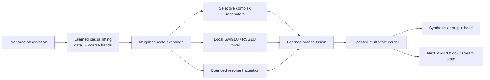
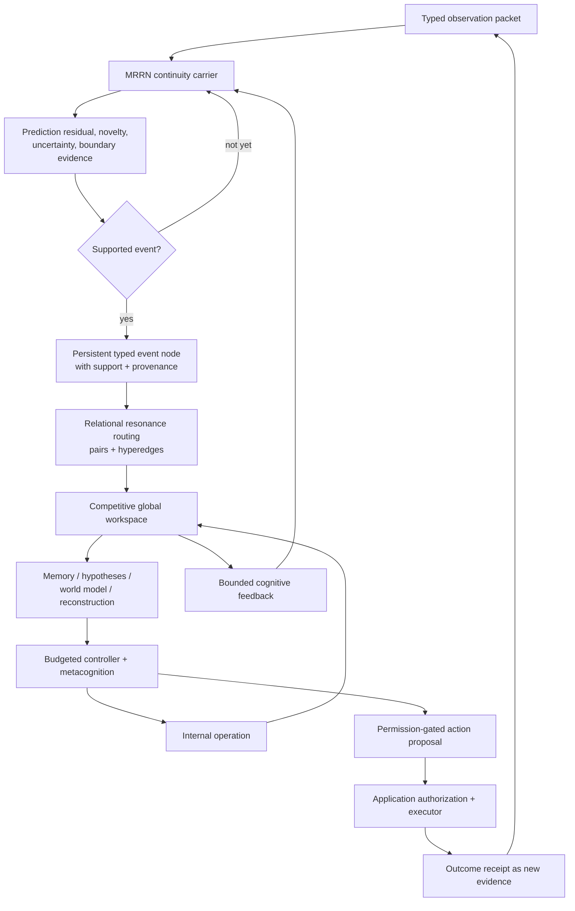
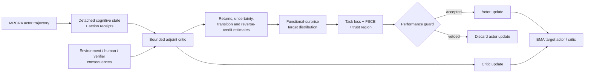

# MRCRA

## Multimodal Relational-Continuity Resonance Architecture

MRCRA is an experimental PyTorch architecture that combines a
**multiresolution spectral recurrent network** with a **bounded relational
cognitive substrate**. The dense spectral carrier preserves causal signal
history across multiple time scales; the sparse cognitive system turns salient
events into typed relations, memories, hypotheses, workspace state, and
permission-gated action proposals.

This repository contains the architecture, language-model interface, original
English FineWeb trainer, checkpointing and evaluation systems, Trackio
instrumentation, and executable acceptance evidence.

> **Project status:** research implementation. No pretrained production
> checkpoint is included. The repository validates mechanisms and causal
> contracts; it does not claim general intelligence, deployment maturity, or
> capabilities that have not been established by training and held-out
> evaluation.

[MRRN carrier](#1-mrrn-the-spectral-continuity-carrier) ·
[MRCRA cognition](#2-mrcra-the-cognitive-framework) ·
[Learning system](#critic-and-self-learning) ·
[Quick start](#quick-start) ·
[Model profiles](#model-profiles) ·
[Training](#fineweb-training) ·
[Dashboard](#trackio-dashboard) ·
[Documentation](#documentation) ·
[Validation](#validation-and-claim-boundaries)

## The core idea

MRCRA is best described as **a spectral continuity substrate inside a bounded
relational cognitive framework**.

- The **Multiresolution Resonance Network (MRRN)** is the dense carrier. It
  processes every valid input position and maintains causal, multiscale history
  in stable complex recurrent modes.
- **MRCRA** is the cognitive framework around that carrier. It promotes only
  selected events into explicit structure and coordinates relations, memory,
  hypotheses, reconstruction, uncertainty, internal operations, and authorized
  action.

The word *spectral* does not mean that tensors or learned vectors have been
abolished. Spectra are represented by ordinary real tensors. The difference is
that parts of the latent state are given explicit amplitude, phase, frequency,
decay, scale, and support semantics rather than being treated as interchangeable
feature coordinates.

The word *cognitive* is also used narrowly. It names an implemented organization
of recurrent perception, memory, prediction, relational structure, uncertainty,
and action selection. It is not a claim that an untrained checkpoint is
conscious, generally intelligent, or an empirical model of a biological brain.

## 1. MRRN: the spectral continuity carrier

### What the carrier is

The Multiresolution Resonance Network is a causal sequence and field model whose
persistent state is a hierarchy of damped complex oscillators. Each mode carries
four interpretable dynamical quantities:

| Quantity | Function |
| --- | --- |
| Amplitude | How strongly a pattern is currently represented |
| Phase | Where the pattern is within a learned temporal or spatial cycle |
| Frequency | How rapidly that phase evolves |
| Decay | How quickly the stored influence is forgotten |

Those modes operate at several physical resolutions. Fine scales preserve sharp
changes and precise timing. Coarser scales integrate progressively larger
regions. The result is not one global Fourier transform: it is a causal,
localized multiresolution hierarchy with recurrent state at every scale.

### Why it was made

A cognitive architecture needs a carrier that can preserve continuity without
turning every observation into a permanent graph node or revisiting every past
position at every step. Conventional approaches each solve only part of that
problem:

- dense self-attention can retrieve arbitrary details but normally expands its
  cache and pairwise work with context;
- a fixed recurrent state is streamable but must compress history;
- a global Fourier representation captures periodic structure but localizes
  abrupt events poorly;
- a local convolution or wavelet representation preserves events but does not
  by itself provide content-selective persistent state.

MRRN was developed to provide MRCRA with a **continuous, causal, multiscale
working medium**. The cognitive layer can then remain sparse and event-driven:
the carrier preserves the evolving field; the cognitive system reifies only the
parts that require explicit identity, provenance, relational structure, exact
retrieval, or deliberate control.

### How it works



1. **Preparation.** A modality adapter produces values plus masks, timestamps,
   sample intervals, coordinates, boundaries, source identity, and uncertainty
   metadata. Frequency is assigned only to an ordered or metric domain; an
   arbitrary feature axis is never relabeled as a physical spectrum.
2. **Transform-once lifting.** A learned causal lifting bank separates local
   detail from progressively slower approximations. Predictor and updater pairs
   are algebraically invertible, so downscaling need not silently discard the
   fine information.
3. **Multiscale exchange.** Completed fine-scale evidence is pooled causally
   toward neighboring coarse scales; aligned coarse context is projected back
   toward fine scales. The exchange is local in scale, bounded, and mask-aware.
4. **Resonant recurrence.** Each scale drives stable complex modes with
   content-dependent decay, phase increment, input direction, and readout
   direction. A work-efficient associative affine scan is used during parallel
   training; the identical recurrence is stepped directly during streaming.
5. **Local nonlinear computation.** A conventional SwiGLU-like path is blended
   with the Resonant Spectral GLU (RSGLU). RSGLU learns bounded amplitude gain,
   bounded phase rotation, and sparse sum/difference-frequency interactions.
   This gives the spectral state conditional nonlinear behavior without making
   the entire recurrent update unstable.
6. **Selected exact retrieval.** Attention is exact over an explicit bounded
   candidate set: a causal local window, aligned coarse landmarks, and selected
   memory items. It is not unrestricted dense attention over the full prefix.
7. **Branch fusion.** Identity, resonance, local mixing, and attention are
   combined by learned gates and small residual scales. This lets the network
   fall back toward an ordinary local model when spectral structure is not
   useful.
8. **Output and continuation.** The hierarchy is synthesized for a task output
   or retained directly as recurrent stream state. Streaming state is independent
   of total context length except for explicitly bounded recent windows and
   memory.

### The recurrent mathematics

For one scale, head, mode, and input lane, the continuous state begins with

$$
\frac{dz(t)}{dt} = \lambda(t)z(t) + g(t),
\qquad
\lambda(t) = -\alpha(t) + i\omega(t),
\qquad
\alpha(t) > 0.
$$

The real part, $-\alpha$, guarantees decay; the imaginary part, $\omega$,
rotates phase. MRRN uses an exponential-trapezoidal step. With
$q_t=\Delta_t\lambda_t$,

$$
z_t = e^{q_t}z_{t-1}
+ \Delta_t\left[\left(\varphi_1(q_t)-\varphi_2(q_t)\right)g_{t-1}
+ \varphi_2(q_t)g_t\right],
$$

where

$$
\varphi_1(q)=\frac{e^q-1}{q},
\qquad
\varphi_2(q)=\frac{e^q-1-q}{q^2}.
$$

Small-$q$ series are used near zero to avoid unstable division. Because
$|e^{q_t}|=e^{-\alpha_t\Delta_t}<1$, the isolated recurrence is contractive.
The drive is decay-normalized so that learning a longer half-life does not
automatically increase steady-state gain. Complex values are stored as paired
real numbers; ordinary CUDA, MPS, and CPU tensor kernels are sufficient.

This is the carrier's mathematical authority. The broader cognition definition
discussed below uses equations only as schematic state bookkeeping, not as
derived physical laws.

### How local and global context coexist

MRRN does not divide context into a purely local module and one all-seeing global
module. It obtains a continuum:

- a scale-$s$ coefficient summarizes approximately $2^s$ original positions;
- a window of $w$ coefficients at that scale covers approximately $w2^s$
  original positions;
- recurrent modes at every scale summarize the entire valid prefix, with
  different learned half-lives and frequencies;
- fine-to-coarse exchange carries innovations outward;
- coarse-to-fine exchange returns slower contextual constraints;
- selected memory and attention recover exact details that fixed-state
  compression cannot guarantee.

The carrier is therefore globally informed but not globally exact. This
distinction is fundamental: no finite recurrent state can losslessly preserve
an unbounded history.

### The attention equivalent

MRRN's attention mechanism asks a more structured question than raw dot-product
similarity: **does this candidate contain a compatible spectral pattern after
accounting for its time lag and physical scale?**

Queries and keys are projected into complex heads and bands. Their normalized
cross-spectrum is phase-rotated by the query-candidate lag. The score combines:

- phase-aligned coherence;
- query-key amplitude support;
- a learned distance penalty;
- a learned scale-distance penalty;
- causal and validity masks.

Values are phase-aligned by the same lag before weighted aggregation. Softmax is
exact over the supplied candidates and may be tiled without changing the result.
The approximation lies in **candidate selection**, not in the softmax
calculation. When an attention branch is scheduled, its local window is always
available; distant retrieval is bounded and its miss rate must be measured.

### What MRRN builds on

| Prior line of work | Inherited idea | MRRN specialization |
| --- | --- | --- |
| [Wavelet and lifting methods](https://arxiv.org/abs/2205.02191) | Localized multiresolution analysis | Learned causal perfect-reconstruction hierarchy retained through the network rather than repeated transforms |
| [Fourier Neural Operator](https://arxiv.org/abs/2010.08895), [FNet](https://arxiv.org/abs/2105.03824), and [Hyena](https://arxiv.org/abs/2302.10866) | Efficient global or long-range spectral/convolutional mixing | Localized scale hierarchy plus recurrent resonant state instead of a single global transform |
| [S4](https://arxiv.org/abs/2111.00396), [Mamba](https://arxiv.org/abs/2312.00752), and [Mamba-2](https://arxiv.org/abs/2405.21060) | Structured, selective, hardware-aware state-space sequence modeling | Explicit complex oscillatory modes at several physical resolutions with neighbor-scale exchange |
| [Unitary RNNs](https://arxiv.org/abs/1511.06464) | Complex recurrence for long-range dynamics | Strictly damped, input-selective poles that expose a controlled stability-memory tradeoff |
| [RoPE](https://arxiv.org/abs/2104.09864) | Relative displacement represented through rotation | Phase is persistent dynamical state and is also used for lag-aligned candidate coherence |
| [FlashAttention](https://arxiv.org/abs/2205.14135) | Exact tiled softmax and I/O-aware execution | Exact attention only inside a bounded, multiscale candidate contract |
| [External neural memory](https://arxiv.org/abs/1410.5401) | Exact information cannot be guaranteed by fixed recurrent state | Bounded recent/eidetic retrieval with cheap routing, exact reranking, causality, and versioned eviction |

These sources support ingredients and limitations; none validates MRRN as a
whole.

### What MRRN contributes

The claimed contribution is a **specific implemented synthesis**, not a claim
that complex numbers, wavelets, state-space models, or memory are individually
new:

- one transform-once, perfect-reconstruction hierarchy coupled to selective
  complex recurrence at every scale;
- decay-normalized resonant drive, so persistence and gain cannot be conflated;
- bidirectional neighboring-scale exchange with causal physical support;
- resonant coherence attention that aligns phase by lag and scale over bounded
  candidates;
- a hybrid conventional/spectral activation with bounded gain, bounded phase,
  and frequency-legal triads;
- one carrier contract shared by batch training, chunked execution, recurrent
  generation, cognitive event extraction, and diagnostic instrumentation.

Whether this synthesis improves quality, efficiency, or extrapolation over
matched modern baselines remains an empirical question.

## 2. MRCRA: the cognitive framework

### What the complete architecture is

MRCRA couples the MRRN carrier to a bounded, event-driven relational system.
Dense carrier state remains continuous and distributed. Explicit cognitive
state is sparse, typed, capacity-limited, and provenance-bearing.

This separation solves a practical representation problem:

- continuous context, weak signals, and gradual change remain cheap in MRRN;
- events that need identity become nodes;
- important relations become typed edges or hyperedges;
- selected exact detail enters episodic memory;
- repeatedly validated structure may enter semantic memory;
- uncertainty, hypotheses, and simulations remain distinguishable from
  observations;
- internal operations receive finite budgets;
- external actions remain behind application-owned authority.

MRRN was developed specifically for this role. A graph-only architecture would
have to decide what every input *is* before it had enough temporal context; a
token-only carrier would leave durable identity, provenance, alternatives, and
action authority implicit. MRRN supplies the continuity field from which MRCRA
can form and revise explicit structure.

### The cognitive cycle



| Subsystem | Local role | System-wide role |
| --- | --- | --- |
| Event extractor and allocator | Detects completed, supported changes without future leakage | Converts dense continuity into persistent identity under a hard event quota |
| Typed relation graph | Scores bounded candidate pairs and writes compatible relations/hyperedges | Makes entity, role, temporal, causal, analogical, and system relations explicit |
| Provenance ledger | Records source, support interval, derivation parents, scenario, and verification | Prevents predictions, reconstructions, simulations, and observations from becoming silently interchangeable |
| Global workspace | Runs competitive selection over active structure | Broadcasts a small relevant state back into cognition and the carrier |
| Episodic memory | Preserves selected exact events and relations | Supports delayed retrieval without pretending the recurrent carrier is lossless |
| Semantic memory and knowledge validation | Consolidates only evidence-backed reusable structure | Separates a learned proposal from accepted knowledge |
| Hypothesis bank | Maintains bounded alternatives and an explicit unknown option | Prevents premature collapse to one interpretation |
| World model | Predicts multihorizon latent, reward, cost, constraint, and success consequences | Supplies conditional futures for comparison and control |
| Reconstruction and abstraction control | Reconstructs local detail and tests whether a compressed representation remains applicable | Moves toward finer resolution when uncertainty or contradiction invalidates the current abstraction |
| Invariant discovery | Tests candidate structure across transformations and examples | Supports reusable relational regularities without equating compression with truth |
| Uncertainty and calibration | Separates uncertainty channels and evaluates prediction calibration | Controls abstention, evidence requests, semantic promotion, and action risk |
| Adaptive controller | Selects bounded internal operations and halting | Allocates expensive computation only when its predicted value justifies the cost |
| Metacognitive router | Predicts error and the marginal value of retrieval, reconstruction, simulation, evidence, and more compute | Builds a bounded, provenance-bearing technical self-model of the system's own operations |
| Agent boundary | Produces structured proposals | Requires capability, permission, provenance, viability, and executor receipts before an external effect |

### From the working definition to the implementation

The architecture was designed as a computational interpretation of a *General
Working Definition of Cognition*: cognition as a physically bounded,
self-modifying continuum of relational state updates that preserves useful
continuity, compresses recurring structure, reconstructs detail when necessary,
and changes its own future information through internal operations and action.

That definition is a design framework, not an established scientific consensus
or a proof of cognition. Its equations are schematic descriptions of interacting
state, not mathematical laws. MRCRA implements the principles through explicit,
testable contracts:

| Working principle | Architectural realization |
| --- | --- |
| Scale-flexible relational continuity | MRRN multiresolution state, typed event support intervals, temporal boundaries, and cross-scale routing |
| Physical constraint and bounded resources | Fixed graph capacities, bounded candidate attention, memory quotas, controller step budgets, and explicit halting |
| Adaptive relational compression | Event promotion, graph compression, abstraction applicability tests, and semantic consolidation gates |
| Generative reconstruction rather than perfect archival recall | Conditional graph reconstruction from traces, context, and evidence, with historical-fidelity estimates |
| Provenance of sensed, inferred, predicted, imagined, and reconstructed state | Immutable provenance DAG, source and verification classes, scenario IDs, versions, and revocation |
| External and internally generated content share an active field | Observation packets, retrieved memory, hypotheses, goals, simulations, symbols, and workspace broadcasts enter one bounded cycle while retaining type |
| Cognition changes its effective environment | Internal operations alter later routing; authorized external actions return executor receipts as new observations |
| Stability/plasticity balance | Stable resonant poles, fast recurrent state, medium-term memory, slower parameter learning, replay, trust regions, retention tests, and rollback |
| Agency and self-modeling as higher-order regimes | Alternative action evaluation, world prediction, adaptive control, and metacognitive value/error heads; their presence enables these functions but does not prove emergent agency |
| Intelligence as reusable relational invariants | Invariant proposals must preserve predictive, relational, reconstruction, and counterexample performance before promotion |
| Highest valid abstraction plus local correction | Abstraction selection handles the common case; novelty, uncertainty, contradiction, or boundary failure triggers localized descent |

This is why “spectral intelligence substrate” is only half the description.
MRRN provides continuity, delay, scale, and efficient recurrent context. MRCRA
provides explicit relation, epistemic status, memory policy, alternatives,
correction, and action constraint. The intended unit is the coupled loop.

### Critic and self-learning

MRCRA contains a separate training system called the **Cognitive Resonant
Adjoint Surprise Learner (RASL)**. “Self-learning” here means that the actor can
change from measured consequences of its own trajectories. It does not mean
unrestricted autonomous weight modification.



The learning path has several important safeguards:

1. **Bounded actions.** For language, the critic evaluates at most 64 explicit
   candidates per position: the behavior token, high-policy candidates,
   verifier alternatives when available, and sampled negatives with recorded
   proposal probabilities. It never constructs a
   `time × vocabulary × critic` tensor.
2. **Critic gradient firewall.** Cognitive features, workspace state, relation
   probabilities, action receipts, goals, and candidate embeddings are detached
   before critic evaluation. Critic optimization therefore cannot update the
   actor through a hidden gradient path.
3. **Consequence modeling.** The critic estimates return quantiles, immediate
   reward, termination, relation transitions, memory utility, cognitive-state
   transitions, epistemic/aleatoric uncertainty, and reverse consequence credit.
4. **Functional surprise.** A stop-gradient target combines signed return
   surprise, counterfactual advantage, reverse credit, phase/transition error,
   learning progress, uncertainty, and estimated controllability. The actor is
   trained by cross-entropy toward that bounded target while retaining the
   ordinary task objective and a KL trust region.
5. **Target networks and replay.** EMA actor and critic copies are maintained;
   the current cognitive learner uses the target critic for bootstrapped value
   targets. Bounded prioritized replay preserves recurrent burn-in and
   prioritizes experience only when surprise is also learnable and controllable.
6. **Performance veto.** If the proxy surprise loss improves while measured
   downstream performance regresses beyond tolerance, the actor step is
   rejected. Proxy optimization is never allowed to redefine success.
7. **Transactional continual adaptation.** A separate optional adapter path can
   modify only an explicit parameter allowlist. Base weights are fingerprinted;
   candidate changes are committed only after an application-supplied retention
   evaluation, otherwise parameters and optimizer state are rolled back.

The actor objective is conceptually

$$
\mathcal L_{\text{actor}}
= \lambda_{\text{task}}\mathcal L_{\text{task}}
+ \lambda_{\text{FS}}\mathcal L_{\text{functional-surprise CE}}
+ \lambda_{\text{trust}}D_{\mathrm{KL}}(\pi_{\text{target}}\|\pi_{\text{actor}}).
$$

Functional-surprise learning is **genuine reinforcement only when the reward is
an external downstream consequence** supplied by an environment, human, or
verifier. If reward is merely negative next-token cross-entropy, the mechanism
is hard-example reweighting, not reinforcement learning. The production
FineWeb trainer therefore leaves RASL disabled.

| Learning timescale | What changes | Authority |
| --- | --- | --- |
| Every valid position | MRRN recurrent state | Current causal input and retained stream state |
| Event/cognitive cycle | Nodes, relations, workspace, hypotheses, uncertainty, memory proposals | Learned proposals under hard capacities and type/provenance rules |
| Supervised training | Carrier and cognitive actor parameters | Exact task loss plus evidence-backed auxiliary targets |
| Consequence learning | Critic, then guarded actor update | Environment/human/verifier outcomes, gradient firewall, trust region, performance veto |
| Continual adaptation | Explicit adapter allowlist only | Replay, retention evaluator, exact commit or rollback |
| Semantic consolidation | Accepted reusable knowledge | Repeated support, prediction/reconstruction validity, distortion and provenance gates |

### What the full architecture builds on

| Prior line of work | Inherited idea | MRCRA specialization |
| --- | --- | --- |
| [Slot Attention](https://arxiv.org/abs/2006.15055) and [shared global workspaces](https://arxiv.org/abs/2103.01197) | Bounded competition can form task-relevant entities and coordinate specialist state | Persistent typed nodes, support intervals, provenance, explicit relation incidence, and carrier feedback rather than exchangeable content slots alone |
| [Graph Networks](https://arxiv.org/abs/1806.01261), interaction networks, and relational GNNs | Entities and relations provide a strong compositional inductive bias | Event-rate typed pair/hyperedge graph coupled to a continuous spectral carrier |
| [Neural Turing Machines](https://arxiv.org/abs/1410.5401) and [Differentiable Neural Computers](https://www.nature.com/articles/nature20101) | Learned systems benefit from explicit external memory | Separate bounded episodic and semantic tiers with evidence, causal query time, exact reranking, versioning, and consolidation authority |
| [DreamerV3](https://arxiv.org/abs/2301.04104) and latent world models | Action-conditioned latent prediction supports planning and learning from consequences | Multihorizon latent/reward/cost/constraint/success heads tied to hypotheses, uncertainty, viability, and authorized actions |
| [Adaptive Computation Time](https://arxiv.org/abs/1603.08983) and [PonderNet](https://arxiv.org/abs/2107.05407) | Computation can be allocated according to input difficulty | Event-triggered internal operations with hard step budgets, operation costs, predicted marginal value, and explicit halt receipts |
| [Distributional RL](https://arxiv.org/abs/1710.10044) and [deep ensembles](https://arxiv.org/abs/1612.01474) | Return distributions and model disagreement expose uncertainty | Bootstrap/quantile critic plus decomposed epistemic and aleatoric channels used in surprise weighting and abstention |
| [Predictive and causal representation learning](https://arxiv.org/abs/2102.11107) | Prediction error, interventions, and invariance can reveal structure | Evidence-gated event formation, conditional invariant proposals, counterexamples, provenance, and action receipts |
| Continual learning with replay and rollback | Adaptation must preserve prior competence | Parameter allowlists, bounded replay, retention gates, immutable base checks, and exact transactional rollback |

Established ingredients include selective recurrence, competitive slots, typed
graphs, external memory, world models, uncertainty estimation, adaptive compute,
and actor-critic learning. MRCRA's contribution is their explicit division of
labor around an MRRN continuity carrier, together with hard epistemic and action
authority boundaries.

### What MRCRA contributes

- **Dense-sparse coupling:** every position receives continuous multiscale
  processing, while explicit graph computation occurs only at supported events.
- **Carrier-to-cognition-to-carrier recurrence:** cognitive workspace state
  feeds back into the same spectral stream that produced the events.
- **Authoritative metadata:** learned content cannot rewrite node identity,
  relation type, physical support, source class, verification state, scenario,
  permission, or observed-versus-predicted status.
- **Explicit abstraction failure:** compression and invariants are provisional;
  uncertainty, novelty, contradiction, and counterexamples can trigger
  localized reconstruction and descent.
- **Bounded multi-hypothesis cognition:** alternatives remain explicit without
  duplicating the full network, including an unknown hypothesis.
- **Consequence learning with a firewall:** the critic observes cognitive
  operation and outcome but cannot backpropagate into the actor; actor changes
  require a separate guarded objective.
- **Fail-closed action:** the neural system proposes; application-owned
  capability, permission, provenance, viability, and execution logic decides.
- **Mechanism-level observability:** spectral state, event thresholds, cognitive
  gradients, causal ablations, memory, uncertainty, provenance, and action gates
  are exposed without giving telemetry control authority.

This exact unification should be treated as experimental until matched ablations
and trained-checkpoint evaluations establish which parts are useful. The
architecture enables phase-transition-like changes in functional regime, but it
does not assume or claim that agency, reflection, or general intelligence must
emerge at a universal threshold.

### Multimodal boundary

The cognitive network consumes typed observation packets rather than assuming
that every input is a one-dimensional token sequence. Modality preparation for
text, audio, images, video, fields, graphs, and sets lives in
[`src/mrrn/modalities.py`](src/mrrn/modalities.py). Masks, timestamps,
coordinates, sample intervals, segment boundaries, uncertainty seeds, source
identities, and provenance accompany learned values into the model.

The included end-to-end trainer is specifically an English language-model
trainer. Other modalities require an application to provide their observation
packets and evidence-backed training targets; unordered structures are not
silently flattened into the temporal carrier.

## Model profiles

The model sizes below use the GPT-2 vocabulary of 50,257 tokens.

| Profile | Parameters | Carrier | Intended use | Selection |
| --- | ---: | --- | --- | --- |
| Integrated light | 8,413,442 | 5 scales, shared learned depth, 96-wide base | Local development, architecture experiments, and lower-cost training while retaining the complete cognitive substrate | `--lightmodel` |
| Serious | 115,925,944 | 6 scales, unshared learned depth, 256-wide base | Full architecture training and serious evaluation | Default |
| Legacy sequence MRRN | 4,695,023 | Sequence-only spectral carrier | Compatibility and carrier-only ablation | `--legacy-mrrn` |

The parameter counts are construction-time invariants, not rounded marketing
targets. Reproduce the audits with:

```bash
python scripts/report_mrcra_parameters.py --lightmodel
python scripts/report_mrcra_parameters.py
```

Detailed subsystem allocations are retained in
[`outputs/mrcra_8p4m_parameter_report.json`](outputs/mrcra_8p4m_parameter_report.json)
and
[`outputs/mrcra_120m_parameter_report.json`](outputs/mrcra_120m_parameter_report.json).

## Quick start

MRCRA requires Python 3.11 or newer.

### Linux or macOS

```bash
git clone https://github.com/leatherman55/MRCRA.git
cd MRCRA
python3.11 -m venv .venv
source .venv/bin/activate
python -m pip install --upgrade pip
python -m pip install -r requirements.txt
```

### Windows PowerShell

```powershell
git clone https://github.com/leatherman55/MRCRA.git
cd MRCRA
py -3.11 -m venv .venv
Set-ExecutionPolicy -Scope Process Bypass
.\.venv\Scripts\Activate.ps1
python -m pip install --upgrade pip
python -m pip install -r requirements.txt
```

For NVIDIA training, install the CUDA-enabled PyTorch wheel selected by the
[official PyTorch installer](https://pytorch.org/get-started/locally/) before
installing `requirements.txt`. A separate system CUDA toolkit is not required
for official PyTorch wheels.

### Verify the installation

The smoke test uses a tiny local model and does not download FineWeb:

```bash
python scripts/train_fineweb.py \
  --smoke-test \
  --no-trackio \
  --no-dashboard \
  --output-dir work/mrcra-smoke
```

Run the complete Python test suite with:

```bash
python -m pytest
```

## Python API

The following constructs an **untrained** integrated light model and demonstrates
the output contract:

```python
import torch
from mrrn import MRCRAConfig, MRCRALanguageModel

vocabulary_size = 50_257
config = MRCRAConfig.light_8p4m(output_dim=vocabulary_size)
model = MRCRALanguageModel(config)

tokens = torch.randint(0, vocabulary_size, (1, 128))
output = model(tokens, source_uris=("example://prompt",))

logits = output.logits
nodes = output.cognitive.nodes
relations = output.cognitive.relations
workspace = output.cognitive.workspace
uncertainty = output.cognitive.uncertainty
provenance = output.ledger
```

Generation preserves recurrent cognitive state and records generated tokens as
predictions rather than observations:

```python
generated = model.generate(
    tokens[:, :16],
    maximum_new_tokens=32,
    temperature=0.8,
    top_k=50,
    top_p=0.95,
)

generated_tokens = generated.tokens
generated_provenance_ids = generated.generated_provenance_ids
```

Meaningful generation requires trained weights. Checkpoint identity includes the
complete model configuration, so incompatible profiles cannot be silently mixed.

## FineWeb training

[`scripts/train_fineweb.py`](scripts/train_fineweb.py) is the canonical training
entrypoint. A normal invocation trains the integrated serious MRCRA model; it
never silently falls back to the legacy sequence-only carrier.

### Recommended first substantial run

```bash
python scripts/train_fineweb.py \
  --lightmodel \
  --total-tokens 20000000
```

### Serious profile

```bash
python scripts/train_fineweb.py \
  --total-tokens 20000000
```

### Resume a run

`--resume` loads the latest checkpoint in the resolved output directory:

```bash
python scripts/train_fineweb.py \
  --lightmodel \
  --total-tokens 20000000 \
  --resume
```

If you change the total-token target while extending a run, reuse the original
directory explicitly because the default light-model directory includes the
token budget:

```bash
python scripts/train_fineweb.py \
  --lightmodel \
  --total-tokens 32000000 \
  --output-dir outputs/my-light-run \
  --resume
```

### Device selection

`--device auto` is the default:

- CUDA is selected first when available.
- CUDA uses BF16 when supported and dynamically scaled FP16 otherwise.
- Pure carrier tensor kernels are compiled automatically on CUDA.
- On Apple silicon, the integrated light model defaults to CPU because its
  heterogeneous cognitive graph is launch-bound on MPS in matched local probes.
- Explicit `cpu`, `mps`, `cuda`, and indexed CUDA devices remain available.

Examples:

```bash
python scripts/train_fineweb.py --lightmodel --device cuda:0 --precision bf16
python scripts/train_fineweb.py --lightmodel --device cpu --cpu-threads 4
python scripts/train_fineweb.py --lightmodel --device mps
```

The built-in trainer is single-process and single-device. It does not claim
multi-GPU data or model parallelism.

An optional MLX backend is available on Apple silicon for supported carrier
inference and recurrent decode:

```bash
python -m pip install -e '.[apple]'
```

It imports the same learned weights and fails closed for unsupported topology.
The complete relational cognitive authority path remains the PyTorch reference.

### Default data and context contract

| Setting | Default |
| --- | --- |
| Dataset | Original English `HuggingFaceFW/fineweb`, configuration `sample-10BT` |
| Tokenizer | GPT-2 BPE |
| Optimization context | 32,768 tokens |
| Carrier execution chunk | 256 tokens |
| Carrier TBPTT span | 4,096 tokens |
| Cognitive TBPTT horizon | 4 event cycles |
| Full-softmax tile | 2,048 vocabulary entries |
| Held-out split | Stable document-ID hash, 1% |
| Evaluation/checkpoint interval | 25 optimizer updates |

Dataset and tokenizer revisions are pinned before training. Documents are packed
for throughput, but document transitions are excluded from next-token loss and
reset recurrent and cognitive state. Full-vocabulary cross entropy is exact and
tiled for memory control; it is not sampled or approximated.

Raw FineWeb supplies language targets but no external downstream consequence.
The FineWeb stage therefore does **not** enable functional-surprise reinforcement
learning by treating task loss as reward. RASL is available only for trajectories
with a legitimate environment, verifier, or preference consequence.

### Run outputs

Each run directory contains the durable state required for exact continuation:

```text
run_manifest.json
metrics.jsonl
checkpoints/
diagnostics/
```

Checkpoints include model, optimizer, scheduler, AMP scaler, stream position,
packer buffers, retained runtime state, provenance ledger, and random state.
Local run directories and weight files are excluded from Git by default.

## Trackio dashboard

Trackio logging and the local dashboard are enabled by default during training.
MRCRA adds two architecture-specific tabs:

- **Spectral Network:** training stability, token-scale resonance, learned
  spectral activation triads, pole/phase structure, and phase-transition
  telemetry.
- **MRCRA Cognition:** typed event graphs, reconstruction, deliberation,
  hypotheses, viability, invariant transfer, uncertainty, memory, provenance,
  and action authorization.

The trainer also records matched **full**, **soft-only**, and **cognition-off**
evaluation arms so cognitive contributions can be measured on identical retained
data.

Reopen the dashboard with:

```bash
PYTHONPATH=src python scripts/show_trackio_dashboard.py \
  --project mrcra-fineweb
```

Disable UI launch while retaining or disabling logging independently:

```bash
python scripts/train_fineweb.py --lightmodel --no-dashboard
python scripts/train_fineweb.py --lightmodel --no-trackio --no-dashboard
```

Dashboard artifacts are diagnostic observers. They do not participate in model
authority, optimization decisions, or external action permission.

## External actions and application authority

The neural model never calls tools or changes an environment directly.
Application integration uses `CognitiveAgentSession`, an application-owned
`ActionSchemaRegistry`, explicit authorized goals, viability authority when
enabled, and a structured executor.

The session owns:

```text
observe → deliberate → authorize → execute → ingest receipt
```

Learned utility cannot bypass capability, permission, provenance, viability, or
abstention gates. Simulation remains scenario-tagged, and environment feedback
updates the measured system model without granting new permissions.

## Repository layout

```text
src/mrrn/              Architecture, language interface, training, and runtime
scripts/               Training, parameter audits, benchmarks, and verification
tests/                 Unit, integration, causal, and acceptance tests
trackio_frontend/      Spectral Network and MRCRA Cognition dashboard source
outputs/               Small retained specifications and evidence artifacts
spec/                  Machine-readable traceability ledgers
```

Large checkpoints, local datasets, Trackio databases, build products, and active
training runs are intentionally not stored in the public repository.

## Documentation

| Document | Contents |
| --- | --- |
| [MRCRA architecture specification](outputs/multimodal_relational_continuity_resonance_architecture.md) | Complete cognitive architecture, invariants, authority boundaries, training contracts, and acceptance criteria |
| [MRRN mathematical specification](outputs/multiresolution_resonance_network_spec.md) | Spectral carrier equations, attention, recurrent state, activation, input/output contracts, and scaling behavior |
| [8.4M parameter audit](outputs/mrcra_8p4m_parameter_report.json) | Exact light-profile configuration and subsystem parameter allocation |
| [115.9M parameter audit](outputs/mrcra_120m_parameter_report.json) | Exact serious-profile configuration and subsystem parameter allocation |
| [Acceptance manifest](outputs/mrcra_acceptance_manifest.json) | Environment, commands, source hashes, and retained verification results |
| [Evidence ledger](spec/mrcra_evidence.json) | Machine-readable mapping from specification requirements to implementation and tests |

## Validation and claim boundaries

Run the repository-wide acceptance workflow with:

```bash
python scripts/run_mrcra_acceptance.py
python scripts/build_mrcra_evidence.py
```

The retained initial-public-release evidence records:

- 536 passing Python tests and 1 skipped test;
- passing frontend tests, lint, and production build;
- passing empirical mechanism acceptance;
- passing integrated cognitive-path acceptance;
- passing bounded performance acceptance;
- source hashes for every retained acceptance input.

These results establish implemented contracts, bounded causal effects, exact
resume behavior, and local mechanism learnability. They do not substitute for a
seriously trained checkpoint, broad downstream evaluation, target-hardware
qualification, or evidence of general cognition.

## License

No license file is currently included. Public visibility alone does not grant
permission to reuse, modify, or redistribute the code. Add an explicit license
before treating this repository as an open-source release.
