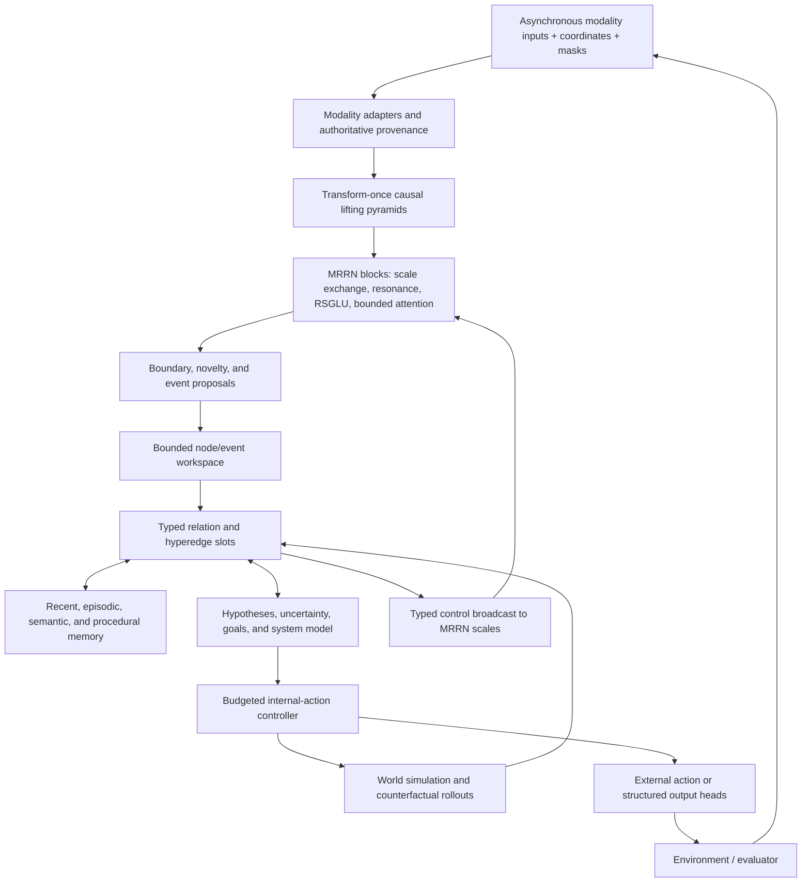

# Multimodal Relational-Continuity Resonance Architecture

## Canonical architecture and implementation specification

**Working name:** MRCRA  
**Status:** normative architecture plus implemented production baseline and bounded learned-behavior acceptance; serious-scale capability remains empirical  
**Date:** 22 July 2026  
**Target:** a bounded, causal, multimodal cognitive architecture built on the MRRN continuity substrate  
**Serious actor scale:** exactly 115,931,878 trainable parameters with the GPT-2 vocabulary and default CSTM head, inside the declared 110M–125M 120M-class envelope  
**Maximum designed sequence span:** 32,768 finest-scale positions per training example or prefill; recurrent generation may continue beyond that span with bounded neural state

---

## 0. Executive decision

The architecture to implement is not a literal conversion of every noun in the source document into a separate neural module, and it is not an MRRN with a generic graph network attached to its output. It is a coupled system with two deliberately different computational regimes:

1. **The MRRN continuity substrate** remains the dense, causal, transform-once path over every input position. It performs invertible multiresolution organization, stable complex recurrence, cross-scale exchange, learned spectral nonlinearity, bounded candidate attention, and selected exact retrieval.
2. **A bounded relational workspace** operates on events, entities, hypotheses, goals, memories, and abstractions rather than on all raw positions. It constructs explicit typed relations, maintains provenance and uncertainty, performs a small number of internal operations, and broadcasts its conclusions back into the multiresolution substrate.

This separation is the central design choice. A token-level dynamic hypergraph over 32,768 positions would recreate quadratic or highly irregular computation. A single fixed recurrent vector would erase exactly the entity, provenance, hypothesis, and compositional structure required by the cognitive specification. MRCRA therefore uses dense linear-context recurrence for continuous context and a bounded explicit graph for discrete relational structure.

The resulting architecture can be summarized as:

\[
\boxed{
\text{MRCRA}
=
\text{multiresolution resonant continuity}
+
\text{event formation}
+
\text{typed relational workspace}
+
\text{tiered memory}
+
\text{uncertain world simulation}
+
\text{budgeted internal control}
}
\]

The source architecture's central cycle is retained in operational form:

\[
\boxed{
\text{detect continuity or rupture}
\rightarrow
\text{propose typed relations}
\rightarrow
\text{compress reusable structure}
\rightarrow
\text{retrieve or simulate when needed}
\rightarrow
\text{test by prediction or intervention}
\rightarrow
\text{revise confidence, memory, and policy}
}
\]

### 0.1 What this architecture does not claim

MRCRA is a research architecture, not a demonstrated theory of general cognition. The repository implements and unit/integration-tests the bounded carrier, typed workspace, provenance, tiered memory, hypotheses, world model, controller, candidate-bounded RASL, exact tiled likelihood, checkpointing, and diagnostic paths. A deterministic bounded empirical suite additionally demonstrates learnable cross-modal binding, delayed retrieval utility, validated graph compression, calibrated alternatives, action-conditioned prediction, adaptive compute, delayed consequence learning, and replay/rollback on controlled synthetic tasks. It does not yet demonstrate open-domain typed reasoning, serious-scale multimodal competence, useful 32K semantic recall, or general cognitive capability. Bounded mechanism learnability is evidence for the design, not proof of broad capability.

The architecture does not claim that:

- frequency coefficients cease to be vectors or tensors;
- phase intrinsically carries semantics without learned grounding;
- correlation, prediction, or temporal precedence establishes causation;
- a fixed recurrent state can preserve arbitrary unbounded history;
- sparse candidate attention is identical to unrestricted dense attention;
- learned symbols obey formal logic unless a typed executor enforces it;
- uncertainty estimates remain calibrated under arbitrary distribution shift;
- test-time weight updates are safe merely because surprise is bounded;
- any 120M model can be seriously trained on only 20 million tokens.

### 0.2 Status labels used below

- **Existing substrate (E):** inherited MRRN mechanism covered by direct component or integration tests.
- **Implemented integration (I):** present in the integrated MRCRA runtime and covered by direct component or integration tests; learned task utility may still require a later gate.
- **Conditional mechanism (A):** part of the canonical interface and enabled only on applicable tasks or modalities.
- **Research extension (R):** deliberately outside the initial acceptance boundary; it may be tested later without changing the core contracts.

### 0.3 Capability added beyond the present MRRN

The present MRRN can encode multiscale context, track stable recurrent dynamics, mix locally, attend to bounded candidates, and expose a bounded memory interface. MRCRA adds the structures needed to make those capabilities explicitly cognitive and compositional:

- persistent entity and event identity rather than only distributed sequence state;
- named relation families and participant roles rather than implicit pairwise mixing;
- cross-modal `same event` and `same entity` hypotheses with explicit alternatives;
- exact source distinction among observation, retrieval, prediction, and simulation;
- controlled episodic-to-semantic consolidation with conditions and counterexamples;
- several simultaneous hypotheses instead of one forced latent interpretation;
- action-conditioned world simulation and information-seeking tests;
- high-level symbolic procedures that can fall back to fine detail under uncertainty;
- explicit attribution of memory misses, router misses, model uncertainty, and contradiction;
- event-triggered adaptive computation instead of applying every expensive operation everywhere.

These mechanisms do not create abilities automatically. They make the required state and operations representable, trainable, inspectable, and falsifiable.

---

## 1. Corrections and refinements to the source specification

The source document provides the right functional ontology, but several concepts must be sharpened before implementation.

### 1.1 Three clocks, not one

The source uses one index \(t\) for perception, internal thought, environmental transition, memory change, and parameter learning. Those events do not share one clock. MRCRA uses:

- \(t\): external or evidence time; a new observation or environment transition;
- \(c\): internal cognitive microstep performed while external time is held fixed;
- \(u\): optimizer update index;
- \(s\): physical resolution scale;
- \(\ell\): network depth or recurrent block application;
- \(a\): dynamic abstraction depth in the workspace.

This prevents a retrieval or simulation step from being mistaken for elapsed environment time and prevents an inference-state update from being mistaken for a weight update.

### 1.2 Three distinct spectral meanings

The following must never be conflated:

1. **analysis-band scale**, produced by the lifting hierarchy;
2. **dynamical frequency**, the learned rotation rate of a resonant pole;
3. **relative positional phase**, the phase adjustment associated with a temporal or spatial displacement.

The model may learn relations among them, but their metadata and parameterizations remain separate.

### 1.3 Physical resolution is not abstraction depth

The MRRN lifting pyramid is a fixed physical hierarchy: scale \(s\) changes sample support and coefficient rate. The cognitive hierarchy is a dynamic abstraction DAG: an invariant or symbol can summarize children from several scales, modalities, and times. A coarse coefficient is not automatically a concept, and a concept is not required to live only at the coarsest band.

### 1.4 Learned content is not authoritative metadata

Source class, parentage, timestamp, scenario identity, action authority, and external verification cannot be trusted to a learned embedding alone. MRCRA maintains:

- a compact differentiable provenance feature vector used by neural modules; and
- an immutable sidecar provenance record used as the authority for source-sensitive operations.

The learned state may predict that something was observed. It cannot change the authoritative record from `simulated` to `observed`.

### 1.5 Fast state, memory, and weights are different kinds of plasticity

The source permits general self-modification. The canonical architecture separates:

- **fast activation:** resonator state, workspace state, active hypotheses;
- **fast writeable memory:** bounded episodic records and retrieval indices;
- **slow semantic consolidation:** invariant records, prototypes, and optional adapters;
- **parameter learning:** gradient updates at optimizer time \(u\).

Normal inference does not update base weights. Test-time parameter learning is a research extension requiring a separate optimizer, rollback checkpoint, trust region, and performance guard.

### 1.6 Causation requires more than temporal prediction

Temporal order, predictive utility, and phase-consistent delay are evidence for directed dependence, not proof of causation. A relation may be promoted to `causal` only when supported by interventions, randomized variation, a validated causal model, or supplied causal supervision. Otherwise its type remains `predictive`, `temporal`, or `correlational` with calibrated confidence.

### 1.7 Mutual information and MDL are design principles, not directly computable losses

Exact mutual information and exact description length are normally unavailable for high-dimensional learned states. MRCRA uses tractable proxies:

- variational rate terms or quantized code-length estimates;
- reconstruction and predictive negative log likelihood;
- explicit slot, edge, and pointer costs;
- held-out distortion and counterexample rates;
- intervention or transformation consistency.

The system never reports an exact information-theoretic quantity when it has only optimized a proxy.

---

## 2. Complete state and transition semantics

At external time \(t\), internal microstep \(c\), and optimizer step \(u\), define:

\[
\Omega_{t,c;u}=
\left(
\mathcal R_{t,c},
\mathcal W_{t,c},
\mathcal M^E_{t,c},
\mathcal M^S_{t,c},
\mathcal G_{t,c},
\mathcal H_{t,c},
\mathcal U_{t,c},
\mathcal P_{t,c},
\mathcal C_{t,c};
\theta_u
\right).
\]

The components are:

| State | Meaning |
|---|---|
| \(\mathcal R\) | multiresolution coefficient streams, complex resonator states, recent windows, lifting carries, and cross-scale buffers |
| \(\mathcal W\) | bounded active typed graph of node slots, relation slots, bindings, active abstractions, and read/write masks |
| \(\mathcal M^E\) | episodic memory containing source-preserving event records |
| \(\mathcal M^S\) | semantic memory containing conditional invariants, schemas, symbols, and their failure conditions |
| \(\mathcal G\) | active goal, constraint, preference, and available-action state |
| \(\mathcal H\) | weighted counterfactual or explanatory hypothesis slots |
| \(\mathcal U\) | aleatoric, epistemic, calibration, conflict, and source-reliability estimates |
| \(\mathcal P\) | differentiable provenance features plus references to immutable provenance records |
| \(\mathcal C\) | controller state, compute budget, halting probability, internal action history, and system-capability estimates |
| \(\theta_u\) | slowly learned parameters, fixed throughout an ordinary inference episode |

### 2.1 Observation transition

The environment evolves only under an external action or exogenous change:

\[
E_{t+1}=F_E(E_t,a^{\mathrm{ext}}_t,\xi_t),
\qquad
X_{t+1}=O(E_{t+1}).
\]

The modality front ends ingest \(X_{t+1}\), attach authoritative source metadata, and update the spectral substrate:

\[
\mathcal R_{t+1,0}=F_{\mathrm{ingest},\theta_u}
\left(\mathcal R_{t,C_t},X_{t+1},P_{t+1}\right).
\]

### 2.2 Internal transition

Internal actions do not advance \(t\):

\[
\Omega_{t,c+1;u}^{\mathrm{fast}}
=
F_{\mathrm{cog},\theta_u}
\left(
\Omega_{t,c;u}^{\mathrm{fast}},
a^{\mathrm{int}}_{t,c}
\right),
\qquad c<C_{\max}.
\]

The controller may retrieve, bind, compare, compress, expand, simulate, test, write, abstain, or halt. Every generated state receives a scenario and source tag.

### 2.3 Memory transition

Memory updates are explicit actions with write gates and quotas:

\[
(\mathcal M^E,\mathcal M^S)_{t,c+1}
=
F_M
\left(
(\mathcal M^E,\mathcal M^S)_{t,c},
\mathcal W_{t,c},
a^{\mathrm{mem}}_{t,c},
\varepsilon_{t,c},
\mathcal P_{t,c}
\right).
\]

An imagined item may be stored only with `simulated` provenance. Promotion to semantic memory requires later evidence and consolidation tests.

### 2.4 Parameter transition

Weights change only at optimizer step \(u\):

\[
\theta_{u+1}=\operatorname{OptimizerStep}
\left(
\theta_u,
\nabla_{\theta}\mathcal L_u,
\text{trust region},
\text{stability guards}
\right).
\]

This transition is not part of the ordinary forward state recurrence.

---

## 3. End-to-end dataflow



### 3.1 Local and global context

MRCRA has four coupled context ranges:

1. **Position-local:** causal convolutions, RSGLU, and exact local candidate attention preserve sharp detail.
2. **Scale-global:** complex recurrent states summarize the whole prefix at every scale; coarse bands carry slow context and cross-scale exchange broadcasts it downward.
3. **Workspace-global:** a bounded set of active entities, events, goals, and relations is globally accessible to all active workspace nodes.
4. **Memory-global:** selected episodic and semantic records provide exact non-compressive access to distant information.

No single path is required to do every job. The fixed recurrent state handles compressible continuity; explicit slots preserve active compositional structure; memory preserves selected details.

---

## 4. Existing MRRN continuity substrate

The following mechanisms remain architectural invariants unless an ablation demonstrates a strictly better replacement.

### 4.1 Transform-once lifting hierarchy (E)

For each ordered modality stream, the learned lifting bank produces detail bands and a final approximation using causal prediction and update operators:

\[
d_s[n]=o_s[n]-\mathcal P_s(e_s)[n],
\qquad
a_{s+1}[n]=e_s[n]+\mathcal U_s(d_s)[n].
\]

The inverse reverses those equations exactly. The hierarchy is computed once at ingestion and retained through the backbone. Each coefficient carries:

- scale index;
- physical sample interval;
- support interval;
- completion time;
- validity mask;
- detail or approximation kind;
- modality and coordinate frame.

Only ordered axes may be lifted. Feature channels are mixed by learned projections; they are not falsely interpreted as physical frequencies.

### 4.2 Stable selective complex recurrence (E)

At scale \(s\), head \(h\), mode \(n\), and MIMO lane \(r\), the state is complex:

\[
z_{s,h,n,r}(t)=a_{s,h,n,r}(t)e^{i\phi_{s,h,n,r}(t)}.
\]

Input-conditioned positive decay, bounded frequency, complex drive, and complex readout produce stable persistent dynamics. Paired real tensors remain the storage authority. Pole exponentials, phase accumulation, and state arithmetic use FP32 even when projections use BF16 or FP16.

Within the cognitive architecture:

- amplitude is evidence or activation strength;
- phase can encode displacement, alignment, or role binding;
- frequency characterizes a recurrence pattern;
- decay controls evidence persistence;
- none of these alone defines semantic relation type.

### 4.3 Neighboring-scale exchange (E)

Fine-to-coarse innovation lets local ruptures update slow context. Coarse-to-fine modulation lets slow context alter fine interpretation. Exchange remains adjacent-scale per block to preserve linear work and physical alignment.

### 4.4 Hybrid SwiGLU/RSGLU nonlinearity (E)

The canonical local mixer keeps the existing hybrid path:

- a conventional gated nonlinear branch for arbitrary local channel interactions;
- a resonant spectral GLU for bounded mode-wise gain, phase transport, and sparse legal triads;
- a learned blend initialized toward the conventional branch.

Relation and goal context modulate RSGLU through bounded low-rank FiLM coefficients. They do not create a separate full activation network per relation type.

### 4.5 Bounded exact candidate attention (E, extended by C)

The existing local, landmark, and memory candidate tiers remain. The integration extends candidate metadata and scoring with explicit node type, relation family, provenance, hypothesis, and goal features. The normal batch implementation must use tiled attention rather than materializing all \([B,T,w,d]\) candidate values at 32K.

### 4.6 Existing limitations that the redesign must not hide

- The causal sequence output currently fuses support-expanded scale contributions; it does not use exact inverse lifting on the ordinary language path.
- Batch local attention currently materializes window candidates even though a tiled routine exists.
- Eidetic memory retrieval is a CPU brute-force correctness implementation, and full-capacity eviction can be quadratic in memory size.
- FineWeb language training does not currently write or retrieve eidetic memories.
- Passing only the batch resonator state is not a complete chunk-resume authority; the full streaming state is required.
- Current evidence demonstrates component correctness and finite small runs, not the cognitive capabilities specified here.

These are implementation gaps to resolve during the later build, not reasons to discard the substrate.

---

## 5. Modality ingestion and input preparation

### 5.1 Unified modality batch contract (I)

Every input adapter produces an `EncodedModality` containing:

| Field | Contract |
|---|---|
| `values` | real tensor in the shared adapter width |
| `valid_mask` | positions that exist and may update state |
| `observed_mask` | positions directly observed rather than imputed |
| `timestamps` | physical or logical time in declared units |
| `coordinates` | spatial, graph, or sequence coordinates where applicable |
| `sample_interval` | interval or local spacing metadata |
| `boundary_mask` | hard, segment, and soft-boundary classes |
| `modality_id` | controlled modality type |
| `source_record_ids` | immutable provenance references |
| `uncertainty_seed` | sensor or annotation uncertainty supplied by the adapter |

Missing data is represented by masks and uncertainty, not silently filled with zeros and treated as observed.

### 5.2 Text and symbolic sequences

- Tokenization remains outside the neural model and is checkpointed by identity and revision.
- Lifting operates over token order, never over vocabulary or embedding dimensions.
- Document boundaries reset or mask local attention and, according to data policy, recurrent state and memory.
- Packed examples must carry segment IDs; no state, attention, lifting pair, or memory write may cross documents accidentally.
- Byte counts and token counts remain separate so CE in nats/token and effective CE in nats/byte are not conflated.
- Source text is `external`; model completions and synthetic traces are `predicted` or `simulated` until externally verified.

### 5.3 Audio, sensors, and continuous signals

- Declare sample rate and units.
- Calibrate sensor offsets and normalize robustly without destroying meaningful amplitude.
- Apply anti-alias filtering before any learned or fixed downsampling.
- Preserve channel identity and coordinate frame.
- Use overlap or stateful filters at chunk boundaries so resampling does not create discontinuities.
- Attach sensor reliability and saturation flags to uncertainty and provenance.

### 5.4 Images and video

- Use separable two-dimensional lifting for images and factorized temporal/spatial lifting for video.
- Preserve patch footprints, frame timestamps, camera coordinates, and valid regions.
- Spatial processing may be noncausal; temporal video processing is causal in online mode.
- Object/event slots are formed from multiscale features, but pixels or patches are not declared objects merely because a slot attended to them.

### 5.5 Graphs, meshes, and irregular fields

- A graph spectrum is meaningful only with an explicit adjacency, Laplacian, metric, or localized graph-wavelet construction.
- Eigenvector sign and degenerate-eigenspace ambiguity must be handled through invariant projectors, canonicalization, or equivariant operations.
- Node permutation equivariance is mandatory.
- Existing edges are inputs with provenance; predicted edges remain hypotheses.

### 5.6 Cross-modal synchronization

Modalities are asynchronous. Candidate binding uses support overlap and timestamp tolerance but never assumes that simultaneity means shared event identity. Clock offsets and latency estimates are learned or calibrated explicitly. A modality may be absent without removing the event slot if other evidence supports it.

### 5.7 Internally generated inputs

Retrieved, predicted, simulated, abstracted, and goal-derived states enter through the same adapter interface but carry distinct source classes and scenario IDs. They are never concatenated into the observed stream without source features and routing masks. Simulated branches are sandboxed from external-action and semantic-memory writes unless the controller explicitly selects and verifies them.

---

## 6. Event and entity formation

### 6.1 Why events are the interface

The dense substrate has one state per coefficient position; the relational system needs a bounded set of persistent participants. Event formation converts salient spans or regions into candidate slots. It also gives graph computation a size determined by meaningful changes rather than raw context length.

### 6.2 Proposal signals (I)

At each eligible band position, an event proposal score combines:

\[
b_{s,t}=\sigma\left(
w_b^\top[
u_{s,t};
d_{s,t};
\widehat\varepsilon_{s,t};
\Delta z_{s,t};
U_{s,t};
g_t;
\text{boundary}_{s,t}
]
\right),
\]

where detail-band energy \(d\), prediction error \(\widehat\varepsilon\), resonator-state change \(\Delta z\), uncertainty \(U\), and goal context \(g\) identify continuity breaks or significant persistence. Proposal generation is multi-scale so both brief transients and long events can be represented.

### 6.3 Span formation

Proposal peaks seed spans. A causal event is finalized only when its end condition becomes available. During an unfinished span, an `open_event` slot may update but cannot claim evidence beyond the current completion time. Overlapping proposals compete within modality and scale while compatible cross-scale proposals merge.

### 6.4 Slot state

For a maximum of \(N_A\) active event/entity slots, the differentiable state is:

\[
v_i=
\left(
x_i,
z_i,
\pi_i^{V},
\sigma_i,
\mu_i,
q_i,
p_i,
h_i,
\nu_i
\right),
\]

where:

- \(x_i\in\mathbb R^{d_W}\): real content state;
- \(z_i\in\mathbb C^{H_W\times N_{\mathrm{mode}}^W}\): optional compact phase/amplitude signature;
- \(\pi_i^V\): node-type distribution;
- \(\sigma_i\): temporal/spatial support;
- \(\mu_i\): modality-presence vector;
- \(q_i\): confidence and uncertainty features;
- \(p_i\): differentiable provenance features plus sidecar ID;
- \(h_i\): hypothesis/scenario membership;
- \(\nu_i\): activity, age, importance, and eviction state.

Node types include observation, feature, entity, event, action, goal, hypothesis, memory, abstraction, invariant, symbol, system-state, and counterfactual. Types are distributions during learning but become explicit typed records when written to memory.

### 6.5 Slot allocation and persistence

Allocation is bounded and competitive:

1. update a compatible existing slot when identity continuity is high;
2. merge redundant proposals when relation-preserving distortion is low;
3. allocate a free slot for a novel event;
4. evict or archive the lowest-utility inactive slot when capacity is full;
5. retain explicit alternatives when evidence supports multiple identities.

Hard top-k allocation is used in the forward pass. Training uses a straight-through or soft competitive relaxation only inside the bounded proposal set. Slot identity is stabilized by persistence and assignment losses, not by fixed slot index semantics.

---

## 7. Typed continuity operator bank

### 7.1 Factorized relation ontology (I)

MRCRA uses a small controlled family of relation primitives plus continuous attributes. It avoids a separate dense neural network for every possible relation.

Required relation families are:

1. identity and persistence;
2. temporal successor and predecessor;
3. spatial adjacency and containment;
4. part and whole;
5. transformation, motion, and trajectory;
6. same object and co-reference;
7. same event and participation;
8. correlation and co-occurrence;
9. predictive support and inhibition;
10. causal influence, only under the stricter evidence rule;
11. similarity;
12. structural analogy;
13. instance and type;
14. goal relevance and instrumental relation;
15. derivation and provenance;
16. contradiction, exclusion, and alternative.

Direction, inverse relation, participant role, modality pair, physical scale, abstraction depth, and confidence are attributes rather than separate monolithic relation classes. New learned subtypes may be added under a base family, but base-family semantics remain auditable.

### 7.2 Shared trunk and type-specific adapters

Each relation operator shares a common pair/hyperedge encoder and uses a bounded low-rank type adaptation:

\[
W_r=W_0+A\operatorname{diag}(e_r)B,
\]

where \(e_r\) is the relation-family embedding. This preserves specialization without multiplying full projection parameters by the number of types.

### 7.3 Continuity evidence

For node pair \((i,j)\) and relation family \(r\), the operator receives:

\[
\phi_{ij}=
[x_i;x_j;x_j-x_i;x_i\odot x_j;
\operatorname{coh}(z_i,z_j,\Delta t);
\sigma_{ij};\mu_{ij};q_i;q_j;p_{ij};g_t].
\]

The phase-aware coherence term is:

\[
\operatorname{coh}(z_i,z_j,\Delta t)=
\frac{
\operatorname{Re}\sum_m
\overline{z_{i,m}}z_{j,m}e^{-i\omega_m\Delta t}
}{
\|z_i\|\|z_j\|+\epsilon
}.
\]

The typed score is:

\[
\ell_{ijr}=f_r(\phi_{ij})
+b_r^{\mathrm{support}}
+b_r^{\mathrm{goal}}
+b_r^{\mathrm{source}}
-c_r^{\mathrm{contradiction}}.
\]

Phase coherence contributes evidence for continuity at a delay. It does not choose the semantic type by itself.

### 7.4 Forced differentiation without destructive orthogonality

Strict orthogonality of all relation representations would discard useful shared structure. The canonical objective combines:

- supervised or synthetic relation-type cross entropy where labels exist;
- hard negatives such as simultaneous-but-unrelated, analogy-versus-causation, and identity-with-change;
- batch cross-correlation penalties on only the type-specific residual channels;
- entropy and load floors preventing one relation family from absorbing all edges;
- inverse and composition consistency constraints;
- shared-trunk communication left unpenalized.

The target is identifiable function, not globally orthogonal embeddings.

### 7.5 Relation continuity through time

Each active edge has its own evidence state:

\[
r_{e,t+1}=\lambda_{e,t}\odot r_{e,t}
+(1-\lambda_{e,t})\odot\widehat r_{e,t+1},
\]

with relation-conditioned decay and explicit invalidation by contradiction. A high-confidence persistence edge may survive temporary missing observations; an `observed-at` edge cannot.

---

## 8. Relational resonance routing: the attention equivalent

### 8.1 Candidate set

For query node or coefficient \(i\), construct:

\[
\mathcal C_i=
\mathcal C_i^{\mathrm{local}}
\cup\mathcal C_i^{\mathrm{scale}}
\cup\mathcal C_i^{\mathrm{workspace}}
\cup\mathcal C_i^{\mathrm{graph}}
\cup\mathcal C_i^{\mathrm{episodic}}
\cup\mathcal C_i^{\mathrm{semantic}}.
\]

Candidate counts are capped per tier and relation family. Dense pair proposal may be faster than irregular sparse kernels for a temporarily selected subgraph of roughly 128 or fewer nodes; the full 256-item event ring uses cheap routing before exact scores, and messages are always top-k. External memory uses indexed or batched signature retrieval followed by exact reranking against a brute-force oracle during validation.

### 8.2 Phase- and type-aware score

For head \(h\), mode \(m\), relation \(r\), and delay \(\Delta_{ij}\):

\[
\widetilde k_{j,r,h,m}
=k_{j,r,h,m}e^{-i\omega_{r,h,m}\Delta_{ij}}.
\]

The complete candidate score is:

\[
s_{ijr}=
\beta_{r,h}
\frac{\operatorname{Re}\sum_{h,m}\overline q_{i,r,h,m}\widetilde k_{j,r,h,m}}
{\|q_{i,r}\|\|k_{j,r}\|+\epsilon}
+u_r^\top\psi_{ij}
+b^{\mathrm{type}}_{\tau_i,\tau_j,r}
+b^{\mathrm{goal}}_{ijr}
+b^{\mathrm{source}}_{ijr}
-\lambda_d\log(1+|\Delta_{ij}|)
-\lambda_s|s_i-s_j|.
\]

Here \(\psi_{ij}\) includes real content, support, confidence, provenance, modality, scenario, and existing-edge features.

The joint posterior is factorized for efficiency:

\[
p(j,r\mid i)=p(r\mid i,j)\,p(j\mid i,r),
\]

with exact softmax or entmax only over the bounded candidates.

### 8.3 Typed value transport

Values are phase-aligned and relation-transformed before aggregation:

\[
m_i^{(r)}=
\sum_{j\in\mathcal C_i}
p(j\mid i,r)
\operatorname{Re}
\left[
W^V_r v_j\odot e^{-i\omega_r\Delta_{ij}}
\right].
\]

Messages from observation, simulation, memory, and goal nodes use separate source gates. The destination update is a simplex mixture over relation families plus a residual identity path.

### 8.4 Why this is the correct attention equivalent

Ordinary attention asks which candidate content matches a query. Relational resonance routing asks a richer question:

> Which bounded candidate, under which typed relation, at which relative delay and scale, coherently explains or constrains the current state?

It retains exact selected retrieval, explicit relation type, temporal phase alignment, and graph construction in one bounded operation. It is not unrestricted all-pairs attention and must report candidate recall.

### 8.5 Hyperedges through relation slots

Materializing an order-\(k\) hyperedge tensor is intractable. MRCRA reifies each hyperedge as a relation slot with ordered participant pointers:

\[
e_j=
\left(
r_j,
\tau_j,
\{(i_p,\rho_p,w_p)\}_{p=1}^{a_j},
q_j,
\sigma_j,
p_j
\right),
\qquad a_j\le a_{\max}.
\]

The exact participant indices are authoritative. A compact distributed summary uses unit-complex role phasors:

\[
\widetilde r_j=
\sum_{p=1}^{a_j}
w_p\left(Wx_{i_p}\right)\odot\rho_{\tau_j,p},
\qquad |\rho_{\tau_j,p}|=1.
\]

Approximate unbinding multiplies by the conjugate role phasor. This spectral role binding is efficient and composition-friendly, but superposition interference means it never replaces the explicit participant pointers.

### 8.6 Graph update

One workspace microstep performs:

1. candidate proposal;
2. typed relation scoring;
3. per-node top-k and per-type quotas;
4. relation-slot update;
5. relation-to-node and node-to-relation message passing;
6. confidence, contradiction, and provenance update;
7. optional graph compression;
8. controller halt or next-action decision.

The relational message enters each MRRN block as a fifth small-gain branch beside resonance, local mixing, candidate attention, and identity. Goal and workspace summaries also condition coarse-to-fine modulation.

---

## 9. Global workspace and budgeted access

### 9.1 Active event set versus global workspace slots

The architecture maintains two bounded collections that serve different purposes:

- **active event/entity ring:** up to 256 differentiated nodes retaining current episode structure;
- **global workspace:** 8–16 fixed-capacity slots representing the structures currently granted system-wide influence.

The event ring preserves multiplicity. The global workspace enforces competition for expensive global broadcast. Pooling the entire episode into 16 slots would destroy detail; allowing all 256 nodes to broadcast into every fine coefficient would waste compute and encourage associative explosion.

### 9.2 Workspace competition

At an event or chunk boundary, global slots query the active event graph:

\[
\widehat W_{c+1}=\operatorname{TypedCrossRoute}
(W_c,V_c,E_c,G_c,U_c),
\]

\[
W_{c+1}=(1-g_c)\odot W_c+g_c\odot\widehat W_{c+1},
\qquad 0\le g_c\le g_{\max}<1
\]

during the stability warm-up. Slot competition is normalized over workspace slots so one event cannot be copied into all slots without a measured reason. Slots are exchangeable except for optional anchored classes such as goal, system state, or unresolved contradiction.

### 9.3 Broadcast

Workspace output does not overwrite the spectral stream. It produces:

- low-rank FiLM scale and bias for selected MRRN scales;
- relation-conditioned attention queries;
- memory retrieval queries;
- event proposal bias;
- output-head context;
- controller state.

The broadcast residual is initialized near zero and has a measured norm budget. This makes the unintegrated MRRN path a valid ablation and prevents early random workspace states from destabilizing the carrier.

### 9.4 Access cycle

One bounded cognitive cycle is:

\[
\mathcal Q=
\mathcal U\circ
\mathcal T\circ
\mathcal S\circ
\mathcal C\circ
\mathcal D\circ
\mathcal R\circ
\mathcal A,
\]

where activation, relation construction, continuity detection, compression, simulation, testing, and state update are realized as explicit controller actions. They are not all executed unconditionally. The controller selects the next operation and may halt after the minimum useful work.

---

## 10. Cross-modal binding

### 10.1 Event identity is a typed hypothesis

Given modality events \(v_i^{(m_a)}\) and \(v_j^{(m_b)}\), the binder predicts a distribution over:

- same entity;
- same event;
- participant in event;
- temporally coincident but unrelated;
- causal predecessor or consequence;
- shared source;
- structural analogy;
- shared goal relevance;
- unrelated.

There is no generic `aligned` relation. Each binding proposal has a temporal/spatial support test, a typed score, uncertainty, and provenance.

### 10.2 Shared event slot

A shared event slot is constructed only after typed agreement:

\[
e=\operatorname{Bind}
\left(
\{v_i^{(m)}\},
\{\rho_i^{\mathrm{role}}\},
\{q_i\},
G_t
\right).
\]

It retains modality-specific residuals so one modality cannot dominate and erase disagreement. Missing modalities are predicted with uncertainty; they are not hallucinated as observed.

### 10.3 Training signals

Binding uses:

- contrastive positives from synchronized or annotated views;
- hard negatives from simultaneous but unrelated streams;
- relation-family classification;
- masked cross-modal reconstruction;
- cycle consistency in latent space;
- temporal-offset prediction;
- outcome consistency when modalities share a causal event;
- modality-dropout robustness.

Cycle consistency alone is insufficient because two arbitrary invertible codes can cycle. It is combined with typed negatives, bottlenecks, and downstream predictive utility.

### 10.4 Local and global binding

Fine-scale cross-modal binding handles synchronized details such as a phoneme and lip movement. Coarse-scale binding handles events and topics. Global workspace slots connect them, but exact source supports remain attached to the lower-level event records.

---

## 11. Provenance architecture

### 11.1 Immutable provenance record (I)

Every externally supplied or derived item receives a record:

| Field | Meaning |
|---|---|
| `record_id` | stable unique identifier |
| `source_class` | external, bodily, retrieved, inferred, predicted, simulated, abstracted, or goal-derived |
| `source_uri_or_episode` | dataset item, sensor, environment episode, or memory authority |
| `support` | source and completion time plus spatial region |
| `modality` | authoritative modality class |
| `parents` | immutable parent record IDs |
| `operator` | transform, retrieval, simulation, compression, or decoder that produced the item |
| `scenario_id` | real trajectory or a particular counterfactual branch |
| `model_authority` | model/checkpoint/configuration hash |
| `verification` | unverified, internally consistent, externally checked, contradicted, or revoked |
| `confidence_inputs` | source reliability and calibration context, not a claimed truth probability |

The full DAG may live in an append-only external store. Neural tensors carry the record ID, source simplex, derivation depth, age, contradiction count, verification class, and a bounded parent sketch.

### 11.2 Propagation

For a derived item, provenance is a deterministic union of parent references plus the operator record. Confidence is estimated probabilistically rather than multiplied blindly through long chains. Independent-source assumptions must be declared; duplicate sources are detected to avoid false confidence amplification.

### 11.3 Source-sensitive gates

Provenance controls:

- whether an item may enter semantic consolidation;
- whether it may justify an external action;
- how it contributes to hypothesis evidence;
- whether it can train an observation predictor;
- whether a contradiction is external or only simulated;
- whether a retrieved record is stale or revoked.

The model may attend to an imagined state, but its value transport carries an explicit imagined-source gate.

### 11.4 Required tests

- no neural operation can mutate an authoritative source class;
- parent DAGs remain acyclic;
- duplicate derivations do not appear independent;
- simulated branches cannot write verified observations;
- revocation propagates to dependent confidence;
- checkpoint resume preserves every record reference.

---

## 12. Tiered memory and associative reactivation

### 12.1 Memory tiers

| Tier | Contents | Persistence | Access |
|---|---|---|---|
| resonant state | compressed continuous history | stream state | recurrent update |
| recent buffer | exact recent coefficients/events | bounded short term | local candidate attention |
| active event graph | differentiated current entities/relations | episode | typed workspace routing |
| episodic memory \(\mathcal M^E\) | exact selected event records | bounded or external | indexed retrieval + rerank |
| semantic memory \(\mathcal M^S\) | conditional invariants, symbols, schemas | consolidated | structural/key retrieval |
| procedural memory | controller/world policies | parameters/adapters | ordinary forward execution |

These tiers are complementary. No tier is described as a perfect model of biological memory.

### 12.2 Episodic item

An episodic record contains:

\[
m_i^E=(k_i,v_i,\zeta_i,t_i,\sigma_i,\tau_i,
\mathcal G_i,q_i,p_i,\chi_i,\nu_i),
\]

where key \(k\), value \(v\), spectral signature \(\zeta\), support \(\sigma\), type \(\tau\), local relation subgraph \(\mathcal G_i\), uncertainty \(q\), provenance \(p\), outcome/consequence \(\chi\), and utility/usage \(\nu\) are stored. Writes are detached from the computation graph.

### 12.3 Write policy

The write score uses:

\[
w_i=f_{\mathrm{write}}(
\text{innovation},
\text{prediction error},
\text{boundary},
\text{novelty},
\text{goal relevance},
\text{outcome magnitude},
\text{epistemic uncertainty},
\text{controllability},
\text{redundancy}).
\]

Each chunk and episode has a hard write quota. High irreducible noise is not valuable merely because its prediction error is large. Repeated important events may update an existing record rather than allocate a duplicate.

### 12.4 Retrieval policy

Retrieval is two-stage:

1. a low-dimensional signature router returns causal candidates from the requested memory families;
2. exact typed resonant reranking scores key, phase, relation, goal, source, support, and uncertainty compatibility.

The retrieval policy chooses whether to retrieve, which tier, how many candidates, whether to expand associatively, and when to stop. Its utility is improvement in held-out prediction, action value, uncertainty, or graph consistency minus compute and distraction cost.

### 12.5 Controlled associative spread

Associative expansion is a controller action, not automatic diffusion. At expansion step \(j\):

\[
a^{j+1}=\operatorname{TopKBudget}
\left(
\sigma\left[\sum_r G_{r,j}\odot A_r a^j+b_j\right],
B_j
\right).
\]

Visited-set masks, relation quotas, depth limits, and decreasing budgets prevent loops and explosion. Expansion terminates when marginal expected utility is nonpositive.

### 12.6 Production backend

The existing Python memory remains the correctness oracle. The canonical serious model uses a batched tensor ring with contiguous keys, signatures, values, timestamps, provenance IDs, versions, and masks. Reads occur before same-time writes. Brute-force GPU signature scoring is preferred at capacities around 2,048–8,192 until an ANN index wins measured end-to-end latency while maintaining recall.

### 12.7 Consolidation

Episodic records are not immediately converted into universal knowledge. A slower consolidation job:

1. retrieves structurally similar episodes;
2. normalizes roles while retaining source identities;
3. proposes recurring patterns;
4. searches for applicability and failure conditions;
5. measures compression, prediction, and reconstruction on held-out episodes;
6. promotes, revises, or rejects a semantic record;
7. records all supporting and contradicting provenance.

---

## 13. Dynamic hierarchy, compression, invariants, and symbols

### 13.1 Dynamic abstraction DAG

An abstraction node points to child nodes or relations across physical scales and modalities:

\[
h_k^a=F_{\uparrow}
\left(
\{v_i^{a-1}\},
\{e_j^{a-1}\},
G_t
\right).
\]

It stores a decoder or residual model:

\[
(\widehat V,\widehat E,\Delta)=F_{\downarrow}(h_k^a).
\]

The dynamic depth \(a\) is a graph property, not a network layer number or physical wavelet scale.

### 13.2 Tractable description-length proxy

For candidate abstraction \(h\) covering structure \(D\):

\[
\widehat L(D,h)=
L_{\mathrm{type}}(h)
+L_{\mathrm{participants}}(h)
+L_{\mathrm{parameters}}(h)
+L_{\mathrm{residual}}(D\mid h).
\]

The proposal is accepted only if:

\[
\Delta\widehat L=widehat L(D)-\widehat L(D,h)>\delta_L,
\]

and all distortion constraints pass:

\[
d_G(D,\widehat D)=
\lambda_Vd_V+\lambda_Ed_E+\lambda_Td_T+\lambda_Cd_C
\le D_{\max}.
\]

Prediction and relation reconstruction are evaluated on held-out or future structure. Compression that improves code length while degrading causal or task behavior is rejected.

### 13.3 Structural normalization

Surface identities are replaced by local role variables while authoritative provenance remains attached. Role normalization may map domain-specific participants to agent, resource, container, cause, constraint, or outcome roles. The normalized graph is an additional view, not a destructive replacement for the episode.

### 13.4 Efficient graph matching

Full graph edit distance and all-pairs Sinkhorn matching do not run online. The architecture uses:

1. invariant key retrieval to find a few candidate semantic records;
2. induced subgraphs of bounded size;
3. relation-type-aware soft assignment or optimal transport on those subgraphs;
4. exact consistency checks for required discrete roles.

For assignment matrix \(P\):

\[
\mathcal L_{\mathrm{match}}=
\sum_r\lambda_r
\left\|A_i^{(r)}-PA_j^{(r)}P^\top\right\|_F^2
+\lambda_x\|X_i-PX_j\|_F^2.
\]

Matching is permutation-aware and is forbidden from relabeling relation families merely to reduce loss.

### 13.5 Conditional invariant record

An invariant is stored as:

\[
I_k=(P_k,C_k,F_k,q_k,\Pi_k,\Delta_k,\mathcal P_k),
\]

where preserved pattern \(P\), applicability conditions \(C\), known failures \(F\), calibrated confidence \(q\), optional procedure \(\Pi\), residual decoder \(\Delta\), and provenance \(\mathcal P\) are inseparable.

Promotion requires:

- coverage across more than one episode or transformation;
- predictive or action utility;
- compression gain;
- acceptable reconstruction and relation distortion;
- explicit counterexample search;
- source diversity when independence is claimed;
- calibration on held-out cases.

### 13.6 Symbol as activated invariant

A symbol is a persistent semantic-memory identifier plus a context-conditioned activation:

\[
z_{s,t}=\Phi_s
(\text{bindings}_t,G_t,H_t,U_t,M_t).
\]

It includes role bindings, referents, practical consequences, historical support, context restrictions, and failure conditions. Language tokens may name symbols, but the token is not the entire symbol. Structural analogy never implies identity or causation.

### 13.7 Symbolic-scale execution

When a validated abstraction predicts a family of lower-level transitions within its distortion bound, the controller may execute one high-level procedure rather than all lower-level operations. It descends to finer structure when predicted distortion, uncertainty, contradiction, or goal risk exceeds threshold.

### 13.8 Compositional capacity

Reusable relation and role bindings create combinatorial composition without allocating a parameter for every graph. Real capacity remains bounded by workspace, memory, candidate recall, numeric precision, controller depth, and training coverage. Exact formal guarantees apply only to operations handled by an explicit typed executor, not to arbitrary latent compositions.

---

## 14. Prediction, world state, and counterfactual simulation

### 14.1 Action-conditioned world model (I)

The world model predicts distributions over:

- future multiscale band signatures;
- event continuation, termination, and identity;
- relation persistence, creation, and deletion;
- external observations by modality;
- rewards, costs, constraint violations, and action success;
- memory or retrieval utility where applicable.

For latent state \(Z_t\), graph \(W_t\), and action \(a_t\):

\[
p_\theta(Z_{t+1},W_{t+1},Y_{t+1}\mid Z_t,W_t,a_t).
\]

The forward path is causal and deployable. Outcome-conditioned reverse credit is training-only.

### 14.2 Factorized hypotheses

MRCRA keeps \(N_H=4\)–8 hypothesis slots rather than duplicating the entire backbone. Hypothesis \(h_k\) contains:

- a shared observed context pointer;
- a low-rank latent residual;
- alternative relation/type assignments;
- a scenario ID;
- log weight;
- predicted outcomes and uncertainty;
- supporting and contradicting evidence.

Weights update in log space:

\[
\log \widetilde w_{k,t+1}=
\log w_{k,t}+
\log p(E_{t+1}\mid h_k),
\qquad
w_{k,t+1}=\operatorname{softmax}_k\log\widetilde w_{k,t+1}.
\]

Slot matching across time prevents permutation from looking like hypothesis replacement. Pruning uses hysteresis; a low-weight hypothesis must remain weak for several evidence updates unless logically impossible.

### 14.3 Counterfactual rollout

For a candidate internal or external action sequence:

\[
\widehat\Omega^{(k)}_{t,j+1}=
F_{\mathrm{world}}
(\widehat\Omega^{(k)}_{t,j},a_{t,j}),
\qquad j=0,\ldots,H-1.
\]

Rollouts are tagged `simulated` and isolated by scenario. Common observed context is shared; only residual scenario state is duplicated. Candidate plans are evaluated by expected utility, risk, information gain, constraint satisfaction, and compute.

### 14.4 Interventions

An internal `do(A=a)` operation severs the model's incoming causal parents of \(A\) only if the graph explicitly represents those parents and the causal relation has adequate authority. Otherwise the operation is labeled a conditional simulation, not a causal intervention.

### 14.5 Counterfactual tests

When permitted by the environment, the controller selects actions that separate hypotheses:

\[
a^*=\arg\max_a
\mathbb E_y
\left[
D_{\mathrm{KL}}(p(h\mid y,a)\|p(h))
\right]
-\lambda_R\operatorname{Risk}(a)
-\lambda_CC(a).
\]

Unsafe, unavailable, or unauthorized actions are masked before optimization.

---

## 15. Uncertainty, confidence, and contradiction

### 15.1 Required uncertainty channels

The model does not reduce uncertainty to one scalar. It maintains:

- **aleatoric uncertainty:** predicted conditional noise or quantile spread;
- **epistemic proxy:** disagreement across compact bootstrapped heads;
- **hypothesis entropy:** ambiguity among explicit alternatives;
- **router uncertainty:** margin and recall risk in candidate selection;
- **retrieval uncertainty:** score dispersion and oracle gap;
- **source uncertainty:** calibrated reliability of provenance classes;
- **structural conflict:** mutually inconsistent active relations;
- **calibration error:** running reliability error by task, modality, scale, and source.

Bootstrap disagreement is a practical proxy, not a clean Bayesian decomposition.

### 15.2 Distributional heads

Continuous outcomes use ordered quantiles or an appropriate likelihood. Categorical outcomes use calibrated logits. The model reports both prediction and uncertainty parameters; confidence is never derived solely from maximum softmax probability.

### 15.3 Control uses

High uncertainty may trigger finer-scale processing, larger retrieval, another hypothesis, a verification action, or abstention. The controller receives stop-gradient or slowly changing calibrated summaries so it cannot trivially lower compute by manipulating its own uncertainty estimator.

### 15.4 Calibration

Validation includes NLL, Brier score, quantile coverage, reliability diagrams, selective risk, out-of-distribution behavior, and source-conditioned calibration. A calibrated in-distribution model is not assumed calibrated under shift.

### 15.5 Contradiction handling

Contradiction is an explicit relation among claims or hypotheses. New contradictory evidence does not immediately delete either item. It lowers joint consistency, updates hypothesis weights, schedules verification, and prevents semantic consolidation until resolved.

---

## 16. Goals, internal actions, controller, and system model

### 16.1 Goal state

Goal slots specify desired outcomes, constraints, priority, horizon, authority, and termination. They condition salience and retrieval but cannot rewrite provenance or observed data. Goal relevance and truth likelihood are distinct features.

### 16.2 Internal action vocabulary

The canonical discrete internal actions are:

- `HALT`;
- `BIND` or `UNBIND` participants;
- `RETYPE_RELATION`;
- `RETRIEVE_RECENT`, `RETRIEVE_EPISODIC`, or `RETRIEVE_SEMANTIC`;
- `EXPAND_ASSOCIATION`;
- `COMPARE` structures;
- `COMPRESS` or `DECOMPRESS`;
- `CREATE_HYPOTHESIS`, `MERGE_HYPOTHESES`, or `PRUNE_HYPOTHESIS`;
- `SIMULATE` action or transformation;
- `VERIFY` against available evidence;
- `WRITE_EPISODE` or `PROPOSE_INVARIANT`;
- `DESCEND_SCALE` or `ASCEND_SCALE`;
- `ABSTAIN_OR_REQUEST_EXTERNAL_EVIDENCE`.

Arguments are factorized pointers, relation types, horizons, and memory tiers. The controller does not learn one flat class for every possible action-argument combination.

### 16.3 Adaptive computation

The controller runs at event or 256-token chunk rate, not every token. It performs at most \(C_{\max}=4\) microsteps by default, with a target mean of roughly 1.5–2. Halting probability \(p_c\) is trained with task utility and a ponder cost:

\[
\mathcal L_{\mathrm{halt}}=
\mathbb E[\mathcal L_{\mathrm{task}}(C)]
+\lambda_C\mathbb E[C]
+\lambda_T\mathcal L_{\mathrm{truncation}}.
\]

Training initially unrolls all steps with masks for stable accelerator utilization. True conditional skipping is enabled only after it improves wall-clock performance.

### 16.4 System model

The source `self-model` becomes a technical system-model state containing:

- available modalities and action channels;
- recent action success and failure;
- memory and router reliability;
- remaining compute and memory budget;
- permissions and action authority;
- persistent goals and episode history;
- known model/version and calibration regime.

It is trained to predict the system's own action success, latency, resource use, and error, not to generate unrestricted narratives about an agent identity.

### 16.5 Operational schemas

The source identity-pattern mixture is implemented, when useful, as **operational schemas**: sparse context-conditioned priors such as exploration, protection, conflict resolution, restoration, or resource conservation. Schemas modulate attention and policy through bounded adapters. An entropy floor prevents permanent collapse and switching hysteresis prevents oscillation. Human-like identity interpretations are not architectural claims.

---

## 17. Resonant Adjoint Surprise Learning in MRCRA

### 17.1 Role

RASL is the consequence-learning system for external actions and selected internal actions. Its existing principles remain:

- reuse detached actor bands rather than build another lifting pyramid;
- a narrow causal critic forward path predicts deployable consequences;
- a separate reverse outcome-conditioned path assigns training-time credit;
- distributional multihorizon values distinguish aleatoric spread from bootstrap disagreement;
- functional surprise is signed, calibrated, bounded, controllability-gated, and stop-gradient;
- actor and critic gradients are firewalled;
- EMA targets, bounded replay, trust region, and a performance veto remain mandatory.

### 17.2 Cognitive-state extension

The critic additionally consumes detached workspace summaries, selected typed relations, goal state, and factorized action arguments. It predicts relational state changes and memory/retrieval utility as well as scalar reward and termination.

### 17.3 Surprise uses

Functional surprise may influence:

- actor policy targets;
- event boundary and memory-write priority;
- hypothesis likelihood update;
- verification scheduling;
- replay priority;
- semantic consolidation priority.

It may not directly relabel simulated data as evidence or bypass the performance guard.

### 17.4 Language action scaling

The existing full categorical action treatment is unsuitable for a 50,257-token vocabulary at 32K. For language RASL, the critic evaluates a candidate token set of approximately 32–64 containing:

- the behavior token;
- target-policy top-k tokens;
- sampled negatives with known proposal probabilities;
- verifier- or constraint-proposed alternatives.

FSCE is computed on that set with sampled-softmax or importance correction. Ordinary full-vocabulary next-token CE remains the task authority and is computed with a fused or chunked output loss.

### 17.5 Warm-up and update order

1. train the substrate and primary task;
2. train event, graph, memory, and world objectives while anchoring the actor;
3. freeze or strongly anchor the actor and warm up critic/calibrator;
4. enable a slowly ramped functional-surprise CE;
5. enable replay only with correct recurrent burn-in or saved state snapshots;
6. reject updates that improve proxy surprise loss while degrading held-out consequence with statistical confidence.

### 17.6 Genuine reinforcement boundary

If reward is only negative task CE, RASL is hard-example reweighting rather than reinforcement learning. Genuine RL requires delayed or otherwise non-identical environment, human, or verifier consequences.

---

## 18. Output preparation and output contracts

### 18.1 Output families

MRCRA may emit:

1. modality reconstruction or generation;
2. sequence logits;
3. event and entity records;
4. typed relation graph with confidence and support;
5. memory read/write decisions;
6. predictions over future state and outcome;
7. hypothesis weights and uncertainty;
8. internal or external action distributions;
9. provenance references and verification status;
10. diagnostics and compute usage.

Only requested heads execute. The model does not materialize every output at every position.

### 18.2 Sequence output

Token logits use the finest causal carrier plus support-aligned multiscale contributions and a gated workspace readout. Tied embeddings remain preferred. At 32K, projection and CE are fused or sequence-chunked so the full BF16 logits and a second FP32 copy are never simultaneously retained.

### 18.3 Structured graph output

Graph output includes node IDs, node-type probabilities, edge participant pointers, role labels, relation-family probabilities, support, uncertainty, and provenance IDs. A thresholded graph is a decoded prediction; the soft state remains available for training.

### 18.4 Actions

Unavailable and unauthorized actions are masked before normalization. Continuous actions require bounded distributional heads; they are not silently discretized. Every external action records the policy authority and selected hypothesis context.

### 18.5 Confidence and abstention

Predictions expose calibrated uncertainty and an abstention or evidence-request option where the application permits. Model confidence does not overwrite provenance confidence.

### 18.6 Streaming generation

A resumable generation checkpoint contains all existing MRRN stream state plus:

- event ring and slot identities;
- relation slots and graph indices;
- global workspace;
- goal, hypothesis, uncertainty, and controller state;
- tensor memory and version counters;
- pending consolidation queue;
- provenance store checkpoint/offset;
- scenario IDs and RNG states.

Hard, segment, and soft reset semantics are declared for every field.

---

## 19. Learning objectives

### 19.1 Objective families

The architecture exposes the following loss groups. They are not all active on every batch.

#### Primary task

\[
\mathcal L_{\mathrm{task}}=
\text{token or class CE, likelihood, regression NLL, reconstruction, diffusion, or domain objective}.
\]

#### Spectral substrate

\[
\mathcal L_{\mathrm{sub}}=
\lambda_{\mathrm{pred}}\mathcal L_{\mathrm{multiscale\ pred}}
+\lambda_{\mathrm{pole}}\mathcal L_{\mathrm{pole\ coverage}}
+\lambda_E\mathcal L_{\mathrm{state\ energy}}
+\lambda_{\mathrm{spec}}\mathcal R_{\mathrm{RSGLU}}
+\lambda_{\mathrm{recon}}\mathcal L_{\mathrm{lifting/reconstruction}}.
\]

#### Events and relations

\[
\mathcal L_{\mathrm{rel}}=
\lambda_b\mathcal L_{\mathrm{boundary}}
+\lambda_V\mathcal L_{\mathrm{node\ type}}
+\lambda_R\mathcal L_{\mathrm{relation\ type}}
+\lambda_I\mathcal L_{\mathrm{identity\ assignment}}
+\lambda_C\mathcal L_{\mathrm{relation\ composition}}
+\lambda_D\mathcal L_{\mathrm{type\ diversity}}
+\lambda_B\mathcal L_{\mathrm{budget}}.
\]

#### Multimodal binding

\[
\mathcal L_{\mathrm{bind}}=
\lambda_A\mathcal L_{\mathrm{contrastive}}
+\lambda_X\mathcal L_{\mathrm{crossmodal\ recon}}
+\lambda_Y\mathcal L_{\mathrm{cycle}}
+\lambda_T\mathcal L_{\mathrm{offset}}
+\lambda_N\mathcal L_{\mathrm{typed\ hard\ negative}}.
\]

#### Memory, compression, and invariants

\[
\mathcal L_{\mathrm{mem}}=
\lambda_Q\mathcal L_{\mathrm{retrieval\ rank}}
+\lambda_W\mathcal L_{\mathrm{write\ utility}}
+\lambda_M\mathcal L_{\mathrm{miss\ attribution}}
+\lambda_L\widehat L_{\mathrm{code}}
+\lambda_G d_G
+\lambda_F\mathcal L_{\mathrm{counterexample}}.
\]

#### World model, hypotheses, and uncertainty

\[
\mathcal L_{\mathrm{world}}=
\lambda_Z\mathcal L_{\mathrm{latent\ transition}}
+\lambda_O\mathcal L_{\mathrm{outcome}}
+\lambda_E\mathcal L_{\mathrm{edge\ transition}}
+\lambda_H\mathcal L_{\mathrm{hypothesis\ likelihood}}
+\lambda_{HD}\mathcal L_{\mathrm{hypothesis\ diversity}}
+\lambda_U\mathcal L_{\mathrm{calibration}}.
\]

#### Controller and consequence learning

\[
\mathcal L_{\mathrm{control}}=
\lambda_{\mathrm{act}}\mathcal L_{\mathrm{action}}
+\lambda_{\mathrm{halt}}\mathcal L_{\mathrm{halt}}
+\lambda_{\mathrm{cost}}\mathbb E[C]
+\lambda_{\mathrm{FS}}\mathcal L_{\mathrm{FSCE}}
+\lambda_{\mathrm{KL}}D_{\mathrm{KL}}(\pi^-\|\pi_\theta).
\]

#### Provenance and consistency

\[
\mathcal L_{\mathrm{prov}}=
\lambda_S\operatorname{CE}(\widehat{\text{source}},\text{source})
+\lambda_P\mathcal L_{\mathrm{parent\ consistency}}
+\lambda_X\mathcal L_{\mathrm{scenario\ separation}}
+\lambda_L\mathcal L_{\mathrm{logical\ constraints}}.
\]

The provenance losses train recoverability and appropriate use; the immutable ledger, not the classifier, remains authoritative.

### 19.2 Masked modular total

For task family \(d\), only applicable losses are enabled:

\[
\mathcal L_u=
\mathcal L_{\mathrm{task}}
+\sum_g
m_{u,g}\lambda_{u,g}
\frac{\mathcal L_{u,g}}
{\operatorname{EMA}(|\mathcal L_g|)+\epsilon}.
\]

Weights have declared bounds and schedules. Automatic balancing may normalize scale, but it cannot reduce a safety or provenance constraint to zero. Gradient norms and pairwise cosine similarities between primary and auxiliary objectives are logged. Persistently harmful auxiliary gradients are projected, delayed, or disabled by a documented ablation decision.

### 19.3 Avoiding degenerate objectives

- Predictive-state targets are stop-gradient and use distributional loss for stochastic futures.
- Relation diversity is measured on type-specific residuals, not the shared trunk.
- Hypothesis diversity prevents duplicates; it does not reward unsupported disagreement.
- Compression is evaluated out of sample and includes exceptions.
- Surprise is signed and learnability-gated; absolute error does not become intrinsic reward.
- Source prediction does not authorize source mutation.
- Reconstruction does not force every abstraction to retain task-irrelevant noise.

---

## 20. Training curriculum for the canonical model

The stages below are an activation and optimization curriculum for one canonical architecture, not a sequence of incompatible model versions.

### Stage 0: numerical and causal authority

- exact lifting round trip and boundary handling;
- sequential/parallel/stream recurrence parity;
- FP32 pole/phase stability;
- tiled/materialized candidate-attention equivalence on small shapes;
- no future leakage through coefficients, event finalization, graph routing, memory, world heads, or workspace broadcast;
- full checkpoint and reset determinism.

### Stage 1: carrier pretraining

Train the primary modality objectives, conventional/spectral mixer, fixed or weakly selective resonators, and cross-scale exchange. Workspace residuals remain near zero. Establish useful local and long-context baselines before relational losses can hide carrier failure.

### Stage 2: event and typed-relation grounding

Train boundary proposals, persistent identity, relation types, inverse relations, contradiction, and graph budgets on synthetic and annotated structure. Use hard negatives deliberately constructed to distinguish:

- identity from equality;
- coincidence from same event;
- prediction from causation;
- analogy from identity;
- source derivation from semantic similarity.

### Stage 3: memory and retrieval

Enable the tensor memory backend, conservative writes, causal reads, exact reranking, and retrieval-utility supervision. Train on copy, delayed reference, rare identifier, distractor, and contradiction tasks. Measure router recall against brute force.

### Stage 4: cross-modal event binding

Add paired modalities, asynchronous timing, missing-modality prediction, typed cross-modal negatives, and cycle/reconstruction objectives. Modality-specific encoders may be pretrained, but shared event types and provenance are trained jointly.

The local bounded acceptance task trains production token and continuous-signal encoders on shared latent events and compares them with an equal-parameter shuffled-pair control. Held-out cross-modal recall and the control gap are recorded in `outputs/mrcra_empirical_acceptance.json`. This establishes that the binding path can learn the intended relation; it does not substitute for a serious multimodal corpus.

### Stage 5: dynamic compression and semantic memory

Enable abstraction proposals only after relation predictions are useful. Train decoder/residual, code-length proxy, held-out distortion, invariant correspondence, applicability, and counterexample heads. Semantic promotion remains gated by offline validation.

### Stage 6: world model, uncertainty, and hypotheses

Train multihorizon latent and relation transitions, outcomes, termination, quantiles, bootstrap heads, hypothesis updates, and calibration. Start with provided action traces and short horizons. Increase horizon only when rollout error remains bounded.

### Stage 7: internal controller

Train controller actions first by supervised oracle traces, search distillation, or hindsight utility. Then enable adaptive halting and compute penalties. Validate that extra microsteps improve hard examples and halt quickly on easy ones.

### Stage 8: RASL consequence fine-tuning

Warm the critic with a fixed or strongly anchored actor. Enable bounded FSCE gradually, then bounded replay with recurrent burn-in or state snapshots. Preserve full-task CE and performance vetoes.

### Stage 9: consolidation and continual adaptation

Evaluate episodic-to-semantic consolidation, replay, counterexample retention, and optional parameter-isolated adapters. Base-weight online learning remains disabled until replay, rollback, and held-out performance are reliable.

The bounded acceptance task now exercises naive adaptation, replay, a parameter-isolated adapter, two-phase knowledge validation, revocation, and exact rollback on held-out task measurements. Passing this task validates the safety mechanics. It does not authorize unattended live base-weight updates.

---

## 21. Numerical stability and stability–plasticity policy

### 21.1 Initialization

- lifting starts from a known exact split;
- content-dependent pole modulation starts near zero;
- decay half-lives cover fine through 32K-effective coarse horizons;
- RSGLU starts near conventional SwiGLU;
- relational and workspace residual gains start near zero;
- relation logits start diverse but low-confidence;
- event and memory-write gates start conservative;
- hypothesis weights start from declared priors;
- uncertainty heads start broad rather than overconfident;
- controller initially favors `HALT` after required processing;
- semantic-memory writes are disabled until consolidation targets exist.

### 21.2 Precision

- BF16 is preferred on validated CUDA hardware; FP16 uses dynamic loss scaling;
- pole exponentials, phase, complex normalization, scan accumulators, calibration statistics, and code-length accumulators use FP32;
- timestamps, version counters, provenance IDs, and segment IDs use integer types with explicit overflow bounds;
- recurrent-state quantization is attempted only after old memory and projections have been validated.

### 21.3 Gradient policy

- global pre-clip and post-clip norm reporting;
- slower learning-rate groups for pole decay, frequency, phase, and provenance/source gates;
- no weight decay on normalization, pole coordinates, phase biases, or immutable embeddings unless tested;
- per-module gradient telemetry for substrate, workspace, relation router, world model, critic, and controller;
- nonfinite update rejection and safety checkpoint;
- persistent extreme-norm backoff rather than silent clipping forever;
- actor/critic firewall tests enumerate every parameter.

### 21.4 Three-speed plasticity

Fast state updates occur on every valid coefficient or event. Episodic memory writes occur under quota. Semantic consolidation occurs asynchronously or at episode boundaries. Base parameter changes occur under optimizer authority with replay and validation. Novelty increases plasticity only when error is reliable, learnable, and not merely aleatoric noise.

### 21.5 Nonlinear loop stability

Spectral radius below one is a useful local linear diagnostic, not a global safety proof. MRCRA additionally uses bounded residuals, rate-limited workspace broadcast, action constraints, uncertainty gates, alternative hypotheses, delayed consolidation, external receipts, rollback where possible, and anomaly detection.

---

## 22. Serious 120M-class configuration

### 22.1 Parameter budget

The canonical GPT-2-vocabulary actor constructs exactly 115,931,878 unique trainable parameters, including the default shared CSTM predictor. This deliberately remains inside the declared 110M–125M envelope rather than adding inert capacity to reach a cosmetic round number:

| Allocation | Exact constructed count |
|---|---:|
| tied token/input-output embedding, 50,257 × 256 | 12,865,792 |
| six-scale MRRN carrier excluding the tied embedding | 93,733,942 |
| event, typed graph/workspace, multimodal/knowledge/symbol memory, reconstruction, abstraction, invariants, uncertainty, world, provenance, metacognition, viability, internal controller, and external-action modules | 9,326,210 |
| shared Causal Spectral Target Multiplexing predictor | 5,934 |
| **inference actor total** | **115,931,878** |
| online RASL critic, training only | at most about 5% of actor, additional |

The constructor-side budget assertion fails outside 110,000,000–125,000,000 parameters. `scripts/report_mrcra_parameters.py` reconstructs the model and writes the exact module breakdown and static-storage estimates to `outputs/mrcra_120m_parameter_report.json`. EMA copies and target critics count toward training memory even though they are not additional inference-actor parameters.

### 22.2 Carrier configuration

| Parameter | Canonical value |
|---|---:|
| finest/model width | 256 |
| unique MRRN blocks | 6 |
| physical scales | 6 |
| scale widths | 256, then 288 capped on coarser scales |
| heads | 8 |
| base complex modes/head | 20 |
| coarse mode cap | 25 |
| MIMO rank | 2 |
| dense mixer expansion | 2.0 |
| RSGLU modes | 8 |
| RSGLU triads/mode | 1 initially |
| local attention window | 32 |
| retrieved items/query | 8–16 |
| lifting kernel | 3 or 5 after latency comparison |

Attention runs on the fine scale every second block, intermediate scales every third block, and the coarsest scale every block. This is a starting authority and must be ablated at matched wall clock.

Six scales are enough for the 32K target when the coarsest coefficients have support near 32 original positions and coarsest resonant half-lives reach roughly 1,024 coefficient steps. More physical scales are not the primary source of global reach; the recurrence and memory are.

### 22.3 Cognitive capacities

| Capacity | Canonical value |
|---|---:|
| eventization chunk | 256 finest positions |
| new event proposals/chunk | hard quota 4–8 |
| active event/entity ring | 256 |
| directed pair-edge budget | 2,048 |
| explicit higher-arity relation slots | 128 |
| maximum hyperedge arity | 4 |
| retained graph neighbors/node | 4–8 |
| relation families | 16 base families |
| global workspace slots | 16 |
| hypothesis slots | 4 default, 8 maximum |
| internal microsteps | 4 maximum, target mean 1.5–2 |
| episodic tensor memory | 8,192 items |
| recent event candidates | 32 |
| coarse landmarks | 8 |
| episodic/semantic reranked candidates | 8 each when requested |
| world-model horizons | 1, 4, 16, 64 event steps |

### 22.4 Role of small profiles

The 4.7M model remains a substrate and component demonstrator. It is too narrow to support the full cognitive system without displacing most carrier capacity, and its retained FineWeb run is not a trained language capability result. Small versions of the new modules may be exercised there for causal and algebraic tests, but the architecture described in this document is the serious approximately 120M target.

The integrated 1.3M ultralight profile is a different object from that legacy
4.7M carrier. It deliberately retains the complete MRCRA module graph and all
authority boundaries by using a tied 20-wide token/output embedding, six
independently stateful physical scales with shared learned depth, reduced
low-rank adapters, and smaller bounded runtime capacities. It is intended for
fast end-to-end mechanism, causality, checkpoint, and training experiments.
Its structural completeness must not be confused with representational
capacity: with the GPT-2 vocabulary, most of its parameters reside in the tied
embedding, so it is not a serious language-capability target.

The 8.4M integrated light profile provides substantially more representational
and cognitive width while retaining shared learned depth. It remains the
recommended first substantial local-training profile. Neither small profile
changes the serious 120M configuration or its acceptance standard.

Twenty million tokens are useful for integration and systems smoke tests at 120M, not serious pretraining. They provide only about 0.17 tokens per parameter. A meaningful capability judgment requires at least a low-billions token regime plus held-out structural tasks; exact scaling should be determined empirically rather than inferred from Transformer-only laws.

---

## 23. 32K context, CUDA, and practical complexity

### 23.1 Asymptotic work

For fixed widths, windows, modes, ranks, slot counts, edge degree, memory candidates, hypotheses, and cognitive steps:

\[
C_{\mathrm{carrier}}=
O\left(
L\sum_sT_s
[d_s^2e+H_sN_sR_s+w_sd_s]
\right),
\qquad \sum_sT_s<2T.
\]

At event rate:

\[
C_{\mathrm{graph}}=
O(CN_AK'd_r)+O(CEa_{\max}d_r),
\]

and retrieval costs:

\[
C_{\mathrm{memory}}=
O(N_q C_{\mathrm{route}}d_k+N_qKd_W),
\]

where \(N_q\ll T\). With bounded capacities, sequence scaling remains linear. An indefinitely growing external archive or provenance ledger has separate storage and index costs and must not be called constant-state.

### 23.2 Mandatory 32K implementation properties

- tiled or fused sliding-window attention; never materialize all \([T,w,d]\) candidate values;
- activation checkpointing per block and scale;
- chunked associative scans with recomputation;
- fused or sequence-chunked tied output projection and CE;
- no full FP32 copy of all vocabulary logits;
- microbatch one on a 20 GiB RTX A4500, with gradient accumulation;
- BF16 when the exact Windows/CUDA/PyTorch path validates it, otherwise stable FP16;
- stateful 1K–2K execution chunks;
- explicit segment and reset masks;
- truncated BPTT of roughly 4K–8K for ordinary training, carrying detached state across the full 32K episode;
- occasional full 32K backward verification to measure the effect of truncation;
- sparse event-rate graph and memory queries;
- no full-vocabulary RASL action tensor.

### 23.3 Why logits are a primary memory risk

For one 32K sequence and 50,257 vocabulary entries, logits alone contain about 1.65 billion values: roughly 3.1 GiB in BF16 and 6.1 GiB in FP32. A naive CE implementation that retains BF16 logits and creates a full FP32 copy can consume nearly half of a 20 GiB device before backbone activations. Chunked fused CE is therefore a requirement, not an optional optimization.

### 23.4 Training state

A 120M actor's FP32 master weights, gradients, and two Adam moments are manageable on 20 GiB. EMA actor, critic, target heads, allocator overhead, and activations determine the real limit. CUDA feasibility must be measured with the exact actor, critic, dtype, checkpoint schedule, and sequence loss; interface-level constant-state generation is not evidence of 32K training feasibility.

### 23.5 Long-range learning caveat

Carrying a detached recurrent state through 32K provides long contextual state but not gradient credit across all 32K positions. Long-distance predictive, retrieval, copy, and delayed-consequence tasks plus occasional full-span gradients are required. Evaluation must separately report state retention, exact retrieval, and long-horizon credit assignment.

---

## 24. Module and interface boundaries for the later implementation

No code is implemented in this architecture pass. The intended module boundaries are:

| Module | Responsibility |
|---|---|
| `cognitive_types` | controlled node/relation/action ontologies and compatibility tables |
| `observation` | modality packet validation, masks, clocks, coordinates, authoritative source creation |
| `events` | causal boundary proposals, span finalization, slot allocation, identity persistence |
| `relational_router` | bounded candidate construction, typed phase-aware scoring, value transport |
| `workspace` | active ring, relation incidence, global slots, graph update, broadcast |
| `provenance` | immutable ledger, parent DAG, verification and revocation |
| `memory_v2` | batched recent/episodic/semantic stores, writes, routing, reranking, eviction |
| `compression` | abstraction proposals, residual decoders, code-length and distortion evaluation |
| `invariants` | role normalization, bounded matching, counterexample records, semantic promotion |
| `world_model` | action-conditioned latent/relation/outcome distributions and scenario rollout |
| `hypotheses` | copy-on-write alternatives, evidence update, merge/prune/resample |
| `uncertainty` | distributional heads, bootstrap disagreement, calibration state |
| `controller` | internal action selection, argument pointers, halting, compute and risk budgets |
| `cognitive_model` | orchestration around the existing MRRN carrier and output contracts |
| `cognitive_objectives` | masked modular objectives and schedules |
| `cognitive_checkpoint` | atomic stream, graph, memory, provenance, controller, and RNG persistence |
| `cognitive_diagnostics` | relation, graph, memory, hypothesis, uncertainty, provenance, and compute telemetry |

The existing MRRN numerical classes remain independently testable. Cognitive metadata wraps their outputs rather than being inserted into lifting arithmetic. A native fifth relational branch is added only with backward-compatible configuration and zero-gain ablation.

---

## 25. Runtime algorithms

### 25.1 Causal ingest and cognition

```text
function MRCRA_INGEST(observation_packets, state):
    validate packets, clocks, masks, coordinates, and authoritative provenance
    encode each modality and advance its causal lifting/resonant stream
    compute multiscale prediction residuals, novelty, uncertainty, and boundaries
    finalize only events whose physical support has completed
    update or allocate event/entity slots under hard quota
    construct bounded relation candidates and update typed graph

    if no event/chunk trigger:
        decode requested streaming outputs
        return state, outputs

    for c in 0 .. C_max - 1:
        update global workspace competition
        controller selects a typed internal action and arguments
        execute retrieval, graph update, compression, hypothesis, or simulation action
        update uncertainty, contradictions, and provenance references
        if controller halts:
            break

    broadcast bounded workspace control into selected MRRN scales
    choose validated memory writes and external actions
    decode outputs with uncertainty and provenance
    return state, outputs
```

### 25.2 Counterfactual simulation

```text
function SIMULATE(action_candidates, hypotheses, state, budget):
    share observed carrier/workspace context read-only
    allocate copy-on-write scenario deltas with unique scenario IDs
    for horizon in increasing multiscale schedule:
        predict relation, latent, observation, reward, termination, and uncertainty
        stop a scenario on termination, budget, constraint failure, or excess uncertainty
        refine only decision-competitive scenarios at finer scale
    return outcome distributions, information gain, risk, cost, and provenance
```

### 25.3 Consolidation

```text
function CONSOLIDATE(episodic_candidates, semantic_memory):
    retrieve structurally similar verified episodes
    normalize roles while retaining residual attributes and provenance
    propose pattern, applicability, failure conditions, decoder, and procedure
    measure code-length proxy, held-out prediction, graph distortion, and exceptions
    actively search stored counterexamples
    promote only if every declared gate passes
    otherwise retain as episodic cluster or rejected proposal
```

---

## 26. Failure modes and required mitigations

| Failure | Detection | Required response |
|---|---|---|
| associative explosion | active nodes/edges or spread exceeds budget | hard top-k, depth limit, visited mask, stop expansion |
| relation collapse | type entropy falls and intervention behavior converges | hard type anchors, hard negatives, mild residual decorrelation |
| slot duplication | two slots track one entity | assignment consistency, merge with version update |
| entity fragmentation | one continuous entity becomes many slots | persistence prediction, occlusion tests, delayed finalization |
| premature abstraction | code gain rises while held-out prediction or graph fidelity worsens | reject promotion and preserve children |
| provenance loss | source or parent references missing | fail closed on write/action; rebuild only from ledger |
| imagined-as-observed contamination | scenario state enters verified memory | immutable source gate and audit violation |
| self-confirming loop | one schema/hypothesis controls evidence collection and grows without external support | alternative retention, verification, randomized safe tests, delayed consolidation |
| analogy/causation confusion | analogical edge predicts physical intervention authority | hard type mask and causal-evidence gate |
| hypothesis collapse | effective sample size vanishes too early | hysteresis, resampling, evidence-conditioned alternatives |
| hypothesis proliferation | unsupported alternatives consume capacity | evidence floor, merge duplicates, budget and expiry |
| scale lock | one scale selected despite residual/uncertainty | exploration floor and verification reconstruction |
| memory saturation | constant eviction or low retained utility | stricter writes, consolidation, larger external archive with reported cost |
| router miss | oracle item exists but is absent from candidates | train router, expand tier, report oracle gap |
| retrieved distraction | candidate is retrieved but hurts task | utility training and stop action |
| world-model exploitation | planned action has high imagined value and poor real consequence | ensemble disagreement, conservative value, short horizon, external guard |
| uncertainty miscalibration | reliability/coverage error | recalibrate, abstain, prevent confidence-sensitive actions |
| excessive plasticity | memory/parameter drift destroys old behavior | quotas, replay, trust region, rollback |
| excessive rigidity | persistent learnable error with no update | allocate adapters or consolidation after reliability test |
| stale slot/reference alias | reused storage generation mismatches pointer | generation counters and fail-closed dereference |
| cross-modal clock error | bindings require implausible learned delays | clock calibration and modality-specific latency model |
| document leakage | state crosses packed example boundary | explicit segment reset for every state family |
| recurrent ringing or phase drift | impulse/noise diagnostics | decay cap, FP32 phase, transient path, pole regularization |
| sparse-kernel slowdown | lower FLOPs but worse wall clock | use fused dense kernel at bounded sizes |
| controller overthinking | compute rises without utility | ponder cost, action-value calibration, halt prior |
| controller underthinking | early halt on hard examples | difficulty curriculum, truncation penalty, oracle traces |

---

## 27. Identifiability and semantic grounding

The following symmetries make latent labels non-identifiable without conventions or supervision:

- resonant mode permutation;
- conjugate frequency sign;
- phase origin;
- complex drive/readout scaling;
- event-slot permutation;
- hypothesis-slot permutation;
- relation-channel permutation;
- abstraction-depth relabeling.

Mitigations are:

- ordered initialization and bounded frequency/half-life ranges;
- fixed complex sign and phase conventions;
- normalized drive/readout directions;
- stable slot matching over time;
- permutation-invariant losses for exchangeable slots;
- anchored relation types where external semantics matter;
- intervention or task probes before assigning human-readable names;
- explicit relation/type records at memory and output boundaries.

A pretty spectral visualization is not evidence that a mode represents a claimed concept. Meaning is established by controlled intervention, prediction, transfer, and failure tests.

---

## 28. Verification and acceptance gates

### Gate A: substrate preservation

Existing lifting, complex arithmetic, recurrence parity, stream parity, attention, RSGLU, checkpoint, optimization, and RASL firewall tests remain passing.

### Gate B: complete causality

Future perturbation leaves every earlier sequence output, event, edge, workspace state, memory candidate, hypothesis weight, uncertainty, and action unchanged. Coefficients and events become visible only at physical completion time.

### Gate C: boundary authority

Hard document/episode boundaries reset every configured state. Soft boundaries preserve only declared state. No packed FineWeb document influences the next unrelated document unless cross-document memory is explicitly enabled and provenance-marked.

### Gate D: bounded structure

Node, edge, hyperedge, write, retrieval, hypothesis, and cognitive-step quotas are never exceeded under adversarial input.

### Gate E: typed relation function

On held-out compositions, the model distinguishes identity/change, same-time/unrelated, prediction/causation, analogy/identity, part/instance, and source/semantic similarity. Shuffled types or edges cause a measurable expected degradation.

### Gate F: provenance integrity

Parent DAG, source, scenario, verification, version, and revocation remain exact through derivation, memory, retrieval, simulation, checkpoint, and output.

### Gate G: retrieval utility

Report write recall, router recall against brute force, reranker recall, downstream use, distraction cost, eviction survival, and oracle gap. A memory feature is not accepted merely because direct unit retrieval works.

Local bounded evidence is recorded by `delayed_retrieval_utility`: routed and reranked tensor memory is compared with a recent-only control under distractors and forced eviction.

### Gate H: hierarchy validity

Every promoted abstraction reduces measured code proxy and preserves held-out predictive, relation, and reconstruction fidelity within tolerance. Counterexamples remain attached.

Local bounded evidence is recorded by `validated_hierarchical_compression`: a production graph compressor must reduce its code proxy, meet distortion limits, preserve held-out classification, and pass the hard promotion decision.

### Gate I: uncertainty and hypotheses

Calibration, coverage, OOD uncertainty, effective hypothesis count, merge/prune correctness, and counterexample retention pass declared thresholds.

Local bounded evidence is recorded by `calibrated_uncertainty_and_hypotheses`: heteroscedastic coverage, categorical ECE, OOD-to-ID epistemic response, ambiguous alternative retention, and evidence-driven resolution are measured together.

### Gate J: world model and intervention

One-step and multihorizon state/relation/outcome errors remain bounded; imagined value correlates with real consequence; causal claims improve specifically under interventions.

Local bounded evidence is recorded by `action_conditioned_intervention`: the production world model predicts held-out controlled transitions and is compared with its action channel ablated at evaluation.

### Gate K: controller value

Variable compute beats fixed one-step and matched-compute baselines on hard tasks without wasting compute on easy tasks. Every internal action has a tested no-op ablation.

Local bounded evidence is recorded by `adaptive_internal_compute`: learned easy/hard action traces are scored against fixed-one, compute-matched fixed-two, and maximum-compute fixed-three policies with an explicit compute penalty. The existing action-receipt suite separately covers each internal action and its hard preconditions.

### Gate L: RASL consequence learning

Gradient firewalls, bounded targets, negative-consequence behavior, noise gating, replay correction, target updates, performance veto, and delayed-consequence improvement remain passing in the integrated stateful setting.

Local bounded evidence is recorded by `delayed_functional_surprise`: FSCE and behavior-CE controls receive equal environment interactions on a three-step delayed-consequence task, and the production performance veto must reject proxy improvement accompanied by reward regression.

### Gate M: 32K and CUDA

On the RTX A4500, report peak allocated/reserved memory, tokens/s, update time, prefill, decode, checkpoint overhead, graph event rate, memory query rate, and numerical failures for the exact 115,931,878-parameter configuration. Test 2K-trained evaluation at 8K, 16K, and 32K and distinguish compressed-state retention from exact retrieval.

This hardware-characterization gate is optional tooling and is excluded from the present acceptance scope by project direction. Automatic CUDA selection and the benchmark harness remain available, but no physical CUDA result is required or claimed.

### Gate N: matched ablations

At minimum compare:

- local-only, real SSM, complex MRRN, and full MRCRA;
- untyped versus typed graph;
- graph shell versus shuffled edges and equal-parameter MLP;
- no workspace versus fixed workspace versus adaptive microsteps;
- no memory, recent only, episodic, and episodic plus semantic;
- no provenance features while retaining ledger authority;
- one hypothesis versus multiple;
- no compression versus validated compression;
- dot-product versus resonant typed routing;
- conventional SwiGLU versus hybrid RSGLU;
- CE-only versus FSCE with equal environment interactions;
- materialized versus tiled/fused kernels at matched outputs.

The bounded suite now supplies matched local controls for recent-only versus episodic retrieval, aligned versus shuffled multimodal binding, action-conditioned versus action-ablated prediction, adaptive versus fixed compute, FSCE versus behavior CE, and naive versus replay/isolated continual adaptation. The full list above still requires serious trained checkpoints and therefore remains a capability-stage gate.

---

## 29. Requirements traceability to the 31-section source

| Source section | Canonical implementation |
|---:|---|
| 1. Scope/status | research claim boundary and testable dual-substrate hypothesis |
| 2. Ontology | three-clock global state with bounded typed slots and fixed slow parameters |
| 3. Modalities | modality-native ordered transforms and continuity banks |
| 4. Differentiation | controlled relation families, type masks, low-rank adapters, hard negatives |
| 5. Cross-modal binding | typed shared event slots with modality residuals and cycle/reconstruction |
| 6. Internal inputs | source- and scenario-typed unified input bus |
| 7. Provenance | immutable ledger plus differentiable compact features |
| 8. Associative memory | recent, active, episodic, semantic, and procedural tiers with bounded spread |
| 9. Emergent hierarchy | dynamic abstraction DAG distinct from physical scale and network depth |
| 10. Compression | code-length proxy, residual decoder, held-out relation-aware distortion |
| 11. Invariants | role normalization, routed bounded matching, conditions, failures, provenance |
| 12. Symbols | stable semantic record with contextual activation and explicit typed edges |
| 13. Temporal continuity | support/completion metadata, phase delay, probabilistic persistence |
| 14. Scale adaptation | goal/uncertainty/error/compute-conditioned scale and abstraction control |
| 15. Search operator | bounded internal action cycle with explicit halt |
| 16. Prediction/simulation | multiscale distributional world model and sandboxed scenarios |
| 17. Closed loop | validated action pipeline, receipts, consequences, risk and authority gates |
| 18. Self-model | calibrated system capability, resource, permission, and history state |
| 19. Identity patterns | optional bounded operational schemas, not a core identity mechanism |
| 20. Objectives | masked, normalized, scheduled objective families with conflict monitoring |
| 21. Stability/plasticity | fast state, medium memory, slow parameters, replay and rollback |
| 22. Uncertainty | distributional outputs, bootstrap proxy, router/retrieval/source calibration |
| 23. Multi-hypothesis | 4–8 copy-on-write alternatives with log-weight updates and hysteresis |
| 24. Counterfactual tests | information-gain/risk/cost controller over authorized actions |
| 25. Event learning | multiresolution episodic record and asynchronous consolidation |
| 26. Retrieval policy | tier/count/query/hop/stop/external-evidence policy with miss attribution |
| 27. Symbolic scale | validated macro procedures with initiation, termination, decoder, and error bound |
| 28. Compositionality | explicit role incidence plus auxiliary complex binding under fixed budgets |
| 29. Failures | monitored fail-closed budgets, source gates, calibration, and ablation criteria |
| 30. Compact equations | coupled ingest, cognitive, memory, environment, and optimizer transitions |
| 31. Characterization | bounded multimodal typed-hypergraph system over a resonant continuity carrier |

Every source principle therefore has a concrete home. The few elements deliberately made optional—identity schemas, online base-weight adaptation, autonomous ontology expansion, and unrestricted causal discovery—are optional because their risks or identifiability problems exceed their current evidence, not because they were overlooked.

---

## 30. Primary-source grounding

The design is a new synthesis. The following primary sources ground individual mechanisms or limitations; none validates MRCRA as a whole.

1. Gu, Goel, and Re, **S4**: <https://arxiv.org/abs/2111.00396>
2. Gu and Dao, **Mamba**: <https://arxiv.org/abs/2312.00752>
3. Dao and Gu, **Transformers are SSMs / Mamba-2**: <https://arxiv.org/abs/2405.21060>
4. Locatello et al., **Slot Attention**: <https://arxiv.org/abs/2006.15055>
5. Petrov et al., **SlotSSM**: <https://arxiv.org/abs/2406.12272>
6. Battaglia et al., **Relational inductive biases and graph networks**: <https://arxiv.org/abs/1806.01261>
7. Schlichtkrull et al., **Relational Graph Convolutional Networks**: <https://arxiv.org/abs/1703.06103>
8. Battaglia et al., **Interaction Networks**: <https://arxiv.org/abs/1612.00222>
9. Kleyko et al., **Vector Symbolic Architectures**: <https://arxiv.org/abs/2106.05268>
10. Yeung, Zou, and Imani, **Generalized Holographic Reduced Representations**: <https://arxiv.org/abs/2405.09689>
11. Graves, Wayne, and Danihelka, **Neural Turing Machines**: <https://arxiv.org/abs/1410.5401>
12. Graves et al., **Differentiable Neural Computer**: <https://www.nature.com/articles/nature20101>
13. Jaegle et al., **Perceiver IO**: <https://arxiv.org/abs/2107.14795>
14. Hafner et al., **DreamerV3**: <https://arxiv.org/abs/2301.04104>
15. Graves, **Adaptive Computation Time**: <https://arxiv.org/abs/1603.08983>
16. Banino et al., **PonderNet**: <https://arxiv.org/abs/2107.05407>
17. Lakshminarayanan, Pritzel, and Blundell, **Deep Ensembles**: <https://arxiv.org/abs/1612.01474>
18. Alemi et al., **Deep Variational Information Bottleneck**: <https://arxiv.org/abs/1612.00410>
19. Mena et al., **Gumbel-Sinkhorn Networks**: <https://arxiv.org/abs/1802.08665>
20. Scholkopf et al., **Towards Causal Representation Learning**: <https://arxiv.org/abs/2102.11107>
21. Behrouz et al., **Titans: Learning to Memorize at Test Time**: <https://arxiv.org/abs/2501.00663>
22. Behrouz et al., **ATLAS: Learning to Optimally Memorize Context at Test Time**: <https://arxiv.org/abs/2505.23735>

Established ingredients include selective state-space recurrence, competitive slots, typed graph message passing, bounded external memory, latent world models, and adaptive compute. The exact unification with complex role signatures, autonomous relational compression, conditional invariant consolidation, immutable provenance, multi-hypothesis control, and RASL is experimental.

---

## 31. Final architecture statement

MRCRA is a bounded recurrent typed-hypergraph cognitive system built over a multiresolution resonant continuity engine.

Its dense path processes every position with stable causal linear-context machinery. Its sparse path promotes only salient completed events into explicit entity, relation, goal, hypothesis, memory, abstraction, and system-state records. Phase supplies delay alignment and compact role algebra; relation types supply semantic meaning; provenance supplies source authority; uncertainty supplies calibrated limits; memory supplies selected exact detail; world simulation supplies conditional futures; and the controller allocates expensive operations only where expected utility justifies them.

The design's strongest property is division of labor:

| Requirement | Mechanism |
|---|---|
| continuous local and global context | multiscale complex recurrent carrier |
| sharp events and nonlinear interactions | detail bands, local mixer, RSGLU |
| explicit entities and relations | bounded typed event graph |
| system-wide relevance | competitive global workspace |
| exact distant detail | selected episodic/eidetic memory |
| reusable abstractions | validated compression and semantic memory |
| symbolic composition | explicit role incidence plus auxiliary phasor binding |
| alternatives and uncertainty | copy-on-write hypothesis slots and distributional heads |
| prediction and planning | multiscale action-conditioned world model |
| adaptive reasoning cost | event-rate internal controller and halting |
| consequence learning | bounded RASL critic and FSCE |
| source integrity | immutable provenance ledger |

Within present mathematical limits, this is the most defensible architecture to implement: it preserves the spectral substrate's efficiency and continuity strengths, adds explicit structure only where continuous compression is insufficient, and places every speculative capability behind a measurable budget, authority boundary, and ablation gate.

---

## Appendix A. Source and repository audit

### A.1 Source authority

The Word document contains all 31 prose sections, but many Greek letters, set operators, arrows, minus signs, and equation identifiers are absent from its underlying OOXML. The original plain-text source supplied with this design restores those expressions and is the mathematical authority for the source architecture. Equations in this specification were re-typeset where their meaning was unambiguous and were revised where the original expression was not directly implementable.

### A.2 Current implementation evidence

The repository's current evidence is numerical, component-level, and end-to-end at smoke scale:

- exact learned lifting inversion, boundaries, odd lengths, masks, and gradients;
- paired-real complex arithmetic and stable resonant integration;
- sequential, parallel, and small-shape stream parity;
- causal future-perturbation tests;
- bounded candidate attention and tiled/materialized agreement tests;
- RSGLU bounded gain/phase and legal triads;
- deterministic bounded memory behavior;
- complete MRRN and MRCRA runtime checkpoints, provenance state, exact packer resume, and boundary reset semantics;
- all 21 internal actions executed under satisfied hard preconditions with explicit receipts;
- exact tiled full-vocabulary cross entropy and gradient parity with dense projection;
- query-tiled attention parity with individual materialized queries, including retrieved candidates;
- complete-state aligned carrier chunks with lifting-history, exchange-carry,
  attention-window, anti-alias, resonator, synthesis-band, and absolute-position
  parity against single-token streaming, including repeated chunks and
  arbitrary tails;
- work-efficient masked prefix-sum fine-to-coarse exchange and safe compiled
  carrier tensor-core boundaries whose persistent state commits remain outside
  compilation;
- RASL gradient firewalls, exact candidate probabilities, target updates, recurrent replay burn-in, replay bounds, performance veto, and delayed-reward tests;
- a two-update CLI smoke train through cognitive recurrence, optimization, and atomic checkpoint creation;
- an exact serious-actor constructor audit of 115,931,878 trainable parameters;
- a format-7 production training checkpoint that binds a deterministic retained-evaluation digest and deterministic prefetched batch, plus exact tiled held-out CE that cannot mutate training state;
- a fail-closed serious-checkpoint authority with typed evidence production, independently recomputed confidence/criterion decisions, exact task-set identity, and measured 32K hardware budgets;
- a deterministic eight-experiment learned-behavior suite with preregistered thresholds, explicit ablations, and a JSON result artifact.

The packaged Trackio frontend reports 51 passing tests, a successful production build, and a successful lint run. The bounded empirical artifact reports all eight learned-behavior experiments passing their declared thresholds. Physical CUDA execution is outside the present acceptance scope. The executable traceability ledger covers all 174 traceable headings with exact pytest node IDs and a hash-bound acceptance artifact; four headings remain documented rather than executable claims: semantic-identifiability limits, primary-source grounding, optional CUDA characterization, and the full serious-checkpoint ablation matrix. This is strong mechanism, integration, and bounded-learnability evidence, not independent proof of broad capability.

### A.3 Current capability boundary

The retained 4.7M FineWeb run ends at roughly 1.1M tokens rather than completing the declared run. Loss remains near the uniform-vocabulary regime and the retained sample is incoherent. This proves that a real data/optimizer path remained finite and updated; it does not yet prove learned language capability or indispensable use of the spectral branches.

There is now a serious-model constructor, a complete bounded cognitive runtime, a retained-evaluation-bound resumable trainer/checkpoint path, exact 32K-oriented loss/execution strategy, optional target-GPU benchmark harness, a Trackio Cognitive Atlas, typed serious-evidence production and audit authority, and bounded learned evidence for multimodal binding, memory utility, compression, uncertainty, world prediction, adaptive control, consequence learning, and continual adaptation. The familiar `scripts/train_fineweb.py` entrypoint selects this integrated MRCRA path by default; the 4.7M sequence-only carrier requires the explicit `--legacy-mrrn` compatibility switch. Even with Trackio disabled, every scheduled held-out evaluation is appended to a digest-bound `evaluation_metrics.jsonl`, retained in training state, and serialized into the next format-7 checkpoint. There is not yet a trained serious-model checkpoint, serious-corpus multimodal competence, the full trained-checkpoint ablation matrix, or a useful 32K semantic-recall result. The architecture therefore treats those outcomes as gates, not facts.

### A.4 Important code/specification differences

1. The implemented MRRN block performs neighboring-scale exchange before per-scale normalization, while the prose block ordering says normalize before exchange.
2. Causal sequence output uses support-aligned additive scale fusion; exact inverse lifting is used for operator or noncausal output, not ordinary causal language output.
3. The normal batch attention path query-tiles exact bounded candidate windows;
   it is memory bounded but is not yet a custom fused CUDA attention kernel.
   CUDA automatically compiles the pure per-scale carrier tensor cores while
   recurrent and cognitive authority commits remain ordered in the portable
   PyTorch runtime. The MLX executor exactly supports both structured mixers and
   causal anti-alias histories, but the full typed cognitive authority remains
   PyTorch.
4. Cognitive episodic and semantic memory use bounded tensor state and exact reranking. The retained legacy Python-object eidetic memory remains a correctness reference, and no approximate CUDA retrieval index is claimed.
5. Raw FineWeb supplies language targets but no external consequence or typed supervision. It can exercise learned internal actions, but Stage 1 does not pretend that next-token loss is an externally verified functional-surprise reward.
6. A carrier resonator state alone is not a complete streaming resume state.
   Integrated training now carries the same `MRRNStreamState` used for
   generation: lifting carries/filter histories, exchange buffers/latest
   coarse values, bounded attention features/masks/absolute times, anti-alias
   histories, all resonators, latest synthesis bands, and absolute position.
   Vectorized aligned spans update this state exactly; arbitrary tails use the
   single-token transition. The MRCRA runtime checkpoint remains format 5 and
   additionally includes graph/workspace/memory/hypothesis/controller state,
   clocks, RNG, and the provenance ledger. The separate format-7 training
   checkpoint binds optimizer/scheduler/scaler, exact packer metadata,
   source/tokenizer/configuration identity, RNG, last runtime/ledger, retained
   evaluation digest, exact-loss memory policy, and the materialized prefetched
   batch paired with its post-prefetch stream state.
7. The packer now emits per-position segment and boundary classes, masks cross-document targets, retains source URIs, and resets every declared stateful mechanism at hard document boundaries.
8. The canonical FineWeb command constructs `MRCRAConfig.serious_120m`, whose nine consequential feature flags are enabled. Stage-1 FineWeb activates only evidence-admissible objectives; enabling a mechanism does not fabricate missing multimodal, external-consequence, or action-outcome targets.

MRCRA preserves the tested numerical core while making these implementation boundaries explicit.

### A.5 Repository references

- Existing design: [`multiresolution_resonance_network_spec.md`](multiresolution_resonance_network_spec.md)
- Current MRRN orchestration: [`../src/mrrn/model.py`](../src/mrrn/model.py)
- Integrated MRCRA orchestration: [`../src/mrrn/cognitive_model.py`](../src/mrrn/cognitive_model.py)
- Observation/provenance authority: [`../src/mrrn/observation.py`](../src/mrrn/observation.py), [`../src/mrrn/provenance.py`](../src/mrrn/provenance.py)
- Typed workspace and memory: [`../src/mrrn/workspace.py`](../src/mrrn/workspace.py), [`../src/mrrn/memory_v2.py`](../src/mrrn/memory_v2.py)
- Cognitive training authority: [`../src/mrrn/cognitive_training.py`](../src/mrrn/cognitive_training.py)
- Evidence-backed cognitive supervision: [`../src/mrrn/cognitive_supervision.py`](../src/mrrn/cognitive_supervision.py)
- Multimodal packet assembly: [`../src/mrrn/multimodal_io.py`](../src/mrrn/multimodal_io.py)
- Knowledge validation authority: [`../src/mrrn/knowledge.py`](../src/mrrn/knowledge.py)
- External action/feedback authority: [`../src/mrrn/interaction.py`](../src/mrrn/interaction.py)
- Cognitive RASL and replay: [`../src/mrrn/cognitive_surprise.py`](../src/mrrn/cognitive_surprise.py)
- Lifting hierarchy: [`../src/mrrn/lifting.py`](../src/mrrn/lifting.py)
- Complex recurrence: [`../src/mrrn/resonance.py`](../src/mrrn/resonance.py)
- Resonant attention: [`../src/mrrn/attention.py`](../src/mrrn/attention.py)
- Spectral activation: [`../src/mrrn/mixer.py`](../src/mrrn/mixer.py)
- Current memory reference: [`../src/mrrn/memory.py`](../src/mrrn/memory.py)
- RASL: [`../src/mrrn/surprise.py`](../src/mrrn/surprise.py)
- Language training: [`../src/mrrn/lm_training.py`](../src/mrrn/lm_training.py)
- Recorded verification: [`mrrn_4p7m_verification.json`](mrrn_4p7m_verification.json)
- Exact serious-actor parameter audit: [`mrcra_120m_parameter_report.json`](mrcra_120m_parameter_report.json)
- MRCRA traceability ledger: [`../spec/mrcra_evidence.json`](../spec/mrcra_evidence.json)
- Attached cognitive source: [`Cognitive Architecture Specification.docx`](Cognitive%20Architecture%20Specification.docx)

---

## Appendix B. Decisions that should not be reopened without new evidence

1. Keep the dense MRRN carrier and bounded relational workspace as separate but coupled representations.
2. Do not create one graph node per token or pixel.
3. Do not equate physical resolution, resonant frequency, phase code, network depth, or abstraction depth.
4. Keep authoritative provenance outside learned latent content.
5. Reify important hyperedges as relation slots with explicit incidence; use complex role binding only as an auxiliary signature.
6. Keep relation types hard enough to audit and low-rank enough to afford.
7. Use explicit alternatives and copy-on-write deltas rather than duplicating the whole network per hypothesis.
8. Require held-out prediction, reconstruction, distortion, and counterexample gates before semantic promotion.
9. Keep ordinary inference weights fixed; use memory for online adaptation by default.
10. Keep full-vocabulary CE as the language authority; apply RASL only to a bounded candidate action set with genuine consequence signals.
11. Treat candidate recall, calibration, provenance integrity, and wall-clock performance as first-class metrics.
12. Target the serious integrated architecture at approximately 120M; use the 4.7M model only for bounded mechanism verification.
