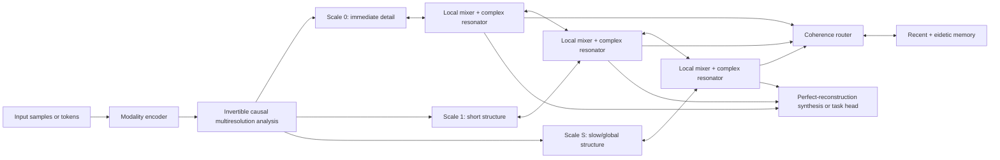

# Multiresolution Resonance Network (MRRN)

## A complete architecture and implementation specification

**Version:** 1.0 research design  
**Date:** 21 July 2026  
**Recommended baseline:** MRRN-H, the hybrid causal sequence configuration  
**Scope:** ordered sequences, sampled continuous signals, regular spatial fields, and graph-supported data

---

## Navigation

- **Concept and boundaries:** Sections 0–3
- **Notation and multiresolution representation:** Sections 4–5
- **Complex recurrent mathematics:** Section 6 and Section 32
- **Local/global interaction:** Sections 7–8
- **Attention equivalent and memory:** Sections 9–10
- **Complete block and network:** Sections 11–14
- **Training, initialization, and optimization:** Sections 15–17
- **Complexity and recommended configurations:** Sections 18–20 and Section 33
- **Diagnostics, ablations, failures, and limits:** Sections 21–24
- **Pseudocode and module contracts:** Sections 25–26
- **Verification and test suite:** Sections 27 and 35
- **Evidence and final rationale:** Sections 28–31
- **Streaming state and quantization:** Section 34

Readers implementing the model should read Sections 0, 4–18, 25–27, and 32–35 in full. Sections 21–24 define the conditions under which performance and efficiency claims are allowed.

---

## 0. Status, claim boundaries, and reading rules

This document specifies a proposed neural architecture rather than reporting a trained, benchmarked model. It is complete at the design and implementation-contract level: every required subsystem, state variable, transform, routing rule, numerical safeguard, training objective, computational cost, and validation gate is defined. It does **not** claim that MRRN has already surpassed existing architectures. That requires implementation and controlled experiments.

Each mechanism is marked with one of three statuses:

- **Established component (E):** directly grounded in an existing mathematical or neural-network mechanism, such as perfect-reconstruction lifting, complex state-space recurrence, RMS normalization, exact local attention, or anti-aliased resampling.
- **Derived design (D):** a new assembly or specialization derived from established components. The equations are implementable, but the particular combination has not yet been empirically validated as a whole.
- **Research option (R):** plausible but nonessential. It must be disabled in the baseline and enabled only after an ablation demonstrates benefit.

“Most powerful and computationally efficient” is interpreted as **best defensible capability–cost frontier**, not as an impossible universal optimum. No architecture is best for every data distribution, hardware target, sequence length, or task. The design therefore optimizes the following constrained objective:

\[
\max_{\mathcal M}\; \text{task capability}(\mathcal M)
\quad\text{subject to}\quad
\begin{cases}
\text{sequence work}=O(T)\text{ or }O(T\log T),\\
\text{streaming state independent of }T,\\
\text{stable causal recurrence},\\
\text{bounded exact-attention budget},\\
\text{no irreversible spectral information loss by default}.
\end{cases}
\]

Here (T) is the number of positions or samples. Dense channel projections can still cost (O(Td^2)), where (d) is model width; “linear time” refers to scaling in (T), not to zero dependence on width.

---

## 1. Executive definition

MRRN is a hierarchical neural network whose persistent computational state is a collection of damped, input-controlled, complex oscillatory modes distributed across resolution levels.

It has five inseparable parts:

1. **An invertible multiresolution analysis bank** separates local innovations from progressively slower structure without discarding information.
2. **A stable complex resonant state-space engine** carries amplitude and phase through time with content-dependent decay, rotation, input, and readout.
3. **Neighboring-scale exchange** lets fine events modify global context and lets global context modulate fine interpretation.
4. **Resonant attention and bounded eidetic memory** provide exact content retrieval where a fixed-size recurrent state cannot preserve arbitrary details.
5. **A local nonlinear mixer** creates conditional and cross-frequency interactions that a linear spectral system cannot express.

The compact design rule is:

> **Transform once, resonate many, retrieve only when necessary, synthesize once.**

The network does not repeatedly FFT and inverse-FFT every layer. It constructs one perfect-reconstruction hierarchy, maintains that hierarchy through the stack, and reconstructs only at the output or at explicitly chosen nonlinear exchange points. This avoids transform overhead and prevents the architecture from degenerating into an ordinary network surrounded by Fourier preprocessing.

### 1.1 Information paths



### 1.2 Local and global context

“Local” and “global” are not separate modules bolted together:

- At scale (s), one coefficient summarizes approximately (2^s) original positions.
- A window of (w) coefficients at scale (s) therefore covers approximately (w2^s) original positions.
- The recurrent state at every scale covers the entire available prefix, but in compressed form.
- Cross-scale exchange makes a local event visible to slow modes and returns slow contextual predictions to fine positions.
- Exact retrieval supplies non-compressive access to a bounded set of selected past items.

Thus locality is a continuum across scales rather than a binary choice.

---

## 2. What “spectral” means in this architecture

A frequency is an index; a spectrum is still a vector or tensor. MRRN does not abolish tensors. It changes the **geometry and constraints** of the state:

\[
z_{s,t,h,n}=a_{s,t,h,n}e^{i\phi_{s,t,h,n}},
\]

where:

- (s) is resolution scale,
- (t) is position at that scale,
- (h) is a processing head,
- (n) is a resonant mode,
- (a\ge 0) is amplitude,
- \(\phi\) is phase.

The complex representation is stored as paired real values in ordinary accelerators. No specialized complex hardware is required.

MRRN uses three related but distinct notions that must not be conflated:

1. **Transform frequency:** the band or scale produced by the analysis bank.
2. **Dynamical frequency:** the rotation rate of a recurrent pole.
3. **Positional phase:** accumulated rotation encoding temporal or spatial displacement.

A mode can reside in a coarse transform band while having a learned dynamical frequency within that band. Keeping these notions separate prevents ambiguous or duplicated frequency semantics.

### 2.1 When a spectrum is meaningful

Frequency requires a domain with structure:

- sequence: temporal or positional order;
- image: two-dimensional spatial coordinates;
- volume/video: spatial and temporal coordinates;
- mesh or graph: eigenmodes or localized graph wavelets derived from a Laplacian;
- unordered set: no canonical frequency exists until a graph, metric, or ordering is supplied.

The model must **never Fourier-transform arbitrary semantic feature indices and call them physical frequencies**. Feature channels can use learned structured mixing, but only the ordered domain receives spectral interpretation.

---

## 3. Design goals and non-goals

### 3.1 Required goals

The recommended MRRN-H configuration must:

1. process causal sequences in one pass;
2. support parallel training and constant-context-size streaming inference;
3. preserve fast transients and slow global structure simultaneously;
4. represent oscillation, delay, relative phase, and decay explicitly;
5. permit content-dependent remembering and forgetting;
6. retain a bounded exact-retrieval path for copying and rare details;
7. prevent downsampling aliasing and circular wraparound leakage;
8. remain implementable with real-valued tensor kernels;
9. degrade gracefully when spectral structure is weak;
10. expose diagnostics that show whether modes, scales, and memory are actually used.

### 3.2 Non-goals

MRRN does not promise:

- lossless compression of an unbounded history into fixed state;
- subquadratic computation of unrestricted exact dense softmax attention;
- perfect localization in both time and frequency;
- automatic resolution invariance without training and validation;
- guaranteed superiority on every symbolic task;
- stable infinite memory with finite precision;
- physical resonance or quantum computation merely because complex numbers are used.

---

## 4. Notation and tensor contracts

### 4.1 Core symbols

| Symbol | Meaning |
|---|---|
| (B) | batch size |
| (T) | input length at finest resolution |
| (d) | finest-scale model width |
| (S+1) | number of scales, indexed (s=0,\ldots,S) |
| (T_s) | length at scale (s), approximately (\lceil T/2^s\rceil) |
| (d_s) | feature width at scale (s) |
| (H_s) | number of heads at scale (s) |
| (N_s) | complex modes per head |
| (R_s) | low-rank MIMO input/output lanes per head |
| (L) | number of MRRN blocks |
| (w_s) | local exact-attention window in scale-(s) positions |
| (K) | maximum retrieved distant memory items per query event |
| (M) | capacity of bounded eidetic memory |
| (\epsilon) | positive numerical stabilizer |

### 4.2 Main tensors for a one-dimensional model

| Tensor | Shape | Type | Purpose |
|---|---:|---|---|
| (X^{(0)}) | (B\times T\times d) | real | encoded finest input |
| (U_s^{(\ell)}) | (B\times T_s\times d_s) | real | scale-(s) coefficients entering block (\ell) |
| (P_s) | (B\times T_s\times H_s\times R_s) | real | MIMO input lanes |
| (B_s,C_s) | (B\times T_s\times H_s\times N_s\times R_s) | complex | content-dependent input/readout directions |
| (Z_s) | (B\times H_s\times N_s\times R_s) | complex | streaming recurrent state |
| (Y_s) | (B\times T_s\times d_s) | real | resonator output |
| (Q_s,K_s,V_s) | implementation-dependent | complex/real | resonant attention projections |

Complex tensors are represented by a final axis of length two or by two real tensors. If (z=x+iy), multiplication is

\[
(x+iy)(u+iv)=(xu-yv)+i(xv+yu).
\]

For real input signals, conjugate symmetry is needed only when using a literal DFT representation. MRRN's complex recurrent modes do not require an explicitly materialized negative-frequency half because the final readout takes a real part.

---

## 5. The transform-once multiresolution representation

### 5.1 Why it exists

A single global Fourier basis has excellent frequency resolution but poor event localization. A purely local representation preserves events but makes long context expensive. A dyadic hierarchy provides a controlled compromise:

- fine scales: precise position, coarse frequency;
- coarse scales: precise low-frequency structure, coarse position;
- total number of coefficients: less than a small constant times (T);
- causal streaming updates: possible with bounded latency;
- perfect reconstruction: possible without learning an approximate decoder.

### 5.2 Perfect-reconstruction lifting transform (E)

At each level, split a sequence (x_s[n]) into even and odd samples:

\[
e_s[n]=x_s[2n],\qquad o_s[n]=x_s[2n+1].
\]

Apply a learned causal predictor (\mathcal P_s) and updater (\mathcal U_s):

\[
d_s[n]=o_s[n]-\mathcal P_s(e_s)[n],
\]

\[
a_{s+1}[n]=e_s[n]+\mathcal U_s(d_s)[n].
\]

The detail (d_s) is retained as the representation at scale (s); the approximation (a_{s+1}) is decomposed again. Inversion is exact algebraically:

\[
e_s[n]=a_{s+1}[n]-\mathcal U_s(d_s)[n],
\]

\[
o_s[n]=d_s[n]+\mathcal P_s(e_s)[n].
\]

Interleaving (e_s,o_s) recovers (x_s). Exact reconstruction does not require (\mathcal P_s) or (\mathcal U_s) to be linear, provided the identical functions and boundary rules are used during inversion. The recommended baseline nevertheless uses short depthwise causal convolutions because they are cheap and stable.

### 5.3 Boundary and causal rules

- **Strict causal sequences:** predictors may depend only on completed samples. A coarse coefficient is emitted when its pair or block is complete. The fine path remains available at every step, so this causes a coarse-update delay rather than future leakage.
- **Offline sequences:** symmetric padding is allowed, but train and evaluation must use the same boundary convention.
- **Images/fields:** reflection or physically specified boundary conditions are preferable to circular padding.
- **FFT-based diagnostics:** zero-pad to at least the linear-correlation length; never mistake circular correlation for causal correlation.
- **Odd lengths:** carry the final unmatched sample with an explicit validity bit and invert it unchanged.

### 5.4 Analysis-bank parameterization

Recommended predictor/updater defaults:

\[
\mathcal P_s(e)=W^{P,\text{point}}_s e+
W^{P,\text{depth}}_s * e,
\]

\[
\mathcal U_s(d)=W^{U,\text{point}}_s d+
W^{U,\text{depth}}_s * d,
\]

where the depthwise kernels have width 3 or 5. Initialize to a Haar or biorthogonal wavelet-like split, then learn small residual corrections. Large unconstrained filters make boundaries brittle and are not the baseline.

### 5.5 Scale widths

The coefficient count decreases geometrically. Coarser levels can therefore be wider without destroying linear sequence scaling. A balanced allocation is

\[
d_s=\operatorname{round}_{m}\left(d_0\min(2^{s/2},c_d)\right),
\]

\[
N_s=\operatorname{round}\left(N_0\min(2^{s/2},c_N)\right),
\]

where (\operatorname{round}_m) rounds to a hardware-friendly multiple and (c_d,c_N) cap growth. Since (T_s\approx T2^{-s}),

\[
\sum_{s=0}^{S}T_s d_s
\propto T\sum_{s=0}^{S}2^{-s/2}<3.42T.
\]

This spends more representational capacity on global structure while preserving (O(T)) coefficient volume.

### 5.6 Choosing the number of scales

Let (w_0) be the desired finest local span and (T_{\mathrm{global}}) the longest scale that should have direct local access. Choose

\[
S=\min\left(S_{\max},\left\lceil\log_2\frac{T_{\mathrm{global}}}{w_0}\right\rceil\right).
\]

For streaming language, 5–8 scales is a reasonable starting search range; it is not a universal constant. Very short inputs should bypass unused levels.

---

## 6. The complex resonant state-space engine

### 6.1 Purpose

The resonator is the main global-context mechanism. Each mode is a damped oscillator that can:

- retain a slowly decaying trace;
- rotate phase to represent delay or periodic progression;
- change its decay and phase increment from current content;
- accept several input lanes and expose several readout lanes;
- be evaluated recurrently for streaming or by a parallel scan for training.

### 6.2 Continuous-time starting point (E)

For one scale, head, mode, and MIMO lane:

\[
\frac{dz(t)}{dt}=\lambda(t)z(t)+g(t),
\qquad
\lambda(t)=-\alpha(t)+i\omega(t),
\]

with (\alpha(t)>0). The real part (-\alpha) controls decay; the imaginary part (\omega) controls rotation.

For constant (\lambda) and zero input:

\[
z(t+\Delta)=e^{-\alpha\Delta}e^{i\omega\Delta}z(t).
\]

The magnitude multiplier is (e^{-\alpha\Delta}<1), which makes the isolated linear recurrence stable.

### 6.3 Stable exponential–trapezoidal discretization (D)

Assume (\lambda_t) is constant over a step and linearly interpolate the drive between (g_{t-1}) and (g_t). Define

\[
q_t=\Delta_t\lambda_t,
\quad
\Phi_t=e^{q_t},
\]

\[
\varphi_1(q)=\frac{e^q-1}{q},
\qquad
\varphi_2(q)=\frac{e^q-1-q}{q^2}.
\]

Then update

\[
z_t=\Phi_t z_{t-1}
+\Delta_t[\varphi_1(q_t)-\varphi_2(q_t)]g_{t-1}
+\Delta_t\varphi_2(q_t)g_t.
\]

This integrates the homogeneous oscillation exactly and approximates a linearly changing input more accurately than a one-point Euler drive. For (|q|\) near zero, direct division is numerically unstable; use the series

\[
\varphi_1(q)=1+\frac q2+\frac{q^2}{6}+\frac{q^3}{24}+O(q^4),
\]

\[
\varphi_2(q)=\frac12+\frac q6+\frac{q^2}{24}+\frac{q^3}{120}+O(q^4).
\]

In implementation, switch to the series below a dtype-dependent threshold or use stable `expm1` kernels.

### 6.4 Input-dependent poles

For normalized input (u_{s,t}\in\mathbb R^{d_s}):

\[
\Delta_{s,t}=\Delta_{\min}+\operatorname{softplus}(W_{\Delta,s}u_{s,t}+b_{\Delta,s}),
\]

\[
\alpha_{s,t,h,n}=\alpha_{\min}
+\operatorname{softplus}(\tilde\alpha_{s,h,n}
+c^{\alpha}_{s,t,h,n}),
\]

\[
\omega_{s,t,h,n}=\omega^{0}_{s,h,n}
+\omega^{\max}_{s,h,n}\tanh(c^{\omega}_{s,t,h,n}).
\]

The content controls (c^\alpha,c^\omega), but the positivity of (\alpha) and boundedness of the frequency modulation are structural. This prevents an input from silently moving a pole into an exponentially unstable half-plane.

Use a minimum decay small enough for long memory but not exactly zero in the baseline. A truly unit-magnitude mode retains signal and noise indefinitely and is especially vulnerable to finite-precision phase error.

### 6.5 Frequency allocation

At scale (s), normalized mode frequencies should cover that level's usable band. Initialize base frequencies on a log-linear hybrid grid:

\[
\omega^0_{s,h,n}
=\omega_{\min,s}
\left(\frac{\omega_{\max,s}}{\omega_{\min,s}}\right)^{r_n},
\qquad r_n\in[0,1],
\]

and reserve a small number of near-zero modes for trends. In original-sample units, the physical frequency is reduced by approximately (2^{-s}).

Decay time constants (\tau=1/\alpha) should also begin log-spaced. Frequency and decay are related through the quality factor

\[
Q=\frac{|\omega|}{2\alpha}.
\]

Very large (Q) yields sharp, persistent resonance but slow adaptation. Very small (Q) yields a transient smoother. The model needs a distribution of both.

### 6.6 Low-rank multi-input, multi-output drive

For head (h) and lane (r), form input amplitudes

\[
p_{t,h,r}=(W^P_su_t)_{h,r}.
\]

Generate complex input directions (B_{t,h,n,r}\) and readout directions (C_{t,h,n,r}). Normalize each across modes:

\[
\widehat B_{t,h,:,r}=
\frac{B_{t,h,:,r}}
{\sqrt{N_s^{-1}\sum_n|B_{t,h,n,r}|^2+\epsilon}},
\]

and similarly for (C). The production drive is decay-normalized:

\[
g_{t,h,n,r}=\alpha_{t,h,n}\widehat B_{t,h,n,r}p_{t,h,r}.
\]

This factor is essential when decay is learned. For fixed poles, the continuous
impulse kernel from an unnormalized drive to state has magnitude
\(e^{-\alpha t}\) and absolute integral \(1/\alpha\), so a mode could increase
gain without bound merely by learning a longer half-life. The normalized kernel
is \(\alpha e^{(-\alpha+i\omega)t}\), whose absolute integral is exactly one.
Decreasing \(\alpha\) therefore extends memory without automatically amplifying
bounded drive. This introduces no nonlinear state operation, keeps the
exponential-trapezoidal update affine, and preserves exact associative scan and
recurrent/parallel parity. The unnormalized form is retained only as an explicit
legacy ablation.

The readout is

\[
r_{t,h,r}=\operatorname{Re}
\sum_{n=1}^{N_s}\overline{\widehat C_{t,h,n,r}}z_{t,h,n,r}.
\]

Concatenate (r_{t,h,r}), project back to (d_s), and apply a bounded output gate:

\[
y_t=W^O_s\operatorname{concat}_{h,r}(r_{t,h,r}),
\]

\[
\tilde y_t=\sigma(W^G_su_t+b^G_s)\odot y_t.
\]

Multiple lanes increase expressiveness without requiring an independent full state matrix for every channel. The recommended starting rank is (R_s\in\{2,4\}), selected by ablation.

### 6.7 Real-valued implementation

For (z=x+iy) and (\Phi=\rho(\cos\theta+i\sin\theta)),

\[
\begin{bmatrix}x_t\\y_t\end{bmatrix}
=\rho
\begin{bmatrix}
\cos\theta&-\sin\theta\\
\sin\theta&\cos\theta
\end{bmatrix}
\begin{bmatrix}x_{t-1}\\y_{t-1}\end{bmatrix}
+\begin{bmatrix}\Re b_t\\\Im b_t\end{bmatrix}.
\]

This is a decayed (2\times2) rotation. Fused paired-real kernels are usually preferable to generic complex tensor support because precision, layout, and accelerator coverage are easier to control.

### 6.8 Parallel and recurrent forms

An affine recurrence (z_t=A_tz_{t-1}+b_t) composes associatively:

\[
(A_2,b_2)\circ(A_1,b_1)
=(A_2A_1,A_2b_1+b_2).
\]

The trapezoidal drive depends on (g_{t-1}), so augment the scan element with the previous drive or precompute the combined (b_t). Then:

- **training/prefill:** use an associative parallel scan or chunkwise structured-state kernel;
- **streaming decode:** retain only the current (z_s), the previous drive, and multirate filter-bank buffers.

The mathematical work is (O(T_sH_sN_sR_s)) per scale. Parallel depth can be (O(\log T_s)), while recurrent inference is one update per active scale.

---

## 7. Cross-scale context exchange

### 7.1 Why it exists

Independent scales would fragment meaning: fine bands would see events without global interpretation, and coarse bands would see trends without exact evidence. MRRN permits only neighboring-scale exchange inside ordinary blocks. Repeated layers propagate information farther, limiting cost and avoiding an all-scales quadratic graph.

### 7.2 Fine-to-coarse innovation

The lifting analysis already sends an approximation upward. Inside block (\ell), additionally compute a content-selected summary:

\[
f_{s\rightarrow s+1}
=\operatorname{Down}_{s}
\left(
\sigma(W^{fg}_sU_s)\odot W^{fv}_sU_s
\right).
\]

Downsampling uses the same anti-aliased boundary and phase convention as the analysis bank. Update the coarse representation:

\[
U_{s+1}\leftarrow U_{s+1}
+\eta^{f}_{s,\ell}W^{f}_sf_{s\rightarrow s+1}.
\]

This carries surprising or task-relevant fine events into slower context rather than indiscriminately pooling everything.

### 7.3 Coarse-to-fine modulation

Interpolate the coarse state into the fine grid:

\[
c_{s+1\rightarrow s}=\operatorname{Up}_s(U_{s+1}).
\]

Use it primarily as modulation, not as an overwrite:

\[
(\gamma_s,\beta_s)=W^{cf}_sc_{s+1\rightarrow s},
\]

\[
U_s\leftarrow U_s+
\eta^{c}_{s,\ell}
\left[
\tanh(\gamma_s)\odot\operatorname{RMSNorm}(U_s)+\beta_s
\right].
\]

The interpolation must compensate for the analysis-bank group delay. A one-sample phase error repeated across layers can masquerade as a meaningful phase relation.

### 7.4 Scale identity

Add or condition on a learned scale code (e_s), the logarithm of the sample interval, and physical metadata when available:

\[
\xi_s=[e_s,\log(2^s),\log \Delta_{\mathrm{physical},s}].
\]

This tells the shared cell whether a pattern is fast/fine or slow/coarse. Parameters may be partly shared across scales with low-rank scale adapters. Full sharing is efficient but can underfit different band statistics; full separation is powerful but wasteful. The recommended compromise is shared main projections plus scale-specific normalization, poles, and adapters.

---

## 8. Local nonlinear and transient path

### 8.1 Why it exists

A stack of linear spectral filters is still linear. It cannot implement conditional logic, frequency creation, multiplicative binding, or general nonlinear operators. The local path provides this missing expressivity and catches sharp events that a narrow resonance may smear.

### 8.2 Phase-preserving normalization

For a complex group (z\in\mathbb C^N), define

\[
\operatorname{ComplexRMS}(z)
=\frac{z}{\sqrt{N^{-1}\sum_n|z_n|^2+\epsilon}}.
\]

This scales amplitude while preserving phase. Do not independently normalize real and imaginary parts; that changes angles.

Real coefficient streams use ordinary RMSNorm with scale-specific learned gain. Mean subtraction is optional and normally avoided because DC/trend content can be semantically meaningful.

### 8.3 Gated local mixer

The dense reference form is

\[
\operatorname{GLU}(u)=W_o\left[
\operatorname{SiLU}(W_au)\odot(W_bu)
\right].
\]

For very wide models, replace full projections with a hardware-tested structured mixer:

\[
W\approx P_2D_2\mathcal B_2P_1D_1\mathcal B_1+UV^\top,
\]

where (P) is a permutation, (D) is diagonal, (\mathcal B) is a butterfly transform, and (UV^\top) is a low-rank correction. This reduces theoretical channel cost toward (O(d\log d+rd)), but dense matrix multiplication can be faster on actual GPUs at moderate widths. The implementation must benchmark both.

### 8.4 Complex radial activation

When nonlinearity is applied directly to complex modes, use

\[
\operatorname{modSiLU}(z;b)
=\frac{\operatorname{SiLU}(|z|+b)}{|z|+\epsilon}z.
\]

It changes amplitude without imposing a privileged global phase. It is useful inside complex projections but is not sufficient alone; real local mixing and cross-scale coupling remain necessary.

### 8.5 Controlled cross-frequency mixing

Nonlinearities create sums, differences, and harmonics. The baseline obtains these interactions through the gated local mixer and cross-scale exchange. An optional explicit low-rank triad mixer is

\[
\operatorname{Triad}(z)
=W_o\left[(W_1z)\odot(W_2z)\right].
\]

Complex multiplication adds phases and therefore resembles frequency mixing. This is **R**, not baseline: it can create unstable high-frequency energy and must pass an ablation plus alias diagnostics.

### 8.6 Alias-controlled continuous-signal mode

For audio, images, physical fields, or any task claiming continuous-coordinate behavior:

1. low-pass before every downsample;
2. temporarily oversample before strong pointwise nonlinearities;
3. apply the nonlinearity;
4. low-pass to the target Nyquist band;
5. decimate.

For discrete text tokens, this continuous-signal rule is not automatically meaningful and should not impose needless oversampling.

### 8.7 Learned resonant spectral GLU

The implemented expanded local branch combines conventional SwiGLU with a
learned complex modal activation. For control and carrier projections

\[
A=P_a u,\qquad B=P_b u,
\]

the spectral gate uses the phase-invariant control magnitude and a bounded
Chebyshev transfer function:

\[
\xi=\frac{2|A|}{1+|A|}-1,
\qquad
m=m_{\max}\sigma\!\left(
\operatorname{logit}(1/m_{\max})+
\sum_{k=0}^{K-1}a_{s,h,n,k}T_k(\xi)+c^{(m)}
\right),
\]

\[
\theta=\theta_{\max}\tanh\!\left(
\sum_{k=0}^{K-1}b_{s,h,n,k}T_k(\xi)+c^{(\theta)}
\right).
\]

The carrier response is

\[
H_{\mathrm{gate}}=
\left(2\sigma(|A|)-1\right)m\,e^{i\theta}B.
\]

Thus zero control produces zero spectral output, amplitude gain and phase
rotation are bounded, and rotating the carrier rotates the gated result without
changing the magnitude decision. Coefficients are learned separately by head and
mode, while a zero-initialized contextual projection permits later regime
dependence.

An optional sparse triad term adds only index-legal sum and difference interactions:

\[
H_k=H_{\mathrm{gate},k}+
\sum_{p+q=k}\eta^{(+)}_{kpq}\frac{A_pB_q}{1+|A_p||B_q|}
+\sum_{p-q=k}\eta^{(-)}_{kpq}\frac{A_p\overline{B_q}}{1+|A_p||B_q|}.
\]

Triad weights are bounded and initialized to zero. The pair list is constructed
to satisfy the destination-frequency rule rather than learning unrestricted
all-to-all mode mixing. This keeps work linear in the configured sparse
interaction count and prevents illegal destination bins by construction.

The final local response is a learned per-channel interpolation between ordinary
SwiGLU and resonant spectral GLU. Continuous-signal mode applies the existing
oversample/activate/filter/decimate path to this combined response. FP16 and BF16
projections retain FP32 magnitude, transfer, phase, and triad arithmetic. The
extension is controlled by `spectral_activation` and can be disabled exactly for
matched ablation. In the concrete version 1.2 baseline it defaults to **enabled**;
ordinary SwiGLU-only and spectral-only forms remain explicit structural ablations.

---

## 9. Resonant attention: the attention equivalent

### 9.1 Why recurrence alone is insufficient

A fixed-size recurrent state compresses the past. Compression is desirable for trends and persistent semantics, but arbitrary exact copying requires storage proportional to the information retained. MRRN therefore uses resonance for broad context and bounded exact attention for selected details.

### 9.2 Candidate-set principle

For query position (i), exact attention operates only over

\[
\mathcal C_i=
\mathcal W_i\cup\mathcal L_i\cup\mathcal R_i,
\]

where:

- (\mathcal W_i): recent local window;
- (\mathcal L_i): multiresolution landmarks;
- (\mathcal R_i): top-(K) distant memory items retrieved by a cheap router.

The softmax is exact **within this candidate set**. It is not claimed to equal full dense attention over all history.

### 9.3 Complex query and key representation

For attention head (h) and resonance subband (m):

\[
q_{i,h,m}=A^q_{i,h,m}e^{i\phi^q_{i,h,m}},
\qquad
k_{j,h,m}=A^k_{j,h,m}e^{i\phi^k_{j,h,m}}.
\]

Define a normalized cross-spectrum

\[
c_{ijhm}=
\frac{q_{i,h,m}\overline{k_{j,h,m}}}
{\sqrt{\sum_m|q_{i,h,m}|^2+\epsilon}
 \sqrt{\sum_m|k_{j,h,m}|^2+\epsilon}}.
\]

Its magnitude represents shared band energy; its angle represents phase difference.

### 9.4 Relative-delay compensation

Let (\delta_{ij}=t_i-t_j\). Demodulate the phase expected from this displacement:

\[
\tilde c_{ijhm}=c_{ijhm}e^{-i\Omega_{h,m}\delta_{ij}}.
\]

The sign convention must be tested with known shifted impulses. A wrong sign still trains but reverses the meaning of delay.

### 9.5 Coherence score

The recommended scalar score is

\[
s_{ijh}=
\frac{1}{\sqrt{F_h}}
\sum_m w_{h,m}\operatorname{Re}(\tilde c_{ijhm})
+\mu_h\log(\epsilon+\sum_m A^q_{i,h,m}A^k_{j,h,m})
+b_h(\delta_{ij},s_i,s_j),
\]

where (w_{h,m}\ge0), (\sum_mw_{h,m}=1), and (b_h) is a relative-scale/distance bias. The first term measures phase-aligned coherence; the amplitude term distinguishes a confident match from two nearly zero spectra.

Then

\[
\alpha_{ijh}=
\frac{e^{s_{ijh}-m_{ih}}}
{\sum_{k\in\mathcal C_i}e^{s_{ikh}-m_{ih}}},
\quad
m_{ih}=\max_{k\in\mathcal C_i}s_{ikh}.
\]

Use tiled online softmax so the score matrix is never fully materialized.

### 9.6 Bandwise value transport

For complex value bands (v_{j,h,m}), align the value to the query frame:

\[
\tilde v_{ijhm}=v_{j,h,m}e^{-i\Omega^v_{h,m}\delta_{ij}}.
\]

Aggregate

\[
y_{i,h,m}=\sum_{j\in\mathcal C_i}\alpha_{ijh}\tilde v_{ijhm}.
\]

An optional bandwise variant computes (\alpha_{ijhm}) separately per band, allowing global structure to come from one memory and detail from another. It is more expressive but costs and stores more; use it only at coarse scales or small candidate sets.

### 9.7 Lag-aware correlation router

For block summaries (Q_i(f),K_j(f)), compute

\[
r_{ij}(\tau)=\mathcal F^{-1}
\left[Q_i(f)\overline{K_j(f)}\right](\tau).
\]

Peaks identify both a candidate block and its likely alignment lag. This operation is used as a **router**, not as the final value aggregation. For offline batches, FFT correlation costs (O(n\log n)). For streaming, maintain multiresolution signatures and an approximate-nearest-neighbor index; do not recompute a full-history FFT for every token.

### 9.8 Relationship to ordinary attention

If there is one real-valued band, no delay compensation, and (q,k) are ordinary projected features, the coherence score reduces to a normalized dot-product-like attention score. Resonant attention strictly adds explicit band, phase, and delay structure; it does not remove the underlying content-matching role.

---

## 10. Bounded eidetic and associative memory

### 10.1 Memory tiers

MRRN-H uses three memory tiers:

1. **Resonant state:** fixed size, compressive, updated every active step.
2. **Recent window:** exact high-resolution values for the last (w_0) positions.
3. **Eidetic memory:** bounded selected events or blocks, addressable by spectral/content signatures.

An optional external store can extend tier 3 beyond fixed accelerator memory. That changes system-level memory and retrieval costs and must be reported separately.

### 10.2 Memory item

Each item contains

\[
m_j=(k_j,v_j,\sigma_j,t_j,s_j,p_j,\nu_j),
\]

where (k_j) is the retrieval key, (v_j) the exact or compressed value, (\sigma_j) a compact band signature, (t_j) time, (s_j) scale, (p_j) priority, and (\nu_j) a validity/version marker.

### 10.3 Write policy

Compute an innovation vector

\[
\iota_t=U_t-\widehat U_t,
\]

where (\widehat U_t) is the resonator's prediction or slow-context reconstruction. Define a write score

\[
\pi_t=\sigma\left(
w^\top[
\operatorname{RMS}(\iota_t),
\operatorname{RMS}(U_t),
\text{deployable task surprise}_t,
\text{boundary flag}_t,
\text{router novelty}_t]
+b
\right).
\]

During training, select a fixed quota per block with differentiable or straight-through top-(k). During inference, write when the score exceeds a calibrated threshold and capacity policy permits it. Fixed quotas prevent pathological “write everything” behavior. Any feature used by the deployed write gate must be computable without the unknown target. Ground-truth loss or future error may train an auxiliary write predictor, but it may not be fed directly to the inference-time gate.

### 10.4 Eviction

When full, evict the lowest score under

\[
E_j=p_j
-\lambda_{\mathrm{age}}\log(1+t-t_j)
-\lambda_{\mathrm{red}}\max_{k\ne j}\operatorname{sim}(k_j,k_k)
+\lambda_{\mathrm{use}}\log(1+u_j),
\]

where (u_j) counts successful retrievals. This balances importance, age, redundancy, and demonstrated utility. For safety-critical audit trails, eviction may be forbidden and storage handled externally.

### 10.5 Retrieval

Use two stages:

1. **Cheap routing:** quantized magnitude/phase signature, product quantization, locality-sensitive hashing, or ANN search returns (K'\ge K) candidates.
2. **Exact reranking:** full resonant coherence selects (K), followed by exact candidate-set attention.

Routing recall must be measured against brute-force top-(K) on held-out sequences. If recall is inadequate, the system must fail closed to a larger candidate set or disable claims of exact long-range retrieval.

---

## 11. One complete MRRN block

Let (U_s^{(\ell)}) be the representation at scale (s) entering layer (\ell).

1. **Pre-normalize**

   \[
   \bar U_s=\operatorname{RMSNorm}_s(U_s^{(\ell)}).
   \]

2. **Exchange neighboring scales** using fine-to-coarse innovation and coarse-to-fine modulation.

3. **Update complex resonant state**

   \[
   R_s=\operatorname{Resonate}_s(\bar U_s;Z_s).
   \]

4. **Apply local nonlinear mixing**

   \[
   F_s=\operatorname{GLU}_s(\bar U_s).
   \]

5. **Run bounded resonant attention when scheduled**

   \[
   A_s=\operatorname{ResAttn}_s(\bar U_s,\mathcal C_s).
   \]

6. **Fuse branches with a simplex gate**

   \[
   [g_R,g_F,g_A,g_I]
   =\operatorname{softmax}(W^{\mathrm{branch}}_s\bar U_s),
   \]

   \[
   \Delta U_s=g_R\odot R_s+g_F\odot F_s+g_A\odot A_s+g_I\odot W_I\bar U_s.
   \]

7. **Residual update**

   \[
   U_s^{(\ell+1)}=U_s^{(\ell)}+
   \eta_{s,\ell}\Delta U_s.
   \]

Initialize (\eta_{s,\ell}) small, for example (10^{-2}) or (1/\sqrt{2L}), depending on depth and optimizer. The identity branch ensures that a newly initialized block need not destroy the perfect-reconstruction hierarchy.

### 11.1 Attention schedule

Exact attention need not run at every layer and scale. Recommended schedule:

- finest scale: local window every (a_0\) blocks;
- middle scales: local/landmark attention every (a_m\) blocks;
- coarsest scale: landmark plus retrieved memory every block or every second block;
- final layers: one cross-scale consolidation attention.

The schedule is a configuration variable and must be reported with compute results.

---

## 12. Full network topology

### 12.1 Encoder

The modality encoder maps raw inputs to (X^{(0)}\in\mathbb R^{B\times T\times d}). It preserves explicit time, space, mask, sampling interval, and boundary metadata. Missing data is never silently replaced without a mask.

### 12.2 Analysis

Apply the learned lifting hierarchy once to produce

\[
\mathcal U^{(0)}=\{U_0^{(0)},U_1^{(0)},\ldots,U_S^{(0)}\}.
\]

The final approximation is retained as (U_S); all detail bands are retained at their respective levels.

### 12.3 Repeated shared-form blocks

Apply (L) blocks with the same computational form. Parameters can differ by layer, while scale-shared base matrices plus scale adapters reduce redundancy.

### 12.4 Output

Three output modes are supported:

- **Per-position sequence output:** map each scale back through inverse lifting, fuse at finest resolution, and apply a task head.
- **Global output:** pool coarsest states and selected memory/landmarks, then apply a head.
- **Operator/field output:** synthesize a full field with perfect reconstruction and a pointwise physical-variable decoder.

For causal next-step generation, logits at step (t) may use only states and coefficients whose input support ends at or before (t).

---

## 13. Modality-specific forms

### 13.1 Text and symbolic sequences

- Embed tokens normally.
- Apply the multiresolution transform along token order, not across embedding coordinates.
- Preserve a fine-scale exact window because arbitrary spelling, code, and identifiers are poorly represented by smooth spectra.
- Use eidetic writes for rare tokens, delimiters, definitions, and high-surprise spans.
- Use causal lifting and causal attention.

Spectral structure in text refers to repetition, hierarchy, discourse rhythm, and relative position—not literal acoustic frequency.

### 13.2 Audio and sensor signals

- Use physical sample intervals in pole frequencies.
- Initialize analysis filters from known wavelets or quadrature filter banks.
- Enable continuous-signal anti-aliasing.
- Retain amplitude calibration metadata.
- Use high-(Q) modes for tones and low-(Q) modes for transients.

### 13.3 Images

Use separable two-dimensional lifting. Each level produces LL, LH, HL, and HH-like bands. LL continues to the next scale; the three detail orientations remain at the current scale. Use bidirectional or noncausal processing unless the application imposes a scan order. Resonant modes may be directional, with frequency vector

\[
\boldsymbol\omega=(\omega_x,\omega_y).
\]

Translation changes phase; orientation changes the distribution among directional modes. Do not flatten the image into one arbitrary raster scan for the primary model if two-dimensional structure matters.

### 13.4 Video

Use separate spatial and temporal decompositions. A practical factorization is spatial lifting per frame plus causal temporal lifting on the resulting bands. Full 3D transforms are more expressive but more expensive. State metadata must distinguish spatial from temporal frequency.

### 13.5 Physical fields and neural operators

- Include coordinates, coefficients, forcing terms, boundary masks, and grid spacing.
- Use basis functions compatible with boundary conditions; plain Fourier modes imply periodicity unless corrected.
- Weight spectral losses by physically relevant Sobolev norms when justified.
- Validate across resolutions rather than assuming discretization invariance.
- Preserve conservation constraints through the output parameterization or projection when the governing problem supplies them.

### 13.6 Graphs and irregular domains

Use a normalized graph Laplacian (L_G) and localized polynomial filters (p_k(L_G)), or graph wavelets. Full eigendecomposition is usually too costly and unstable under graph changes. Cross-scale pooling must preserve graph connectivity and node masks. “Frequency” means graph variation, not Euclidean temporal frequency.

### 13.7 Unordered sets

If no metric, graph, or order is available, use permutation-invariant inducing-point attention or another set model. Inventing an arbitrary ordering creates false frequencies. MRRN is not the correct primitive until a meaningful domain is defined.

---

## 14. Causal, bidirectional, and field modes

### 14.1 Strict causal mode

- one forward resonator per scale;
- causal analysis filters;
- local attention mask (j\le i);
- only past memory items retrievable;
- online dyadic updates through scale-specific buffers;
- no symmetric padding or full-sequence normalization.

### 14.2 Bidirectional offline mode

Run forward and reverse resonators and combine their outputs with a gate. This is suitable for classification, denoising, or full-context encoding but invalid for next-token likelihood if reverse information enters the prediction.

### 14.3 Spatial field mode

Use multidirectional sweeps, spectral operator blocks, or symmetric neighborhood propagation. Causality is replaced by boundary-condition correctness and equivariance tests.

---

## 15. Training objectives

The total loss is

\[
\mathcal L=\mathcal L_{\mathrm{task}}
+\lambda_{\mathrm{pred}}\mathcal L_{\mathrm{pred}}
+\lambda_{\mathrm{retr}}\mathcal L_{\mathrm{retr}}
+\lambda_{\mathrm{pole}}\mathcal L_{\mathrm{pole}}
+\lambda_{\mathrm{energy}}\mathcal L_{\mathrm{energy}}
+\lambda_{\mathrm{route}}\mathcal L_{\mathrm{route}}
+\lambda_{\mathrm{phys}}\mathcal L_{\mathrm{phys}}
+\lambda_{\mathrm{spec}}\mathcal L_{\mathrm{spec}}.
\]

Only (\mathcal L_{\mathrm{task}}) is universally required.

### 15.1 Task loss

Examples include cross-entropy, negative log likelihood, regression error, diffusion loss, reconstruction loss, or a physics residual. The architecture does not prescribe one universal objective.

### 15.2 Optional predictive state loss

Predict the next coefficient or masked scale representation:

\[
\mathcal L_{\mathrm{pred}}=
\sum_s w_s\left\|
\operatorname{stopgrad}(U_{s,t+1})-\widehat U_{s,t+1}
\right\|_2^2.
\]

This makes innovation and memory-write signals meaningful. It must not dominate the task objective or force stochastic futures toward a mean.

### 15.3 Retrieval contrastive loss

Given a true useful memory (j^+) and negatives (j^-):

\[
\mathcal L_{\mathrm{retr}}=-log
\frac{e^{s(i,j^+)/\tau}}
{e^{s(i,j^+)/\tau}+\sum_{j^-}e^{s(i,j^-)/\tau}}.
\]

Training negatives must include spectrally similar but semantically wrong items; otherwise the router learns amplitude shortcuts.

### 15.4 Pole coverage and redundancy

To discourage all modes from collapsing to one frequency/decay:

\[
\mathcal L_{\mathrm{pole}}=
\sum_{n\ne m}
\exp\left(
-\frac{|\log\tau_n-\log\tau_m|^2}{\sigma_\tau^2}
-\frac{|\omega_n-\omega_m|^2}{\sigma_\omega^2}
\right).
\]

Use a small weight. Some convergence of modes can be task-optimal.

### 15.5 State-energy control

\[
\mathcal L_{\mathrm{energy}}=
\frac1{BTHNR}\sum|z|^2
+\max(0,\operatorname{RMS}(z)-E_{\max})^2.
\]

This is a soft safeguard, not a substitute for stable pole parameterization.

### 15.6 Router balance

Penalize pathological memory or branch use with entropy floors and capacity terms. Do not force uniform routing; useful routing is usually nonuniform.

### 15.7 Physical constraints

For operator tasks, (\mathcal L_{\mathrm{phys}}) can include boundary, conservation, divergence, or residual terms. These constraints are domain-specific and cannot be generated from the architecture alone.

### 15.8 Spectral activation regularization

The learned activation regularizer penalizes jagged gain/phase transfer functions
across neighboring modes, excessive phase-response coefficients, contextual phase
gain, and dense triad use. It is optional because a genuinely sharp modal
threshold can be task-optimal; diagnostics and matched ablation must determine
whether smoothness improves extrapolation.

---

## 16. Initialization

1. **Analysis bank:** initialize to a known perfect-reconstruction split; initialize learned residual filters near zero.
2. **Decay:** log-space time constants from a few scale steps to the maximum useful horizon.
3. **Frequency:** log-linear band coverage plus near-DC modes.
4. **Input-dependent decay/frequency projections:** initialize near zero so early training begins with stable fixed poles.
5. **Complex (B,C):** variance (O(1/N_s)); normalize across modes.
6. **Residual scales:** small positive values.
7. **Branch gate:** favor identity and local mixer initially; allow resonance and attention to grow.
8. **Memory write gate:** conservative initial bias so memory does not immediately saturate.
9. **Cross-scale adapters:** near zero to preserve the initial analysis hierarchy.
10. **Output head:** standard task-specific initialization.
11. **Spectral activation:** zero transfer and contextual-phase residuals, zero
    triad weights, neutral phase, and a blend initially favoring conventional
    SwiGLU.

The initial network should behave like a well-conditioned local model with weak multiscale memory, not like a bank of undamped oscillators.

---

## 17. Optimization and numerical stability

### 17.1 Precision policy

- projections and local mixers: BF16 or validated FP16;
- pole exponentials, phase accumulation, learned spectral transfer/triads, normalization statistics: FP32 recommended;
- long-running streaming phase: periodically renormalize sine/cosine pairs or recompute from a bounded phase accumulator;
- memory keys: BF16/FP16 after router-recall validation; timestamps and offsets need sufficient integer range.

### 17.2 Gradient controls

- global gradient clipping;
- optional per-state gradient clipping;
- learning-rate multiplier below 1 for pole frequencies and decay;
- no weight decay on normalization gains, phase biases, or carefully parameterized pole constants unless validated;
- monitor phase-gradient variance separately from amplitude-gradient variance;
- report pre-clip norm, post-clip norm, and the applied clip coefficient;
- monitor mean and maximum resonator-state RMS on every optimizer update;
- penalize state energy only above a declared RMS operating budget;
- reject an update after a declared number of consecutive extreme gradient or
  state-RMS measurements and retain a diagnostic record.

### 17.3 Stable exponentials

Clamp or bound (\Delta\alpha) to avoid underflow, while allowing the model to approximate immediate forgetting. Compute trigonometric functions with range reduction. Use `expm1` and series expansions for small complex arguments.

### 17.4 Normalization placement

Use pre-normalization on coefficient streams and magnitude-based normalization on (B,C). An additional post-gate RMSNorm may improve very long-context hybrid retrieval, but it changes extrapolation behavior and must be ablated rather than assumed beneficial.

### 17.5 Optimizer and schedule

AdamW is a reasonable baseline. Use warmup, cosine or inverse-square-root decay, and sequence-length curriculum only if evaluation includes the final target length. Report optimizer state memory, because it can exceed activation memory in large models.

On launch-sensitive accelerators, projections of the same input should be packed,
paired-real arithmetic may use native-complex kernels at internal boundaries, and
the associative recurrence should use a low-span scan for inference but a
work-efficient tree scan for differentiable long sequences. These schedules are
algebraically equivalent; each backend must verify batch, recurrent, causal, and
gradient parity before being treated as authoritative.

---

## 18. Computational complexity

Let

\[
C_{\mathrm{state}}=\sum_sT_sH_sN_sR_s.
\]

With geometric lengths and (N_s,d_s\propto2^{s/2}), this remains (O(T)) up to caps.

### 18.1 Sequence-dependent work per layer

| Component | Work | Training memory | Streaming state |
|---|---:|---:|---:|
| Lifting analysis/synthesis | (O(Td k_f)), once | (O(Td)) | (O(Sdk_f)) |
| Complex resonant scan | (O(C_{\mathrm{state}})) | (O(Td)) or checkpointed | (O(\sum_sH_sN_sR_s)) |
| Local mixer, dense | (O(\sum_sT_sd_s^2)) | (O(\sum_sT_sd_s)) | none beyond current step |
| Learned spectral GLU | (O(\sum_sT_sH_sN_sR_sK)+O(\sum_sT_sP_s)) plus projections | (O(\sum_sT_sH_sN_sR_s)) | none beyond current step |
| Local attention | (O(\sum_sT_sw_sd_s)) | tiled | (O(\sum_sw_sd_s)) |
| Retrieved attention | (O(N_qKd)) | tiled | (O(Kd)) working set |
| Cross-scale exchange | (O(\sum_sT_sd_s)) plus projections | (O(Td)) | small buffers |
| Offline FFT router | (O(N_b\log N_b)) | (O(N_b)) | not used per token |

Here (N_q) is the number of positions or blocks that issue distant queries. It should normally be much smaller than (T).

### 18.2 Overall sequence scaling

With fixed widths, windows, state sizes, and retrieved count:

\[
\text{work}=O(LT),\qquad
\text{streaming neural state}=O(Ld),
\]

plus a bounded memory of (O(Md)). If a persistent external store grows with history, storage is no longer constant and retrieval complexity depends on its index.

### 18.3 Why no unrestricted dense attention appears

General exact self-attention costs quadratic work in sequence length. Known lower-bound results show that broadly approximating the same operation in truly subquadratic time is not free under standard complexity assumptions. MRRN changes the operator: it uses structured recurrent mixing for the whole past and exact softmax over a deliberately bounded candidate set.

### 18.4 Wall-clock qualifications

Fewer FLOPs do not guarantee lower latency. Kernel fusion, memory traffic, parallel occupancy, sequence length, and batch size matter. A dense GEMM can outperform an irregular sparse or butterfly operation. Every efficiency claim must include:

- hardware and software versions;
- dtype;
- batch, length, and width;
- forward versus training versus decode;
- achieved memory bandwidth and utilization;
- end-to-end timing, not isolated theoretical FLOPs alone.

---

## 19. Recommended MRRN-H configuration

MRRN-H is the strongest reasonable default because it preserves all four capabilities: local precision, compressive long memory, exact bounded retrieval, and multiscale global structure.

### 19.1 Small research model

| Parameter | Starting value |
|---|---:|
| (d_0) | 256 |
| layers (L) | 12 |
| scales | 5 |
| heads per scale | 4–8 |
| modes/head (N_0) | 16 complex |
| MIMO rank | 2 |
| local window (w_0) | 128 |
| distant retrieved (K) | 16 |
| memory capacity (M) | 2,048 items |
| lifting kernel | 3 or 5 |
| local mixer expansion | 2.5–4× |

These are search seeds, not universal optima.

### 19.2 Capability-first large model

- increase width and depth normally;
- increase coarse-scale modes before increasing fine-scale modes;
- use MIMO rank 4 if decode kernels retain good utilization;
- keep local windows moderate and enlarge memory/retrieval only after measuring router recall;
- add sparse MoE only to the nonlinear mixer if parameter capacity, rather than context processing, is the bottleneck;
- retain occasional exact local attention even when the resonator performs well.

### 19.3 Efficiency-first model

- shared block parameters across selected depths;
- scale adapters instead of fully separate scale matrices;
- grouped or low-rank (B,C) projections;
- attention on block boundaries rather than every token;
- quantized old memory values with full-precision recent memory;
- dense kernels until structured mixing wins a measured wall-clock comparison.

---

## 20. Training curriculum

### Stage 0: algebraic and numerical tests

- exact lifting round trip;
- impulse delay and phase-sign tests;
- recurrence parallel/recurrent equivalence;
- no future leakage;
- finite gradients near (q=0);
- stable long zero-input rollout.

### Stage 1: local baseline

Train encoder, local mixer, and task head with resonance/cross-scale gates small and distant memory disabled. Establish that the basic data path learns.

### Stage 2: fixed resonators

Enable stable fixed poles and cross-scale exchange. Validate long-range improvement and inspect mode usage.

### Stage 3: selective dynamics

Enable content-dependent decay, phase, (B), and (C) gradually. Confirm stability and state-tracking gains.

### Stage 4: local resonant attention

Enable exact local coherence attention. Compare with ordinary dot-product attention at the identical candidate set and compute budget.

### Stage 5: eidetic memory

Train write policy, router, and exact reranker. Evaluate brute-force router recall, copy tasks, rare-detail retrieval, and memory saturation.

### Stage 6: research options

Only now test explicit triad mixing, MoE, learned graph spectra, or external unbounded memory. Each must earn its cost in an ablation.

---

## 21. Diagnostics and interpretability

### 21.1 Mode diagnostics

For every scale/layer, log:

- frequency and decay histograms;
- quality factors;
- amplitude occupancy;
- phase entropy and phase-locking value;
- effective memory half-life (\log 2/\alpha);
- gradient norm by mode;
- dead modes and saturated gates.

### 21.2 Scale diagnostics

- energy fraction by scale;
- cross-scale gate magnitude;
- reconstruction error;
- phase/group-delay alignment;
- task loss when each scale is masked;
- effective receptive field in original coordinates.

### 21.3 Memory diagnostics

- writes per thousand positions;
- occupancy and eviction rate;
- router recall@(K) versus brute force;
- exact reranker precision;
- retrieved age distribution;
- copy accuracy by distance;
- fraction of outputs causally dependent on retrieved items;
- false retrievals with similar spectrum but wrong semantics.

### 21.4 Attention diagnostics

- local versus landmark versus distant mass;
- coherence contribution by band;
- selected lag error on synthetic shifted signals;
- entropy and maximum weight;
- candidate-set miss rate relative to dense attention on lengths where dense comparison is feasible.

### 21.5 Stability diagnostics

- maximum and quantiles of state magnitude;
- estimated local Lipschitz gain;
- NaN/Inf checks before and after exponentials;
- energy growth under bounded noise;
- long-run phase drift in each dtype;
- train-length versus test-length degradation.

### 21.6 Spectral activation diagnostics

- conventional-versus-spectral blend fraction;
- amplitude-gate mean and maximum;
- bounded phase-range utilization;
- triad RMS energy;
- transfer roughness across neighboring modes;
- constructed triad destination-frequency error;
- temporal energy above a chosen fraction of Nyquist before and after alias control.

---

## 22. Ablation matrix

At minimum compare:

1. local mixer only;
2. real decaying state versus complex resonant state;
3. Euler versus exponential-trapezoidal drive;
4. single scale versus fixed wavelet hierarchy versus learned lifting;
5. no cross-scale exchange versus one-way versus bidirectional neighboring exchange;
6. ordinary dot-product local attention versus resonant coherence attention;
7. no eidetic memory versus recent-only versus retrieved distant memory;
8. magnitude-only keys versus amplitude-plus-phase keys;
9. SISO versus MIMO rank 2 versus rank 4;
10. fixed versus content-dependent poles;
11. dense versus structured local mixer at matched quality and actual latency;
12. alias-controlled versus ordinary resampling for continuous signals.
13. conventional SwiGLU versus fixed radial activation versus learned spectral
    transfer, then phase transport and sparse triads separately.

Report task quality, training throughput, prefill latency, decode latency, peak memory, router recall, long-context extrapolation, and numerical failures. No single aggregate score should conceal a severe weakness.

---

## 23. Failure modes and mitigations

| Failure | Cause | Detection | Mitigation |
|---|---|---|---|
| Mode collapse | all poles converge | pole/occupancy plots | mild repulsion, better initialization |
| Ringing | high-(Q) modes overreact | impulse response | stronger decay, transient path, pole cap |
| Phase noise | low precision or unbounded increments | drift test | FP32 phase, bounded modulation |
| Aliasing | downsample/nonlinearity without filtering | energy above Nyquist | anti-alias filters, oversampled nonlinearity |
| Circular leakage | FFT correlation without padding/mask | impulse at boundary | zero-padding and causal masks |
| Lost rare details | fixed state compression | copy/retrieval test | eidetic memory and exact reranking |
| Memory saturation | write gate too permissive | occupancy/eviction | quota, threshold, novelty term |
| Router shortcut | amplitude correlates spuriously | hard negative test | normalized coherence and semantic negatives |
| Scale misalignment | group-delay mismatch | shifted impulse | calibrated phase compensation |
| Dead coarse scales | fine path solves training set | scale masking | auxiliary prediction, gate regularization |
| Over-smoothed text | spectral bias rejects discrete detail | identifier/code tasks | stronger fine path and recent attention |
| Unstable residual stack | branch gains accumulate | activation growth | pre-norm, LayerScale, clipping |
| False resolution invariance | training grid leakage | multi-grid evaluation | physical coordinates, boundary-aware basis |
| Sparse kernel slowdown | poor accelerator utilization | end-to-end benchmark | use dense/fused kernel |

---

## 24. Mathematical limitations

### 24.1 Time–frequency uncertainty

No representation can be arbitrarily localized in both position and frequency. Multiresolution analysis chooses short support for high-frequency events and longer support for low-frequency structure; it does not repeal the uncertainty principle.

### 24.2 Nyquist limitation

Frequencies above half the sampling rate are not identifiable from the samples without additional assumptions. Learned filters cannot recover information never sampled.

### 24.3 Fixed-state information bottleneck

A finite recurrent state cannot preserve arbitrary unbounded history exactly. Persistent oscillators delay forgetting but do not create infinite information capacity. Exact remote recall requires stored items, regeneration from a model, or external data access.

### 24.4 Dense-attention limitation

The architecture cannot promise exact all-pairs, content-dependent softmax attention and simultaneously promise general linear sequence cost. Candidate selection changes the operation and can miss an item; that miss probability must be measured.

### 24.5 Stability–memory tradeoff

With (\alpha>0), memory decays. With (\alpha=0), noise and numerical error persist. With (\alpha<0), the mode is exponentially unstable. Long memory is therefore a managed tradeoff rather than a free parameter.

### 24.6 Boundary and nonstationarity limitation

Fourier intuition assumes stationarity and often periodicity. Real data have boundaries and regime changes. Local wavelet structure and input-dependent poles mitigate this but cannot guarantee perfect generalization to unseen regimes.

### 24.7 Spectral semantics limitation

Two signals may have similar magnitude spectra and different meanings. Phase, locality, content projections, and exact reranking reduce this ambiguity; magnitude-only retrieval is insufficient.

### 24.8 No-free-lunch limitation

The spectral prior helps data with multiscale, repeated, smooth, oscillatory, or long-range structure. It may waste capacity on tasks whose relevant organization is an unstructured relation graph. The model retains local nonlinear and attention paths precisely because a universal spectral prior does not exist.

---

## 25. Reference pseudocode

### 25.1 Streaming step

```text
function MRRN_STEP(token_or_sample, stream_state):
    x0 = modality_encoder(token_or_sample, metadata)

    # Streaming lifting uses binary-carry-like buffers.
    active_coefficients = analysis_bank.push(x0)

    for layer in 0 .. L-1:
        for each active scale s:
            u = rms_norm(coeff[s])
            u = exchange_with_active_neighbors(u, coeff, s)

            pole, B, C, drive = parameterize_resonator(u, scale=s)
            z[layer,s] = exponential_trapezoid_step(
                z[layer,s], previous_drive[layer,s], drive, pole
            )
            r = gated_resonator_readout(z[layer,s], C, u)
            f = local_gated_mixer(u)

            if attention_is_scheduled(layer, s):
                candidates = recent_window[s]
                candidates += scale_landmarks[s]
                if query_event(u):
                    candidates += memory.retrieve(signature(u), top_k=K)
                a = exact_resonant_attention(u, candidates)
            else:
                a = 0

            delta = branch_gate(u, r, f, a, identity=u)
            coeff[s] = coeff[s] + layer_scale[layer,s] * delta
            previous_drive[layer,s] = drive

    output = causal_synthesis_or_head(coeff, resonant_states)

    if memory_write_policy(output.innovation, coeff, metadata):
        memory.write(make_memory_item(coeff, output, metadata))

    update_recent_windows_and_landmarks()
    return output, stream_state
```

### 25.2 Parallel training

```text
function MRRN_FORWARD(batch):
    X = modality_encoder(batch)
    U = perfect_reconstruction_analysis(X)  # once

    for layer in 0 .. L-1:
        U = neighbor_scale_exchange(U)
        for scale s in parallel:
            V = rms_norm(U[s])
            parameters = parameterize_all_steps(V)
            R = parallel_complex_affine_scan(parameters)
            F = local_gated_mixer(V)
            A = scheduled_candidate_attention(V, training_memory)
            U[s] += layer_scale[layer,s] * branch_fuse(V, R, F, A)

    prediction = task_output(U)
    losses = task_and_auxiliary_losses(prediction, U, diagnostics)
    return prediction, losses
```

---

## 26. Implementation modules and interfaces

```text
ModalityEncoder
  encode(input, metadata, mask) -> X0, domain_spec

LiftingAnalysisBank
  forward(X0, domain_spec) -> list[ScaleTensor], ReconstructionContext
  inverse(scales, ReconstructionContext) -> X0_reconstructed
  push(x_t, StreamBuffers) -> list[ActiveScaleUpdate]

ComplexResonator
  parameters(U_s) -> PoleParams, B, C, Drive
  parallel(U_s) -> Y_s, StateDiagnostics
  step(u_t, state, previous_drive) -> y_t, new_state, new_previous_drive

ScaleExchange
  forward(list[ScaleTensor]) -> list[ScaleTensor]

ResonantAttention
  score(query, candidates, relative_offsets, scale_ids) -> scores
  attend(query, candidates) -> output

EideticMemory
  propose(item) -> WriteDecision
  retrieve(signature, K_prime) -> CandidateIDs
  rerank(query, CandidateIDs, K) -> MemoryItems
  evict_if_needed() -> EvictionRecord

MRRNBlock
  forward(scales, recurrent_state, memory, schedule) -> updated structures

TaskHead
  forward(scales, state, masks) -> prediction
```

Every module must accept explicit masks and domain metadata. Hidden reliance on zero padding, fixed sampling rate, or fixed length is prohibited.

---

## 27. Verification gates

The design is not considered successfully implemented until all applicable gates pass.

### Gate A: transform correctness

- random round-trip relative error within dtype tolerance;
- impulses at every boundary position;
- odd and even lengths;
- streaming output equals batch causal output;
- no unreported padding dependence.

### Gate B: recurrence correctness

- scalar recurrence checked against high-precision numerical integration;
- parallel scan equals sequential recurrence;
- small-(q) branch is continuous;
- zero input never grows when (\alpha>0);
- gradients finite for maximum tested length.

### Gate C: causal correctness

Perturb future inputs and prove earlier outputs are unchanged within numerical tolerance. Run this test at every scale, memory path, and normalization path.

### Gate D: attention correctness

- coherence score matches a direct complex reference;
- phase compensation selects known shifts;
- tiled softmax matches materialized softmax on small inputs;
- candidate masking and invalid memory entries receive exactly zero weight.

### Gate E: memory correctness

- capacity never exceeded;
- deterministic behavior under fixed seed/tie rule;
- router recall measured against brute force;
- evicted items cannot be returned;
- versioned items cannot alias stale storage.

### Gate F: capability

Pass synthetic tests for delayed copy, nested state tracking, multi-period signal recovery, transient detection, cross-scale composition, and spectrally confusable negatives before expensive pretraining.

### Gate G: efficiency

Measure end-to-end training, prefill, and decode against matched Transformer, modern SSM, and convolutional baselines. Report quality at matched parameters, FLOPs, wall-clock, and memory.

### Gate H: extrapolation

Evaluate lengths, resolutions, sampling intervals, and boundary conditions outside training. State clearly which generalizations hold and which fail.

---

## 28. What is core and what remains experimental

### Required baseline

- invertible multiresolution lifting;
- paired-real complex resonant recurrence;
- positive decay and bounded phase modulation;
- low-rank MIMO input/readout;
- neighboring-scale exchange;
- local gated nonlinear mixer;
- exact local candidate attention;
- bounded memory with measured router recall;
- anti-aliasing when the domain is continuous;
- all verification gates relevant to the task.

### Optional after ablation

- explicit complex triad mixer;
- sparse mixture of experts;
- external unbounded memory;
- fully learned graph basis;
- phase-based cross-modal synchronization objectives;
- photonic or analog execution;
- test-time mode creation or pole birth/death.

These options may improve a specialized system, but including them in the baseline would increase risk and obscure which mechanism is responsible for gains.

---

## 29. Why this is the strongest reasonable form

A pure Fourier network is efficient but weakly localized. A pure wavelet network is localized but does not automatically provide persistent content-selective state. A pure recurrent SSM is efficient but compresses away arbitrary details. A pure attention model retrieves details but pays heavily with context length. MRRN assigns each operation only the job it performs well:

| Need | Mechanism |
|---|---|
| exact invertible multiscale organization | lifting hierarchy |
| persistent trends, rhythms, and delayed influence | complex resonant state |
| input-dependent remember/forget | selective decay, phase, (B,C) |
| fast transients and conditional computation | local nonlinear mixer |
| local exact relationships | windowed resonant attention |
| distant verbatim or rare detail | selected eidetic memory |
| global-to-local interpretation | coarse-to-fine modulation |
| local-to-global evidence | fine-to-coarse innovation |

The architecture is powerful because it does not force every dependency through one bottleneck. It is efficient because none of its expensive mechanisms scales over all pairs of positions.

---

## 30. Research evidence and intellectual lineage

MRRN is a new synthesis. Its established ingredients and constraints are supported by the following primary sources:

1. Li et al., **Fourier Neural Operator for Parametric Partial Differential Equations** — global integral mixing in Fourier space and resolution-oriented operator learning: <https://openreview.net/forum?id=c8P9NQVtmnO>
2. Tripura and Chakraborty, **Wavelet Neural Operator** — localized time/space-frequency operator representation: <https://arxiv.org/abs/2205.02191>
3. Gu, Goel, and Ré, **Efficiently Modeling Long Sequences with Structured State Spaces (S4)** — efficient long-range state-space sequence modeling: <https://arxiv.org/abs/2111.00396>
4. Gu and Dao, **Mamba** — input-selective linear-time state-space sequence modeling: <https://arxiv.org/abs/2312.00752>
5. Dao and Gu, **Transformers are SSMs / Mamba-2** — structured state-space duality and hardware-efficient chunked computation: <https://arxiv.org/abs/2405.21060>
6. Lahoti et al., **Mamba-3** — exponential-trapezoidal discretization, complex state, MIMO formulation, and current evidence for improved state tracking: <https://arxiv.org/abs/2603.15569>
7. Arjovsky, Shah, and Bengio, **Unitary Evolution Recurrent Neural Networks** — complex/unitary recurrence and long-gradient motivation: <https://arxiv.org/abs/1511.06464>
8. Wu et al., **Autoformer** — FFT-based autocorrelation and lag-level aggregation: <https://arxiv.org/abs/2106.13008>
9. Su et al., **RoFormer** — relative position represented through rotations and complex phase: <https://arxiv.org/abs/2104.09864>
10. Dao et al., **FlashAttention** — exact tiled attention and the importance of I/O-aware kernels: <https://arxiv.org/abs/2205.14135>
11. Duman Keles, Wijewardena, and Hegde, **On the Computational Complexity of Self-Attention** — limitations on general subquadratic attention: <https://proceedings.mlr.press/v201/duman-keles23a.html>
12. Karras et al., **Alias-Free Generative Adversarial Networks** — continuous-signal interpretation and anti-aliasing around resampling/nonlinearity: <https://arxiv.org/abs/2106.12423>
13. Lee-Thorp et al., **FNet** — evidence that Fourier token mixing can be computationally effective but is not equivalent to full attention: <https://arxiv.org/abs/2105.03824>
14. Poli et al., **Hyena Hierarchy** — long implicit convolution interleaved with data-controlled gating: <https://arxiv.org/abs/2302.10866>
15. Kovachki, Lanthaler, and Mishra, **Universal approximation and error bounds for Fourier Neural Operators** — relevant operator-approximation theory: <https://arxiv.org/abs/2107.07562>
16. Nunez et al., **Expansion Span** — explicit distinction between fading recurrent memory and selected eidetic retrieval: <https://proceedings.mlr.press/v288/nunez25a.html>

These papers validate ingredients or limits, not the untested claim that their MRRN combination is automatically optimal.

---

## 31. Final architectural statement

The Multiresolution Resonance Network is best understood as a controlled hierarchy of memories:

- **phase** remembers displacement;
- **amplitude** remembers strength;
- **decay** determines persistence;
- **frequency** determines the temporal or spatial pattern of recurrence;
- **scale** determines the locality–globality tradeoff;
- **nonlinearity** creates conditional interactions;
- **attention** resolves exact selected relationships;
- **eidetic storage** preserves information that compression cannot.

Its central advantage is not that spectral coefficients possess magical new computational power. It is that the architecture makes several expensive discoveries—scale, delay, periodicity, global convolution, and persistent oscillation—structural primitives, while retaining exact retrieval for the cases where spectral compression is mathematically insufficient.

That is the strongest defensible form of a spectral-native neural network within current mathematical and computational constraints: **a multiresolution, complex, selective state-space backbone with local nonlinear computation and bounded exact associative retrieval.**

---

## 32. Stability, memory, and error derivations

### 32.1 Uniform bounded-input bounded-state condition

Write one discrete mode as

\[
z_t=\Phi_t z_{t-1}+b_t.
\]

If there is a uniform constant $0\le\rho<1$ such that $|\Phi_t|\le\rho$ and the combined drive satisfies $|b_t|\le\beta$, then

\[
|z_t|\le \rho^t|z_0|+\sum_{j=0}^{t-1}\rho^j\beta
\le \rho^t|z_0|+\frac{\beta}{1-\rho}.
\]

Therefore the isolated mode is bounded-input bounded-state. Positive decay at
each step is not by itself a useful **uniform** guarantee if the model can make
$\rho_t$ arbitrarily close to one for arbitrarily long periods. The production
resonator additionally uses $g=\alpha v$. For a fixed continuous pole and bounded
$|v(t)|\le V$, variation of constants gives

\[
|z(t)|\le e^{-\alpha t}|z(0)|+
\int_0^t \alpha e^{-\alpha(t-s)}V\,ds
=e^{-\alpha t}|z(0)|+(1-e^{-\alpha t})V.
\]

The drive-to-state bound is consequently independent of the chosen half-life.
This is an isolated-mode guarantee; content-varying poles, learned projections,
residual/cross-scale paths, and finite-precision execution still require live
state-RMS monitoring, an excess-energy penalty, and fail-closed training guards.

### 32.2 Half-life and effective horizon

For fixed decay $\alpha$ and sample interval $\Delta$, amplitude evolves as $e^{-\alpha\Delta k}$. The half-life in steps is

\[
k_{1/2}=\frac{\log 2}{\alpha\Delta}.
\]

The horizon at which amplitude falls below a relative tolerance $\varepsilon_m$ is

\[
k_{\varepsilon}=\frac{\log(1/\varepsilon_m)}{\alpha\Delta}.
\]

This is the correct way to describe the memory of a mode. Calling a nonzero-decay recurrence “infinite memory” is misleading: its mathematical influence is nonzero forever, but its numerically and behaviorally useful influence is finite.

### 32.3 Phase and delay

If a component with angular frequency $\omega$ is delayed by $\tau$, its spectral coefficient is multiplied by $e^{-i\omega\tau}$. Cross multiplication gives

\[
Q(\omega)\overline{K(\omega)}
=|Q||K|e^{i(\phi_Q-\phi_K)}.
\]

Multiplying by the expected inverse displacement phase cancels a correct delay, making the real part large. With multiple frequencies, an incorrect lag cannot generally align every phase simultaneously. This is why cross-band coherence can distinguish a true shifted match from an accidental single-band match.

### 32.4 Correlation theorem behind lag routing

For linearly padded discrete signals $q[n]$ and $k[n]$, their cross-correlation is

\[
r_{qk}[\tau]=\sum_nq[n]\overline{k[n-\tau]}.
\]

Its transform is

\[
\mathcal F\{r_{qk}\}(f)=Q(f)\overline{K(f)}.
\]

Thus an inverse transform of the cross-spectrum produces all lags together. Without zero-padding, the result is circular correlation and positions near opposite boundaries interact incorrectly.

### 32.5 Multiresolution cost bound

Let $T_s\le\lceil T/2^s\rceil$ and allocate per-position cost $c_s=c_02^{\gamma s}$ with $0\le\gamma<1$. Then

\[
\sum_{s=0}^ST_sc_s
\lesssim Tc_0\sum_{s=0}^S2^{-(1-\gamma)s}
\le\frac{Tc_0}{1-2^{-(1-\gamma)}}.
\]

The recommended square-root growth uses $\gamma=1/2$, giving a constant factor below $3.42$ before ceilings and caps. Allocating width proportional to $2^s$ would make every level cost roughly the same and introduce an extra factor $S=O(\log T)$.

### 32.6 Reconstruction correctness of lifting

Starting with

\[
d=o-\mathcal P(e),\qquad a=e+\mathcal U(d),
\]

the inverse gives

\[
e'=a-\mathcal U(d)=e,
\]

\[
o'=d+\mathcal P(e')=o.
\]

This identity explains why learned nonlinear predict/update functions can remain exactly invertible. In floating point, the practical error comes from rounding, nondeterministic kernels, or using mismatched functions/boundaries—not from the lifting algebra.

### 32.7 Why global context is compressed rather than lost immediately

At every scale, the resonator output at time $t$ is an input-dependent weighted sum of the prefix. In the simple time-invariant case,

\[
z_t=\sum_{j=1}^{t}\Phi^{t-j}Bu_j,
\qquad
y_t=Cz_t.
\]

Complex powers $\Phi^{t-j}$ encode both decay and relative phase. The selective case replaces this fixed kernel with products of content-dependent transitions. This gives every output a path to the whole prefix, but through a finite-rank summary. Eidetic memory exists because global influence and exact recoverability are different requirements.

---

## 33. Hyperparameter decision rules

### 33.1 Choose scales from physical or semantic span

Do not choose scales only because powers of two are convenient. Define:

- finest event width that must remain distinct;
- longest local relationship that should be compared without recurrent compression;
- maximum useful context;
- permissible causal latency.

Then select scale count and windows so some level directly covers every important span. If $w_s$ is fixed, physical coverage is approximately $2^sw_s$. Too many scales add delay and parameters; too few force a single state to model incompatible time constants.

### 33.2 Choose modes from spectral rank

Estimate the singular-value or spectral-energy decay of representative scale coefficients. Increase $N_s$ until held-out predictive quality or reconstruction of relevant dynamics saturates. Do not retain modes solely because they carry raw energy: a low-energy band may be task-critical.

### 33.3 Choose local window and retrieval count

Increase local window $w$ while quality gained per unit latency remains competitive with adding modes. Increase retrieval $K$ until brute-force oracle recall and downstream quality saturate. If router recall is the bottleneck, increasing $K$ may help; if the required memory was never written, it will not.

### 33.4 Choose decay limits

Given target half-lives $k_{\min},k_{\max}$ at a scale interval $\Delta_s$, initialize

\[
\alpha_{\max}=\frac{\log2}{k_{\min}\Delta_s},
\qquad
\alpha_{\min}=\frac{\log2}{k_{\max}\Delta_s}.
\]

The deployable minimum is also constrained by dtype phase/amplitude drift and the allowed state bound.

### 33.5 Choose frequency limits

For a real sampled stream, normalized angular frequency is limited to $[0,\pi]$. Exclude a transition band near Nyquist when analysis filters are not ideal. Maintain separate DC/trend modes instead of forcing $\omega_{\min}$ to a tiny nonzero value.

### 33.6 Choose MIMO rank

Start with rank 2. Move to rank 4 when:

- state utilization is high rather than collapsed;
- readout rank appears to bottleneck quality;
- fused kernels preserve decode latency;
- matched-parameter ablation beats a wider SISO model.

Rank is not a prestige setting; unused lanes waste projection and state bandwidth.

### 33.7 Choose memory capacity

Measure the rate of nonredundant high-value writes $r_w$ and desired exact retention horizon $H_e$. A first capacity estimate is $M\approx r_wH_e$, increased for burstiness. If a fixed capacity cannot meet the horizon, the system must either accept eviction, compress items, or use external storage.

---

## 34. State, cache, and checkpoint format

### 34.1 Streaming state per layer and scale

A resumable stream checkpoint contains:

- real and imaginary resonator state;
- previous trapezoidal drive;
- lifting pair/carry buffers and validity masks;
- recent-attention circular buffers;
- landmark accumulators;
- memory index, values, priorities, timestamps, and version counters;
- absolute sample/token count;
- scale-specific phase/group-delay offsets;
- model/configuration hash and dtype metadata.

Omitting the absolute position or filter-bank carry state changes phase and coarse coefficients after resume even if the neural state is restored correctly.

### 34.2 Reset semantics

- **hard reset:** clear every state, buffer, memory item, and position counter;
- **segment reset:** clear local/recurrent state but optionally retain approved external memory;
- **soft boundary:** keep state but inject an explicit boundary feature and prevent local attention across the boundary if required;
- **batch padding:** masked steps must not update any state or age any memory item.

### 34.3 Determinism

Exact reproducibility requires deterministic tie-breaking for top-$k$, deterministic memory slot allocation, recorded padding rules, and stable versioned retrieval. Approximate-nearest-neighbor libraries may be nondeterministic; this must be documented when enabled.

### 34.4 Quantization

Quantize in this order:

1. old memory values;
2. router signatures;
3. projection weights;
4. local activations;
5. recurrent state only after long-rollout validation;
6. phase/pole computations last.

Complex state quantization error accumulates through repeated rotations. Evaluate amplitude bias and phase drift, not only one-step tensor error.

---

## 35. Minimum implementation test suite

### 35.1 Algebraic unit tests

1. lifting round trip for random, constant, impulse, odd-length, and empty-valid sequences;
2. complex multiply against a high-precision reference;
3. $\varphi_1,\varphi_2$ against arbitrary precision over small and large complex inputs;
4. sequential versus associative scan;
5. complex implementation versus paired-real implementation;
6. attention score/value transport against a direct reference;
7. tiled versus materialized candidate softmax;
8. memory eviction and stale-version rejection.

### 35.2 Synthetic capability tests

1. **multi-sine recovery:** identify amplitudes, phases, and slowly drifting frequencies;
2. **impulse plus trend:** preserve sharp events while forecasting trend;
3. **delayed match:** retrieve a motif at a known lag;
4. **spectral collision:** distinguish equal-magnitude spectra with different phase/order;
5. **selective copy:** retain marked rare symbols across long distractors;
6. **state tracking:** parity, modular counters, and nested delimiters;
7. **regime switch:** rapidly forget an obsolete oscillator and adopt a new one;
8. **cross-scale causality:** a fine event changes future coarse context but never past output;
9. **boundary stress:** patterns spanning chunk and transform boundaries;
10. **noise stability:** bounded noise over far longer than training length.

### 35.3 Baseline comparisons

Compare at matched parameter count and separately at matched wall-clock budget against:

- Transformer with exact optimized attention;
- current complex/selective SSM baseline;
- long-convolution model;
- Fourier mixer/operator where appropriate;
- wavelet/local-convolution model;
- the MRRN local path with every spectral mechanism disabled.

### 35.4 Required reporting

For every benchmark publish or retain:

- all tensor dimensions and scale schedules;
- total and active parameters;
- theoretical FLOPs and measured latency;
- training tokens/samples and optimizer budget;
- peak accelerator and external-memory use;
- random seeds and uncertainty intervals;
- ablations for every non-baseline mechanism;
- failure cases and longest stable rollout;
- candidate router recall and memory oracle gap.

Without these measurements, “powerful,” “efficient,” “long-context,” and “resolution-independent” remain hypotheses rather than results.

---

## 36. Resonant Adjoint Surprise Learning

Resonant Adjoint Surprise Learning (RASL) is the implemented reinforcement-learning upgrade for a causal MRRN actor. It is not an auxiliary relabeling trick and it is not ordinary cross-entropy with a larger weight on mistakes. It adds a compact distributional consequence model, a reverse outcome-conditioned adjoint, stable target authorities, calibrated functional surprise, bounded policy targets, and an update guard. The mechanism is genuine reinforcement learning only when reward contains consequences not already identical to the supervised task error. If the reward is merely the same cross-entropy restated with a sign change, the method degenerates to hard-example weighting; the reference implementation rejects that configuration by default.

The concrete version 1.3 implementation lives in `mrrn.surprise`. Its default critic is width 16, one layer, three selected actor scales, two heads, four modes, MIMO rank 1, three spectral activation modes, four bootstrap heads, horizons $(1,4,16)$, and five quantiles. The constructor shrinks critic width if necessary and fails closed when even the configured minimum cannot satisfy the critic parameter budget.

### 36.1 Trajectory and time semantics

The atomic input is a padded trajectory batch

$$
\mathcal T=(x_{1:T},a_{1:T},r_{1:T},d_{1:T},m_{1:T},y_{1:T},\ell^{\rm beh}_{1:T}).
$$

$x_t$ is the actor input, $a_t$ is an integer action, $r_t$ is the consequence of $a_t$, $d_t$ marks termination after that consequence, $m_t$ is validity, $y_t$ is an optional supervised target, and $\ell^{\rm beh}_t$ is an optional retained behavior-policy logit vector. Thus reward and termination are transition-aligned, not shifted ambiguously. Padding may change from valid to invalid once and may never reactivate. Invalid actions are ignored but all valid actions must lie inside the actor action space. Inputs and rewards must be finite.

Reward sources are labeled `environment`, `human`, `verifier`, or `task_loss`. The last is rejected when `require_external_reward=True`. Human and verifier rewards are legitimate only to the extent that they encode a downstream preference or consequence rather than reproduce the task label mechanically.

### 36.2 Transform-once critic construction

The actor performs its learned lifting transform once. The critic consumes the actor's final bands through an unconditional stop-gradient:

$$
b^{C,s}=W^{\rm in}_s\operatorname{sg}(b^{A,i_s}),
$$

where $i_s$ selects evenly spaced endpoints of the actor scale hierarchy. With four actor scales and three critic scales the concrete choice is $(0,2,3)$, preserving the finest, an intermediate, and the coarsest context. The critic never constructs a second lifting pyramid. It uses its own narrow adapters, neighbor exchange, resonators, spectral mixers, and readouts, so it can learn a consequence geometry without altering actor representations through the critic loss.

The online critic parameter count is checked against the actor at construction. Width is searched downward from the requested value to the configured minimum. A model that cannot meet `maximum_critic_parameter_fraction` is rejected rather than silently installing an oversized critic.

### 36.3 Causal consequence path and reverse adjoint path

Each critic layer has two separate recurrent systems. The forward system processes time in the causal direction:

$$
f^s_t=b^s_t+\epsilon_f\left(g^s_{t,1}R^s_f(n^s_t)+g^s_{t,2}G^s_{\rm spectral}(n^s_t)\right),
$$

where $n^s_t$ is normalized, completion-time-aligned scale context, $R_f$ is a stable complex resonator, $G_{\rm spectral}$ is the hybrid SwiGLU/RSGLU mixer, and $g$ is a two-simplex gate. Outcomes never enter this path. Consequently, changing actions, rewards, or terminations while holding actor bands and policy logits fixed cannot change forward value predictions.

After a trajectory is complete, the adjoint system receives the realized action one-hot, reward, and termination on each scale's coefficient grid:

$$
o_t=[\operatorname{onehot}(a_t),r_t,d_t],\qquad
\lambda^s_t=f^s_t+\epsilon_a\sigma(W^s_gf^s_t)R^s_a\left(\operatorname{reverse}(f^s+W^s_oo)\right)_t.
$$

$R_a$ runs on the reversed valid sequence and its result is flipped back. This is the adjoint-like credit channel: a terminal consequence can alter earlier $\lambda_t$ while the forward $f_t$ remains exactly unchanged. It is not claimed to be the exact analytic adjoint of every actor operation; it is a learned, stable reverse consequence operator trained against realized return advantage.

### 36.4 Original-time fusion and physical support

Causal forward coefficients become visible only at their physical completion times. A coefficient with support $q_s$ cannot affect a forward feature before $(j+1)q_s-1$. Adjoint coefficients are computed only after trajectory completion and are expanded across their physical support intervals, allowing the reverse consequence to assign credit within the interval that generated the coefficient. Scale projections are summed with $1/\sqrt S$ normalization. Detached policy logits add an original-time state cue without creating an actor gradient through the critic.

This asymmetry is deliberate: the value path must be deployably causal, while the adjoint path is a training-time smoother over an already observed trajectory.

### 36.5 Non-collapsible phase-aware latent targets

Each selected actor band is mapped into paired-real spectral signatures by a fixed normalized sine/cosine basis. The target projector is a buffer, not a learned map, so the critic cannot minimize prediction loss by collapsing both prediction and target coordinates. For predicted $\hat z$ and future target $z$, the per-mode error is

$$
e_{\rm phase}(\hat z,z)=w_A\left(|\hat z|-|z|\right)^2+w_\phi\mathbf 1_{|z|>\epsilon}\left(1-\frac{\Re(\hat z\bar z)}{|\hat z||z|}\right).
$$

The second term is circular: phases near $-\pi$ and $+\pi$ remain close. Phase is ignored when the target mode is absent. Predictions are action-conditioned by a low-cost action embedding and are made at every configured horizon and selected scale.

### 36.6 Factorized distributional consequence model

The critic uses $K$ bootstrap heads and $Q$ ordered quantiles at every horizon. It does not materialize a full $(K,H,A,Q)$ tensor. Instead it predicts state quantiles $u_{t,k,h,q}$ and a low-rank action shift $v_{t,k,h,a}$:

$$
Z_{t,k,h,a,q}=\operatorname{sort}_q(u_{t,k,h,q})+v_{t,k,h,a}.
$$

The action shift is factorized through rank-$r_a$ context features and action embeddings. This preserves action counterfactuals while avoiding quantile-by-action parameter and memory multiplication. Epistemic uncertainty is variance across bootstrap means; aleatoric uncertainty is the mean upper-minus-lower quantile spread. Reward and termination heads use the same low-rank action factorization. The adjoint credit head emits one value per action.

### 36.7 Multihorizon return targets

For horizon $h$, the target is

$$
G_t^{(h)}=\sum_{i=0}^{h-1}\gamma^i r_{t+i}\prod_{j=0}^{i-1}(1-d_{t+j})
+\gamma^h V^-_{t+h}\prod_{j=0}^{h-1}(1-d_{t+j}),
$$

subject to validity and sequence bounds. $V^-$ is the EMA target readout expectation under the target policy. Terminal transitions stop both rewards beyond termination and bootstrapping. A horizon remains valid when at least one real transition is observed; padding contributes neither reward nor state change.

### 36.8 Critic objective

The complete critic loss is

$$
\mathcal L_C=
w_Z\mathcal L_{\rm quantile}
+w_L\mathcal L_{\rm latent}
+w_R\mathcal L_{\rm reward}
+w_D\mathcal L_{\rm done}
+w_A\mathcal L_{\rm adjoint}
+w_K\mathcal L_{\rm calibration}
+w_C\mathcal L_{\rm rank}.
$$

`quantile` is masked quantile Huber regression with independent bootstrap masks. `latent` is the multiscale phase-aware future-signature loss. `reward` is squared selected-action consequence error. `done` is selected-action binary cross-entropy. `adjoint` matches selected reverse credit to standardized longest-horizon realized advantage. `calibration` is a differentiable empirical-CDF coverage penalty at every quantile. `rank` requires the chosen-versus-policy-expected margin to agree with the sign of realized return advantage.

Bootstrap head zero is always active, preventing a transition from receiving no distributional supervision. Other heads are independently subsampled to maintain epistemic diversity.

### 36.9 Calibrated functional surprise

Functional surprise is signed and action-specific. The return residual is

$$
\delta^{R}_{t,h}=G_t^{(h)}-Q_t(a_t,h),
$$

standardized by running per-horizon mean and variance. Counterfactual advantage is

$$
A_t(a)=Q_t(a)-\sum_{a'}\pi^-(a'|s_t)Q_t(a').
$$

Phase surprise is a reliability-weighted sum across scales. Scale $s$ receives weight inverse to its running calibration error, normalized over selected scales. Reverse credit is RMS-normalized and applied only to the realized action. The exploration term is

$$
B_t(a)=
\frac{U^{\rm epi}_t(a)}{U^{\rm epi}_t(a)+U^{\rm alea}_t+\epsilon}
\;P_t\;C_t(a),
$$

where $P_t$ is positive measured learning progress and $C_t$ is counterfactual controllability. Thus epistemic uncertainty alone is not rewarded: a noisy but unlearnable outcome has high aleatoric uncertainty or no positive progress and receives little or no bonus.

The combined score is

$$
S_t(a)=\operatorname{clip}_{[-S_{\max},S_{\max}]}
\left[
w_R\mathbf 1_{a=a_t}\bar\delta^R_t(1+E^{\rm phase}_t)
+w_A\bar A_t(a)
+w_\lambda\mathbf 1_{a=a_t}\bar\lambda_t(a)
+w_BB_t(a)
\right].
$$

Negative realized surprise is negative evidence. It decreases the target probability of the realized action; absolute surprise is never substituted for the signed return component.

### 36.10 Bounded cross-entropy policy target

The actor target is

$$
q_t(a)=\operatorname{softmax}_a\left(
\frac{\log\pi^-(a|s_t)+S_t(a)}{\tau_S}
\right),
$$

with both $S$ and $q$ stopped. The functional-surprise cross-entropy is

$$
\mathcal L_{\rm FSCE}=-\frac{1}{\sum_tm_t}\sum_tm_t\sum_a q_t(a)\log\pi_\theta(a|s_t).
$$

Clipping and softmax guarantee a finite normalized target even under large raw errors. Invalid padded positions retain the target-policy distribution and do not contribute to loss.

### 36.11 Complete actor objective and trust region

The actor objective is

$$
\mathcal L_A=w_T\mathcal L_{\rm task}
+w_S\mathcal L_{\rm FSCE}
+w_{\rm KL}D_{\rm KL}(\pi^-\|\pi_\theta)
+w_{\rm spec}\mathcal R_{\rm RSGLU}.
$$

$\mathcal L_{\rm task}$ may be supervised cross-entropy or a caller-supplied finite scalar. It may be absent in pure reinforcement learning. The KL term limits abrupt drift from the behavior/target policy. Spectral regularization retains smooth gain transfer, controlled phase response, and sparse triad use in the actor's learned activation functions.

### 36.12 Gradient firewalls and update order

The implementation enforces the following graph boundaries:

1. actor bands and policy logits enter the critic through `detach`;
2. target actor and target critic parameters have `requires_grad=False`;
3. returns, bootstrap values, calibrated surprise, and $q_t$ are stopped;
4. critic loss is backpropagated, clipped, and stepped only through critic parameters;
5. actor loss is then backpropagated, clipped, and conditionally stepped only through actor parameters;
6. no optimizer operation or target update is differentiated;
7. EMA targets are updated after their online authority has stepped.

Consequently, critic loss produces exactly zero actor gradients and actor loss produces exactly zero critic gradients. This is tested by enumerating every parameter, not inferred from the presence of a single `detach` call.

### 36.13 EMA target efficiency and rollout preparation

The EMA actor is the stable rollout authority. `rollout_policy(inputs, mask)` returns its predictions; collectors should retain those logits as `behavior_logits` with the actions. During training those logits are the trust anchor. Fixed offline data without retained logits uses the detached pre-update actor prediction.

Training does not rerun either target backbone. Actor bands are detached and reused. The online critic forward representation is detached and passed through EMA critic distributional readouts to form $V^-$. This is a semi-gradient target: target heads are stable while the shared representation is current. Both complete EMA networks are still checkpointed and updated, allowing stable rollout and exact ablations, but redundant lifting and resonant backbone passes are removed from the default batch path.

### 36.14 Prioritized bounded replay

Replay stores detached CPU trajectories, not computation graphs. Per-trajectory priority is

$$
p=\operatorname{clip}\left(
\operatorname{mean}_t |S_t|\,L_t\,C_t,
\epsilon,p_{\max}
\right),
$$

where $L$ is learnability and $C$ controllability. This prevents large but irreducible surprise from monopolizing the buffer. Sampling is stratified: a configured fraction is drawn without replacement from $p^\alpha$, and the remainder uniformly from unchosen items. Importance weights are normalized to at most one. Variable-length trajectories are padded only at sample time. Capacity is counted in valid transitions; oldest trajectories are evicted until the hard bound is satisfied.

`train_replay_step` applies those importance weights to actor task/FSCE/KL terms,
critic quantile/reward/termination/adjoint/calibration/ranking terms, and running
calibration estimates, then recomputes and caps the sampled priorities. Therefore
the built-in replay path does not merely expose correction weights and forget to
use them.

### 36.15 Performance guard

A proxy objective can become easier while real reward becomes worse. The guard retains reference realized performance and best functional cross-entropy. If cross-entropy improves while observed performance falls beyond a relative tolerance, the actor step is rejected. The critic may still learn from the trajectory, and EMA actor update is withheld. This is not a proof of monotonic policy improvement; it is an explicit veto against the most dangerous proxy-only update pattern.

### 36.16 Training checkpoint

A RASL checkpoint contains actor, critic, both EMA targets, calibrator buffers, replay tensors and priorities, replay sequence/capacity state, performance guard, optional actor and critic optimizers, global training step, and Torch random state. Actor and RASL configurations and a format version are checked before restore. Optimizer presence must match the checkpoint. Target modules return to evaluation mode after load. This is separate from the causal inference-stream checkpoint because training replay and optimizer authorities have different lifetime and trust requirements.

### 36.17 Input and output preparation

Continuous features should be scaled as for the actor before entering `TrajectoryBatch`; reward normalization must not be performed per trajectory in a way that erases meaningful differences between successful and unsuccessful episodes. Rewards should be clipped only at a domain-justified bound; the surprise score already has its own clip. `dones` marks true environmental termination, not ordinary chunk boundaries. Truncation without termination should leave `dones=False` and use the validity mask/pipeline metadata so bootstrapping remains possible.

Actions are integer indices into the actor output axis. For language models they are sampled token IDs; for continuous-control tasks the current discrete head must be replaced by a bounded distributional continuous-action factorization rather than quantizing actions silently. Optional supervised task targets are integer class/token labels. Behavior logits must have the full actor action dimension and must correspond to the policy that actually selected the stored actions.

Outputs include loss breakdowns, multihorizon returns and masks, the bounded target distribution, every functional-surprise component, scale reliability and progress, uncertainty, parameter-budget report, gradient norms, update-veto status, and replay size. Critic quantiles are exposed in factorized form; callers request selected-action quantiles without allocating an action-by-quantile product.

### 36.18 Complexity, limitations, and claim boundary

For fixed critic scales, modes, rank, horizons, quantiles, and bootstrap heads, the critic backbone is linear in trajectory length. Candidate-bounded actor attention retains the original MRRN complexity. Distributional action scoring is linear in action count but factorized in parameters and does not multiply action count by quantile count in storage. Reverse adjoint execution is training-only. Replay memory is hard-bounded in valid transitions.

The implemented adjoint is learned rather than an exact derivative of environment dynamics. Distributional calibration is empirical. Bootstrap variance is only a proxy for epistemic uncertainty. The performance guard observes supplied performance and cannot protect against a misspecified or manipulated metric. Replay priority can bias learning if importance correction is ignored by a downstream custom loop. Discrete actions are the current authority. Universal convergence, monotonic improvement, optimal exploration, and superiority over PPO, SAC, DPO, or other task-specific methods are not claimed.

## Gate I. Resonant Adjoint Surprise Learning verification

The upgrade is accepted only when all of the following remain true:

1. default critic parameters are below the configured actor fraction;
2. critic backward produces zero actor gradients and actor backward produces zero critic gradients;
3. changing outcomes changes earlier adjoint credit but changes forward values by exactly zero;
4. quantiles are ordered, targets are finite and normalized, and scores respect the hard bound;
5. negative realized consequence reduces the chosen-action target probability;
6. high aleatoric noise receives substantially less exploration bonus than learnable epistemic error;
7. the performance guard rejects proxy improvement paired with real-reward regression;
8. replay is detached, capacity bounded, priority capped, and stratified;
9. complete training state resumes exactly, including optimizers, replay, guard, and RNG;
10. a seeded delayed-consequence task improves the action made before reward arrives;
11. the complete legacy MRRN suite, strict specification audit, and Apple execution paths remain passing;
12. timing is reported with an explicit scope rather than converted into a universal efficiency claim.
